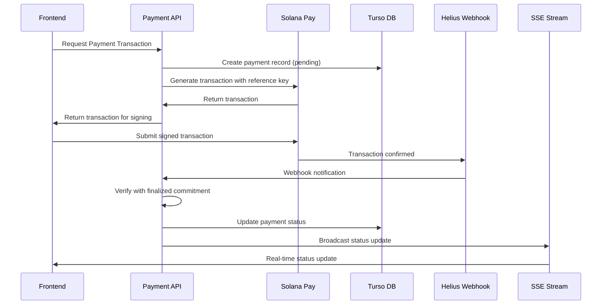
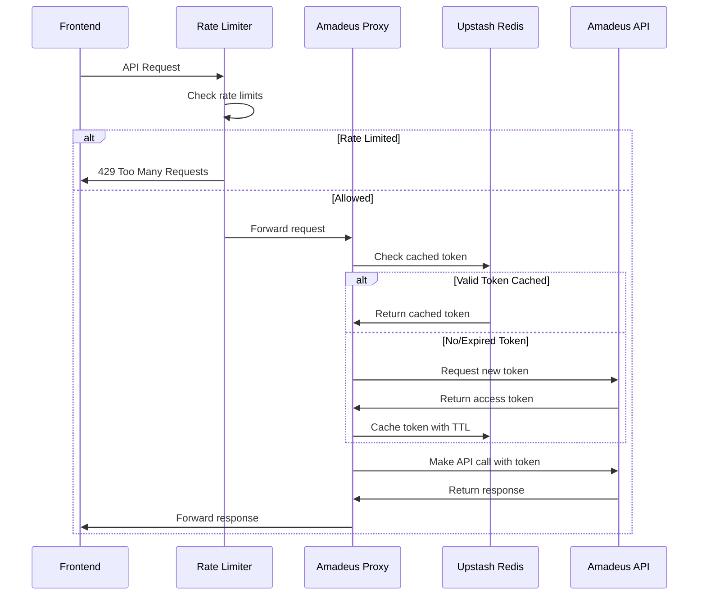

# AxiomID Payment Fulfillment & External API Safety Architecture Plan

## Executive Summary

This document outlines the comprehensive implementation plan for upgrading AxiomID's infrastructure with deterministic payment fulfillment and secure external API integration. The architecture follows a zero-trust security model with proper separation of concerns.

## System Architecture Overview

```mermaid
graph TB
    subgraph "Frontend Layer"
        UI[Payment Modal UI]
        SSE[SSE Client]
    end
    
    subgraph "API Gateway Layer"
        MW[Rate Limiting Middleware]
        PAY[/api/pay/*]
        PROXY[/api/proxy/*]
        WEBHOOK[/api/webhooks/*]
    end
    
    subgraph "Payment Processing"
        SOL[Solana Pay Integration]
        HEL[Helius Webhook Handler]
        VER[Transaction Verification]
        DB_T[(Turso Payments DB)]
    end
    
    subgraph "External API Safety"
        AMA[Amadeus Proxy]
        REDIS[(Upstash Redis)]
        CACHE[Token Cache]
    end
    
    subgraph "Legacy Systems"
        PAYMOB[Paymob Integration]
        DB_D[(D1/SQLite)]
    end
    
    UI --> PAY
    UI --> SSE
    SSE --> PAY
    
    MW --> PAY
    MW --> PROXY
    MW --> WEBHOOK
    
    PAY --> SOL
    PAY --> VER
    VER --> DB_T
    
    WEBHOOK --> HEL
    HEL --> VER
    
    PROXY --> AMA
    AMA --> REDIS
    AMA --> CACHE
    
    PAY --> PAYMOB
    PAYMOB --> DB_D
```

## Payment Fulfillment Flow



## External API Safety Flow



## Database Schema Design

### Payment Fulfillment Tables (Turso/LibSQL)

```sql
-- Primary payments table with strict constraints
CREATE TABLE IF NOT EXISTS payments (
    id INTEGER PRIMARY KEY AUTOINCREMENT,
    tx_signature TEXT UNIQUE NOT NULL,           -- Solana transaction signature
    user_id TEXT NOT NULL,                       -- User identifier
    reference_key TEXT UNIQUE NOT NULL,          -- Anti-replay protection
    amount_lamports INTEGER NOT NULL,             -- Amount in lamports
    status TEXT CHECK(status IN ('pending', 'verified', 'provisioned', 'failed')) DEFAULT 'pending',
    finalized_at INTEGER,                         -- Unix timestamp when finalized
    created_at INTEGER DEFAULT (strftime('%s', 'now')),
    updated_at INTEGER DEFAULT (strftime('%s', 'now'))
);

-- Indexes for performance
CREATE INDEX idx_payments_user_id ON payments(user_id);
CREATE INDEX idx_payments_status ON payments(status);
CREATE INDEX idx_payments_reference_key ON payments(reference_key);
CREATE INDEX idx_payments_tx_signature ON payments(tx_signature);
```

### Bookings Table Extension (D1/SQLite)

```sql
-- Add idempotency to existing bookings
ALTER TABLE agent_transactions ADD COLUMN idempotency_key TEXT UNIQUE;
ALTER TABLE agent_transactions ADD COLUMN payment_provider TEXT DEFAULT 'solana';
ALTER TABLE agent_transactions ADD COLUMN external_booking_ref TEXT;
```

## API Route Structure

### Payment Endpoints
- `POST /api/pay/req/[id]` - Generate payment transaction
- `POST /api/pay/verify` - Manual transaction verification
- `GET /api/pay/check-status/[id]` - Polling fallback
- `GET /api/sse/payment-status/[id]` - Real-time updates

### Webhook Endpoints
- `POST /api/webhooks/helius` - Helius transaction notifications
- `POST /api/webhooks/paymob` - Legacy Paymob callbacks

### Proxy Endpoints
- `POST /api/proxy/amadeus/search` - Secure Amadeus search
- `POST /api/proxy/amadeus/book` - Secure Amadeus booking

## Security Measures

### Rate Limiting Configuration
- **Algorithm**: Sliding Window (10 requests per 10 seconds)
- **Scope**: Applied to `/api/proxy/*` routes
- **Storage**: Upstash Redis for distributed rate limiting
- **Bypass**: Admin users with special headers

### Input Validation
- **Zod Schemas**: All API inputs validated with strict schemas
- **SQL Injection Prevention**: Parameterized queries only
- **HMAC Verification**: All webhook signatures verified

### Idempotency Handling
- **Payment Idempotency**: Reference keys prevent duplicate payments
- **Booking Idempotency**: Idempotency keys prevent duplicate bookings
- **State Management**: Proper state transitions with database constraints

## Implementation Phases

### Phase 1: Foundation (Week 1)
1. Set up Turso/LibSQL connection
2. Create payment schema with proper constraints
3. Configure database client with bigint support
4. Update Next.js configuration

### Phase 2: Payment System (Week 2-3)
1. Implement Solana Pay transaction generation
2. Build deterministic verification logic
3. Create Helius webhook handler
4. Implement polling fallback mechanism
5. Build SSE for real-time updates
6. Update frontend components

### Phase 3: API Safety (Week 3-4)
1. Create Amadeus proxy structure
2. Implement token caching with Redis
3. Set up rate limiting middleware
4. Configure route handlers with timeouts
5. Add idempotency handling

### Phase 4: Integration & Security (Week 4)
1. Environment variable configuration
2. Error handling and logging
3. Input validation with Zod
4. Monitoring and alerting

### Phase 5: Testing & Documentation (Week 5)
1. Unit and integration tests
2. Security testing
3. Performance testing
4. Documentation updates

### Phase 6: Final Preparation (Week 6)
1. Dependency security updates
2. Audit preparation
3. Rollback procedures
4. Final integration testing

## Technology Stack

### New Dependencies Required
```json
{
  "@libsql/client": "^0.5.0",
  "@upstash/ratelimit": "^1.0.0",
  "@upstash/redis": "^1.25.0",
  "helius-sdk": "^1.2.0"
}
```

### Environment Variables Needed
```bash
# Turso Database
TURSO_DB_URL=
TURSO_DB_AUTH_TOKEN=

# Solana/Helius
HELIUS_WEBHOOK_SECRET=
SOLANA_RPC_URL=
SOLANA_PRIVATE_KEY=

# Upstash Redis
UPSTASH_REDIS_REST_URL=
UPSTASH_REDIS_REST_TOKEN=

# Amadeus API
AMADEUS_CLIENT_ID=
AMADEUS_CLIENT_SECRET=
AMADEUS_BASE_URL=

# Legacy Paymob
PAYMOB_HMAC_SECRET=
```

## Monitoring & Observability

### Key Metrics to Track
- Payment success/failure rates
- Transaction verification times
- API response times
- Rate limiting effectiveness
- Webhook processing delays
- Token cache hit rates

### Alerting Thresholds
- Payment failure rate > 5%
- API response time > 2 seconds
- Rate limit rejections > 10%
- Webhook processing failures > 1%

## Security Audit Checklist

### Payment Security
- [ ] HMAC signature verification for all webhooks
- [ ] Idempotency keys preventing duplicate processing
- [ ] Proper transaction finalization checks
- [ ] Secure handling of private keys

### API Security
- [ ] Rate limiting on all external API calls
- [ ] Token caching with proper TTL
- [ ] Input validation on all endpoints
- [ ] Secure credential storage

### Infrastructure Security
- [ ] Environment variable encryption
- [ ] Database connection security
- [ ] API key rotation procedures
- [ ] Audit logging for all transactions

## Rollback Procedures

### Database Rollback
1. Backup current database state
2. Revert schema migrations if needed
3. Restore from backup if data corruption occurs

### API Rollback
1. Maintain previous version in separate branch
2. Use feature flags for gradual rollout
3. Monitor for issues and rollback quickly

### Configuration Rollback
1. Version control all configuration changes
2. Automated testing of configuration validity
3. Quick revert mechanism for environment variables

This architecture provides a robust, secure, and scalable foundation for AxiomID's payment processing and external API integration needs.