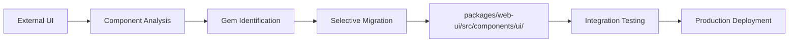

# 🚀 Axiom ID System Enhancement Plan
## UI Component Merge + Google Gemini AI Engine Upgrade

---

## 📋 Executive Summary

This document outlines a two-pronged enhancement strategy for Axiom ID:
1. **Visual System Upgrade**: Selective merge of Google AI Studio UI components
2. **AI Engine Enhancement**: Integration of Google Gemini's advanced capabilities

---

## 🎨 Phase 1: UI Component Analysis & Migration

### Current State Analysis
- **Design System**: Cyberpunk/Neural aesthetic with custom Tailwind colors
- **Key Components**: 
  - `AxiomHolographicMandala.tsx` - 3D holographic visualization
  - `NeuralWorkspace.tsx` - Multi-tab agent visualization  
  - `DashboardCard.tsx` - Glass morphism card component
- **Animation System**: Custom keyframes (glitch, hologram-flicker, float, breathe)
- **3D Integration**: React Three Fiber for advanced visualizations

### External UI Analysis (axiom-id.zip)
**Target Components to Analyze:**
- Hologram components (Google AI Studio quality)
- DashboardLayout improvements
- Advanced animations and transitions
- Superior visual patterns
- Enhanced component architecture

### Migration Strategy


**Selection Criteria:**
- Visual superiority over current components
- Compatibility with existing ai-engine.ts
- Performance impact assessment
- Integration complexity vs benefit ratio

---

## 🧠 Phase 2: AI Engine Enhancement

### Current AI Engine State
- **Providers**: Groq (primary), Vercel Pro Gateway (GPT-4o)
- **Structure**: Unified `ai-engine.ts` with model selection
- **Google Integration**: Only `@google/generative-ai` (not Vercel AI SDK)

### Target Enhancements

#### 🔍 Tool 1: Google Search Grounding
```typescript
// Function to implement
export async function researchWithGoogle(query: string): Promise<string> {
  const model = google('gemini-1.5-flash');
  const result = await generateText({
    model,
    prompt: `Research this topic using Google Search: ${query}`,
    // Search grounding configuration
    options: {
      useSearchGrounding: true
    }
  });
  return result.text;
}
```

#### 👁️ Tool 2: Advanced Vision
```typescript
// Enhanced image analysis
export async function analyzeImage(
  imageUrl: string, 
  prompt: string,
  schema?: z.ZodSchema
): Promise<any> {
  const model = google('gemini-1.5-pro-vision');
  const result = await generateText({
    model,
    prompt: `${prompt}. Return structured JSON.`,
    images: [imageUrl]
  });
  
  if (schema) {
    return parseWithSchema(result.text, schema);
  }
  return result.text;
}
```

#### 🧱 Tool 3: Structured Output
```typescript
// Generic structured data generation
export async function generateStructuredData<T>(
  prompt: string,
  schema: z.ZodSchema<T>
): Promise<T> {
  const model = google('gemini-1.5-pro');
  const result = await generateObject({
    model,
    prompt,
    schema
  });
  return result.object;
}
```

### MENA Agent Integration Examples

#### Sofra Agent (Menu Analysis)
```typescript
const menuData = await aiEngine.generateStructuredData(
  "Extract all items and prices from this menu image",
  z.object({ 
    items: z.array(z.object({ 
      name: z.string(), 
      price: z.number() 
    })) 
  }),
  imageUrl // Menu image
);
// Result: Ready-to-use price list for app upload
```

#### Tajer Agent (Real Estate Research)
```typescript
const realEstatePrice = await aiEngine.researchWithGoogle(
  "ما هو متوسط سعر المتر في التجمع الخامس اليوم؟"
);
// Result: Current market data from Google, not old model memory
```

---

## 🛠️ Implementation Roadmap

### Week 1: Foundation
- [ ] Extract and analyze axiom-id.zip components
- [ ] Install `@ai-sdk/google` dependency
- [ ] Create `packages/web-ui/src/components/ui/` structure
- [ ] Set up Google Gemini provider in ai-engine.ts

### Week 2: Core Development
- [ ] Implement `researchWithGoogle()` function
- [ ] Enhance `analyzeImage()` with vision capabilities
- [ ] Create `generateStructuredData<T>()` function
- [ ] Begin component analysis and selection

### Week 3: Integration & Testing
- [ ] Create test route `/api/ai/google-tools/route.ts`
- [ ] Migrate selected UI components
- [ ] Test MENA agent integration
- [ ] Performance testing and optimization

### Week 4: Documentation & Deployment
- [ ] Create `UI_MERGE_REPORT.md`
- [ ] Update component documentation
- [ ] Final integration testing
- [ ] Production deployment

---

## 📊 Success Metrics

### UI Enhancement Metrics
- Visual quality improvement score
- Component performance benchmarks
- User experience enhancement
- Load time impact assessment

### AI Engine Metrics
- Response time improvements
- Accuracy of structured outputs
- Search grounding effectiveness
- Vision analysis precision

---

## 🔧 Technical Requirements

### Dependencies to Add
```json
{
  "@ai-sdk/google": "^latest",
  "zod": "^4.1.13" // Already installed
}
```

### Environment Variables
```env
GOOGLE_GENERATIVE_AI_API_KEY=your_google_api_key
```

### File Structure Changes
```
packages/web-ui/src/
├── lib/
│   └── ai-engine.ts (Enhanced)
├── components/
│   ├── ui/ (New directory)
│   │   ├── [Migrated components]
│   │   └── index.ts
│   └── [Existing components]
└── app/api/ai/google-tools/
    └── route.ts (New test route)
```

---

## 🎯 Expected Outcomes

### Immediate Benefits
1. **Enhanced Visual Experience**: Google AI Studio quality components
2. **Advanced AI Capabilities**: Search grounding, vision, structured output
3. **MENA Market Readiness**: Arabic language support with real-time data
4. **Competitive Advantage**: Superior UI + Advanced AI integration

### Long-term Impact
1. **Market Leadership**: Best-in-class UI/UX for AI agents
2. **Scalability**: Structured approach for rapid feature development
3. **User Satisfaction**: Dramatically improved interaction experience
4. **Technical Excellence**: Modern, maintainable codebase

---

## 🚨 Risk Mitigation

### Technical Risks
- **Component Compatibility**: Ensure migrated components work with existing data flow
- **Performance Impact**: Monitor load times with new visualizations
- **API Limits**: Respect Google Gemini rate limits and quotas

### Mitigation Strategies
- **Incremental Rollout**: Phase component migration
- **Performance Monitoring**: Real-time performance tracking
- **Fallback Systems**: Maintain Groq as backup provider
- **Testing Protocol**: Comprehensive testing before deployment

---

## 📝 Next Steps

1. **Immediate**: Extract axiom-id.zip and begin component analysis
2. **Priority 1**: Install dependencies and set up Google Gemini
3. **Priority 2**: Implement core AI engine enhancements
4. **Priority 3**: Select and migrate superior UI components
5. **Final**: Integration testing and documentation

---

*This plan provides a comprehensive roadmap for transforming Axiom ID into a market-leading AI agent platform with superior visual design and advanced capabilities.*