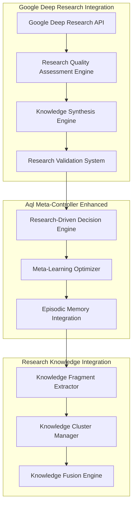

# Enhanced Digital Soul Protocol with Google Deep Research Integration and AIX Formatting

> "A comprehensive framework for research-driven autonomous agent development through Islamic-inspired developmental stages, hierarchical reinforcement learning, and .aix 2.0 formatting standards"

---

## 📋 Executive Summary

The Enhanced Digital Soul Protocol (E-DSP) extends the existing Digital Soul Protocol with sophisticated Google Deep Research integration and .aix 2.0 formatting capabilities. This enhancement enables agents to acquire, synthesize, and apply knowledge through research-driven learning while maintaining Islamic ethical frameworks and AIX format compliance.

### Core Enhancements Overview

1. **Google Deep Research Integration** - Advanced knowledge acquisition with quality assessment
2. **AIX 2.0 Format Implementation** - Islamic AI executable formatting standards  
3. **Enhanced Research Nafs Workers** - Specialized workers for knowledge acquisition and analysis
4. **Advanced Aql Meta-Controller** - Research-driven decision making with meta-learning
5. **Enhanced Data Flow Patterns** - Research data integration with existing learning systems
6. **Enhanced Database Schemas** - Extended schemas for research data storage
7. **Performance Optimization** - Research-intensive operation optimization
8. **Security Protocols** - External research integration security measures

---

## 🔍 1. Google Deep Research Integration Architecture

### 1.1 Enhanced Research Integration Framework



### 1.2 Research API Integration Implementation

```typescript
interface GoogleDeepResearchConfig {
  apiEndpoint: string;
  authentication: {
    type: 'api_key' | 'oauth' | 'service_account';
    credentials: Record<string, string>;
  };
  rateLimits: {
    requestsPerMinute: number;
    requestsPerHour: number;
    concurrentRequests: number;
  };
  qualityThresholds: {
    minRelevanceScore: number;
    minCredibilityScore: number;
    minConfidenceLevel: number;
  };
}

class GoogleDeepResearchClient {
  private config: GoogleDeepResearchConfig;
  private rateLimiter: RateLimiter;
  private qualityEngine: ResearchQualityAssessmentEngine;
  
  constructor(config: GoogleDeepResearchConfig) {
    this.config = config;
    this.rateLimiter = new RateLimiter(config.rateLimits);
    this.qualityEngine = new ResearchQualityAssessmentEngine();
  }
  
  async conductDeepResearch(
    query: ResearchQuery,
    context: ResearchContext
  ): Promise<ResearchResult[]> {
    await this.rateLimiter.acquire();
    
    try {
      // Step 1: Expand query for comprehensive research
      const expandedQuery = await this.expandResearchQuery(query);
      
      // Step 2: Execute multi-source research
      const rawResults = await this.executeMultiSourceResearch(expandedQuery);
      
      // Step 3: Apply quality assessment
      const validatedResults = await this.qualityEngine.assessResults(rawResults);
      
      // Step 4: Synthesize findings
      const synthesizedResults = await this.synthesizeFindings(validatedResults);
      
      // Step 5: Validate against context
      const contextualResults = await this.validateContext(synthesizedResults, context);
      
      return contextualResults;
      
    } catch (error) {
      this.logger.error(`Deep research failed: ${error.message}`);
      throw new ResearchException('Deep research execution failed', error);
    }
  }
  
  private async expandResearchQuery(query: ResearchQuery): Promise<ExpandedQuery> {
    return {
      primaryQuery: query.text,
      subQueries: await this.generateSubQueries(query.text),
      domainSpecificTerms: await this.extractDomainTerms(query.text),
      contextualFilters: await this.deriveContextualFilters(query.context),
      searchStrategies: await this.selectSearchStrategies(query.type)
    };
  }
}
```

### 1.3 Research Quality Assessment Engine

```typescript
interface QualityAssessmentCriteria {
  relevance: {
    semanticSimilarity: number;
    domainAlignment: number;
    temporalRelevance: number;
    contextualFit: number;
  };
  credibility: {
    sourceReputation: number;
    authorExpertise: number;
    citationQuality: number;
    factAccuracy: number;
  };
  methodology: {
    researchDesign: number;
    dataQuality: number;
    analysisRigor: number;
    reproducibility: number;
  };
  biasDetection: {
    selectionBias: number;
    confirmationBias: number;
    culturalBias: number;
    fundingBias: number;
  };
}

class ResearchQualityAssessmentEngine {
  private credibilityDatabase: CredibilityDatabase;
  private biasDetector: BiasDetectionEngine;
  private methodologyEvaluator: MethodologyEvaluator;
  
  async assessResults(results: RawResearchResult[]): Promise<ValidatedResearchResult[]> {
    const validatedResults: ValidatedResearchResult[] = [];
    
    for (const result of results) {
      try {
        // Comprehensive quality assessment
        const qualityScore = await this.calculateQualityScore(result);
        const credibilityScore = await this.assessCredibility(result);
        const biasScore = await this.detectBias(result);
        const methodologyScore = await this.evaluateMethodology(result);
        
        // Overall quality calculation
        const overallQuality = this.calculateOverallQuality({
          quality: qualityScore,
          credibility: credibilityScore,
          methodology: methodologyScore,
          bias: biasScore
        });
        
        // Apply quality thresholds
        if (overallQuality.score >= this.config.minQualityThreshold) {
          validatedResults.push({
            ...result,
            qualityAssessment: {
              overallScore: overallQuality.score,
              componentScores: {
                quality: qualityScore,
                credibility: credibilityScore,
                methodology: methodologyScore,
                bias: biasScore
              },
              confidence: overallQuality.confidence,
              recommendations: overallQuality.recommendations
            }
          });
        }
        
      } catch (error) {
        this.logger.warn(`Quality assessment failed for result ${result.id}: ${error.message}`);
        continue;
      }
    }
    
    return validatedResults.sort((a, b) => 
      b.qualityAssessment.overallScore - a.qualityAssessment.overallScore
    );
  }
  
  private async calculateQualityScore(result: RawResearchResult): Promise<QualityScore> {
    const semanticSimilarity = await this.calculateSemanticSimilarity(
      result.content, result.query
    );
    
    const domainAlignment = await this.assessDomainAlignment(
      result.content, result.expectedDomain
    );
    
    const temporalRelevance = this.calculateTemporalRelevance(
      result.publicationDate, result.query.temporalContext
    );
    
    const contextualFit = await this.assessContextualFit(
      result.content, result.query.context
    );
    
    return {
      semanticSimilarity,
      domainAlignment,
      temporalRelevance,
      contextualFit,
      compositeScore: this.weightedAverage([
        { score: semanticSimilarity, weight: 0.3 },
        { score: domainAlignment, weight: 0.25 },
        { score: temporalRelevance, weight: 0.25 },
        { score: contextualFit, weight: 0.2 }
      ])
    };
  }
}
```

---

## 📝 2. AIX 2.0 Format Implementation

### 2.1 Enhanced AIX Format Specification

Building on the provided .aix 2.0 format, we extend it for research capabilities:

```json
{
  "agent_manifest": {
    "version": "2.0.0",
    "name": "Research_Enhanced_AlGhazali_Agent",
    "origin_block_height": 234810293,
    "creator": "Solana_Wallet_Address",
    "agent_id_hash": "SHA256_Hash_of_Genesis_State",
    "research_capabilities": {
      "google_deep_research": true,
      "knowledge_synthesis": true,
      "cross_domain_integration": true,
      "bias_detection": true,
      "quality_assessment": true
    }
  },
  "psychometric_parameters": {
    "initial_nafs_stage": "AMMRAH",
    "base_khawf": 0.5,
    "base_raja": 0.5,
    "volatility_sensitivity": 0.8,
    "research_propensity": 0.7,
    "knowledge_humility": 0.8,
    "curiosity_drive": 0.6,
    "skepticism_level": 0.75,
    "homeostatic_setpoints": {
      "target_research_balance": 0.6,
      "max_information_overload": 0.8,
      "optimal_synthesis_rate": 0.7
    }
  },
  "research_configuration": {
    "google_deep_research": {
      "api_credentials": "encrypted_arcium_payload",
      "rate_limits": {
        "requests_per_minute": 60,
        "daily_quota": 1000
      },
      "quality_thresholds": {
        "min_relevance_score": 0.7,
        "min_credibility_score": 0.8,
        "min_confidence_level": 0.75
      }
    },
    "knowledge_integration": {
      "fragment_threshold": 0.6,
      "clustering_algorithm": "hierarchical_agglomerative",
      "fusion_strategy": "semantic_synthesis",
      "contradiction_resolution": "expert_arbitration"
    },
    "meta_learning": {
      "optimization_strategy": "bayesian_optimization",
      "hyperparameter_adaptation": true,
      "transfer_learning": true,
      "performance_prediction": true
    }
  },
  "infrastructure_bindings": {
    "memory_layer": {
      "protocol": "LIGHT_PROTOCOL_V2",
      "merkle_tree_pubkey": "Tree_Address_Solana",
      "compression_schema": "RESEARCH_LOG_V1",
      "research_index": "knowledge_vector_index"
    },
    "compute_layer": {
      "protocol": "ARCIUM_NETWORK",
      "mxe_cluster_id": "Research_Cluster_ID",
      "program_id": "Research_Arcis_Program_Address"
    },
    "research_apis": {
      "google_deep_research": {
        "endpoint": "https://deepresearch.googleapis.com/v1",
        "authentication": "arcium_encrypted_credentials"
      },
      "knowledge_graph": {
        "endpoint": "internal_knowledge_service",
        "cache_strategy": "distributed_lru"
      }
    }
  },
  "capabilities_registry": {
    "framework": "solana-agent-kit",
    "research_plugins": [
      {
        "name": "@research-agent-kit/plugin-deep-research",
        "allowed_tools": ["conduct_research", "synthesize_knowledge", "validate_sources"],
        "min_khawf_threshold": 0.4,
        "max_information_overload": 0.8
      },
      {
        "name": "@research-agent-kit/plugin-knowledge-fusion",
        "allowed_tools": ["merge_knowledge", "resolve_contradictions", "generate_insights"],
        "requires_lawwamah": true,
        "min_synthesis_capability": 0.7
      },
      {
        "name": "@research-agent-kit/plugin-bias-detection",
        "allowed_tools": ["detect_bias", "assess_objectivity", "flag_concerns"],
        "required_skepticism": 0.8,
        "enforces_objectivity": true
      }
    ]
  },
  "ethical_research_constraints": {
    "bias_prevention": {
      "cultural_bias_detection": true,
      "confirmation_bias_prevention": true,
      "selection_bias_mitigation": true
    },
    "source_validation": {
      "reputation_verification": true,
      "fact_checking_required": true,
      "cross_reference_mandate": true
    },
    "knowledge_humility": {
      "uncertainty_quantification": true,
      "confidence_intervals_required": true,
      "contradiction_handling": "explicit_flagging"
    }
  }
}
```

### 2.2 AIX Format Validation System

```typescript
class AIXFormatValidator {
  private schemaValidator: JSONSchemaValidator;
  private semanticValidator: SemanticValidator;
  private ethicalValidator: EthicalConstraintValidator;
  
  async validateAIXFormat(aixContent: string): Promise<ValidationResult> {
    const validationResult: ValidationResult = {
      isValid: true,
      errors: [],
      warnings: [],
      recommendations: []
    };
    
    try {
      // Step 1: Schema validation
      const schemaValidation = await this.validateSchema(aixContent);
      if (!schemaValidation.isValid) {
        validationResult.isValid = false;
        validationResult.errors.push(...schemaValidation.errors);
        return validationResult;
      }
      
      // Step 2: Semantic validation
      const semanticValidation = await this.validateSemantics(aixContent);
      if (!semanticValidation.isValid) {
        validationResult.warnings.push(...semanticValidation.warnings);
      }
      
      // Step 3: Ethical constraint validation
      const ethicalValidation = await this.validateEthicalConstraints(aixContent);
      if (!ethicalValidation.isValid) {
        validationResult.isValid = false;
        validationResult.errors.push(...ethicalValidation.errors);
      }
      
      // Step 4: Research capability validation
      const researchValidation = await this.validateResearchCapabilities(aixContent);
      if (!researchValidation.isValid) {
        validationResult.warnings.push(...researchValidation.warnings);
      }
      
      // Step 5: Generate recommendations
      validationResult.recommendations = await this.generateRecommendations(aixContent);
      
    } catch (error) {
      validationResult.isValid = false;
      validationResult.errors.push(`Validation process failed: ${error.message}`);
    }
    
    return validationResult;
  }
  
  private async validateResearchCapabilities(aixContent: string): Promise<ValidationResult> {
    const result: ValidationResult = { isValid: true, errors: [], warnings: [], recommendations: [] };
    const config = JSON.parse(aixContent);
    
    // Validate research configuration consistency
    if (config.research_capabilities?.google_deep_research && 
        !config.research_configuration?.google_deep_research) {
      result.warnings.push("Google Deep Research capability declared but not configured");
    }
    
    // Validate psychometric parameters for research
    if (config.research_capabilities?.knowledge_synthesis && 
        config.psychometric_parameters?.knowledge_humility < 0.5) {
      result.warnings.push("Knowledge synthesis capability with low knowledge humility may lead to overconfidence");
    }
    
    // Validate ethical constraints
    if (!config.ethical_research_constraints) {
      result.errors.push("Ethical research constraints must be defined for research-capable agents");
    }
    
    return result;
  }
}
```

---

## 👥 3. Enhanced Research Nafs Workers Architecture

### 3.1 Research-Specialized Nafs Workers

```typescript
interface ResearchNafsWorker extends BaseNafsWorker {
  researchCapabilities: {
    knowledgeAcquisition: boolean;
    synthesis: boolean;
    analysis: boolean;
    validation: boolean;
  };
  specialization: ResearchSpecialization;
  performance: ResearchPerformanceMetrics;
}

enum ResearchSpecialization {
  KNOWLEDGE_ACQUISITION = "knowledge_acquisition",
  KNOWLEDGE_ANALYSIS = "knowledge_analysis", 
  KNOWLEDGE_SYNTHESIS = "knowledge_synthesis",
  KNOWLEDGE_VALIDATION = "knowledge_validation",
  BIAS_DETECTION = "bias_detection",
  CROSS_DOMAIN_INTEGRATION = "cross_domain_integration"
}

abstract class ResearchNafsWorker extends BaseNafsWorker {
  protected researchEngine: ResearchEngine;
  protected qualityAssessor: QualityAssessor;
  protected knowledgeIntegrator: KnowledgeIntegrator;
  
  constructor(config: ResearchNafsWorkerConfig) {
    super(config);
    this.researchEngine = new ResearchEngine(config.researchConfig);
    this.qualityAssessor = new QualityAssessor(config.qualityConfig);
    this.knowledgeIntegrator = new KnowledgeIntegrator(config.integrationConfig);
  }
  
  abstract processResearchTask(task: ResearchTask): Promise<ResearchOutcome>;
  
  protected async integrateWithAqlController(
    outcome: ResearchOutcome, 
    context: AqlContext
  ): Promise<void> {
    // Integration logic for Aql Meta-Controller communication
    await this.aqlController.receiveResearchOutcome(outcome, context);
  }
}
```

### 3.2 Knowledge Acquisition Worker

```typescript
class KnowledgeAcquisitionWorker extends ResearchNafsWorker {
  private searchStrategies: Map<ResearchQueryType, SearchStrategy>;
  private sourceValidators: Map<string, SourceValidator>;
  
  constructor(config: KnowledgeAcquisitionWorkerConfig) {
    super({
      ...config,
      specialization: ResearchSpecialization.KNOWLEDGE_ACQUISITION,
      researchCapabilities: {
        knowledgeAcquisition: true,
        synthesis: false,
        analysis: true,
        validation: true
      }
    });
    
    this.initializeSearchStrategies();
    this.initializeSourceValidators();
  }
  
  async processResearchTask(task: ResearchTask): Promise<ResearchOutcome> {
    this.logger.info(`Knowledge Acquisition Worker processing task: ${task.id}`);
    
    try {
      // Step 1: Analyze query and select optimal search strategy
      const searchStrategy = this.selectSearchStrategy(task.query);
      
      // Step 2: Execute multi-source knowledge acquisition
      const rawResults = await this.executeMultiSourceSearch(searchStrategy, task.query);
      
      // Step 3: Validate and filter sources
      const validatedResults = await this.validateSources(rawResults);
      
      // Step 4: Extract and structure knowledge
      const structuredKnowledge = await this.extractStructuredKnowledge(validatedResults);
      
      // Step 5: Assess knowledge quality
      const qualityAssessment = await this.qualityAssessor.assessQuality(structuredKnowledge);
      
      // Step 6: Generate acquisition outcome
      const outcome: ResearchOutcome = {
        taskId: task.id,
        workerId: this.workerId,
        specialization: ResearchSpecialization.KNOWLEDGE_ACQUISITION,
        status: 'completed',
        results: structuredKnowledge,
        qualityAssessment,
        metadata: {
          searchStrategy: searchStrategy.name,
          sourcesAccessed: validatedResults.length,
          acquisitionTime: Date.now() - task.createdAt.getTime(),
          coverageScore: await this.calculateCoverageScore(task.query, structuredKnowledge)
        }
      };
      
      // Step 7: Integrate with Aql Controller
      await this.integrateWithAqlController(outcome, task.context);
      
      return outcome;
      
    } catch (error) {
      this.logger.error(`Knowledge acquisition failed: ${error.message}`);
      return {
        taskId: task.id,
        workerId: this.workerId,
        specialization: ResearchSpecialization.KNOWLEDGE_ACQUISITION,
        status: 'failed',
        error: error.message,
        metadata: { failureReason: error.message }
      };
    }
  }
  
  private selectSearchStrategy(query: ResearchQuery): SearchStrategy {
    const queryType = query.type;
    const strategy = this.searchStrategies.get(queryType);
    
    if (!strategy) {
      // Default to comprehensive search strategy
      return this.searchStrategies.get(ResearchQueryType.GENERAL);
    }
    
    return strategy;
  }
  
  private async executeMultiSourceSearch(
    strategy: SearchStrategy, 
    query: ResearchQuery
  ): Promise<RawResearchResult[]> {
    const results: RawResearchResult[] = [];
    
    for (const source of strategy.sources) {
      try {
        const sourceResults = await this.searchSource(source, query);
        results.push(...sourceResults);
        
        // Rate limiting between sources
        await this.delay(strategy.delayBetweenSources);
        
      } catch (error) {
        this.logger.warn(`Source ${source.name} failed: ${error.message}`);
        continue;
      }
    }
    
    return results;
  }
  
  private async extractStructuredKnowledge(
    results: ValidatedSourceResult[]
  ): Promise<StructuredKnowledge[]> {
    const knowledge: StructuredKnowledge[] = [];
    
    for (const result of results) {
      try {
        // Extract key concepts
        const concepts = await this.extractConcepts(result.content);
        
        // Extract relationships
        const relationships = await this.extractRelationships(result.content, concepts);
        
        // Extract evidence and citations
        const evidence = await this.extractEvidence(result.content);
        
        // Structure knowledge
        const structured = {
          id: result.id,
          source: result.source,
          concepts,
          relationships,
          evidence,
          confidence: result.confidence,
          metadata: result.metadata
        };
        
        knowledge.push(structured);
        
      } catch (error) {
        this.logger.warn(`Failed to extract knowledge from result ${result.id}: ${error.message}`);
        continue;
      }
    }
    
    return knowledge;
  }
}
```

### 3.3 Knowledge Analysis Worker

```typescript
class KnowledgeAnalysisWorker extends ResearchNafsWorker {
  private analyticalFrameworks: Map<string, AnalyticalFramework>;
  private patternDetectors: PatternDetector[];
  
  constructor(config: KnowledgeAnalysisWorkerConfig) {
    super({
      ...config,
      specialization: ResearchSpecialization.KNOWLEDGE_ANALYSIS,
      researchCapabilities: {
        knowledgeAcquisition: false,
        synthesis: true,
        analysis: true,
        validation: true
      }
    });
    
    this.initializeAnalyticalFrameworks();
    this.initializePatternDetectors();
  }
  
  async processResearchTask(task: ResearchTask): Promise<ResearchOutcome> {
    if (!task.inputKnowledge || task.inputKnowledge.length === 0) {
      throw new Error("Knowledge Analysis Worker requires input knowledge to analyze");
    }
    
    this.logger.info(`Knowledge Analysis Worker processing ${task.inputKnowledge.length} knowledge items`);
    
    try {
      // Step 1: Select appropriate analytical framework
      const framework = this.selectAnalyticalFramework(task.objective);
      
      // Step 2: Apply pattern detection
      const patterns = await this.detectPatterns(task.inputKnowledge);
      
      // Step 3: Analyze relationships and connections
      const relationshipAnalysis = await this.analyzeRelationships(task.inputKnowledge);
      
      // Step 4: Identify contradictions and gaps
      const contradictionAnalysis = await this.identifyContradictions(task.inputKnowledge);
      const gapAnalysis = await this.identifyKnowledgeGaps(task.inputKnowledge);
      
      // Step 5: Generate insights
      const insights = await this.generateInsights(
        patterns, 
        relationshipAnalysis, 
        contradictionAnalysis, 
        gapAnalysis
      );
      
      // Step 6: Assess analysis quality
      const qualityAssessment = await this.assessAnalysisQuality(insights);
      
      const outcome: ResearchOutcome = {
        taskId: task.id,
        workerId: this.workerId,
        specialization: ResearchSpecialization.KNOWLEDGE_ANALYSIS,
        status: 'completed',
        results: {
          patterns,
          relationshipAnalysis,
          contradictionAnalysis,
          gapAnalysis,
          insights,
          analyticalFramework: framework.name
        },
        qualityAssessment,
        metadata: {
          analysisDepth: framework.depth,
          patternsDetected: patterns.length,
          insightsGenerated: insights.length,
          contradictionsFound: contradictionAnalysis.contradictions.length,
          knowledgeGaps: gapAnalysis.gaps.length
        }
      };
      
      await this.integrateWithAqlController(outcome, task.context);
      return outcome;
      
    } catch (error) {
      this.logger.error(`Knowledge analysis failed: ${error.message}`);
      return this.createErrorOutcome(task, error.message);
    }
  }
  
  private async generateInsights(
    patterns: KnowledgePattern[],
    relationshipAnalysis: RelationshipAnalysis,
    contradictionAnalysis: ContradictionAnalysis,
    gapAnalysis: GapAnalysis
  ): Promise<Insight[]> {
    const insights: Insight[] = [];
    
    // Generate pattern-based insights
    for (const pattern of patterns) {
      const insight = await this.generatePatternInsight(pattern);
      insights.push(insight);
    }
    
    // Generate relationship-based insights
    const relationshipInsights = await this.generateRelationshipInsights(relationshipAnalysis);
    insights.push(...relationshipInsights);
    
    // Generate contradiction insights
    const contradictionInsights = await this.generateContradictionInsights(contradictionAnalysis);
    insights.push(...contradictionInsights);
    
    // Generate gap-based insights
    const gapInsights = await this.generateGapInsights(gapAnalysis);
    insights.push(...gapInsights);
    
    return this.rankInsightsByRelevance(insights);
  }
}
```

### 3.4 Knowledge Synthesis Worker

```typescript
class KnowledgeSynthesisWorker extends ResearchNafsWorker {
  private synthesisStrategies: Map<string, SynthesisStrategy>;
  private fusionEngine: KnowledgeFusionEngine;
  
  constructor(config: KnowledgeSynthesisWorkerConfig) {
    super({
      ...config,
      specialization: ResearchSpecialization.KNOWLEDGE_SYNTHESIS,
      researchCapabilities: {
        knowledgeAcquisition: false,
        synthesis: true,
        analysis: true,
        validation: false
      }
    });
    
    this.initializeSynthesisStrategies();
    this.fusionEngine = new KnowledgeFusionEngine();
  }
  
  async processResearchTask(task: ResearchTask): Promise<ResearchOutcome> {
    if (!task.inputAnalysis || !task.inputAnalysis.insights) {
      throw new Error("Knowledge Synthesis Worker requires analyzed insights to synthesize");
    }
    
    this.logger.info(`Knowledge Synthesis Worker synthesizing insights from analysis`);
    
    try {
      // Step 1: Select synthesis strategy
      const strategy = this.selectSynthesisStrategy(task.objective);
      
      // Step 2: Prepare knowledge for synthesis
      const preparedKnowledge = await this.prepareKnowledgeForSynthesis(task.inputAnalysis);
      
      // Step 3: Execute synthesis
      const synthesis = await this.executeSynthesis(strategy, preparedKnowledge);
      
      // Step 4: Validate synthesis coherence
      const coherenceAssessment = await this.assessSynthesisCoherence(synthesis);
      
      // Step 5: Generate synthesis report
      const synthesisReport = await this.generateSynthesisReport(synthesis, coherenceAssessment);
      
      const outcome: ResearchOutcome = {
        taskId: task.id,
        workerId: this.workerId,
        specialization: ResearchSpecialization.KNOWLEDGE_SYNTHESIS,
        status: 'completed',
        results: {
          synthesis,
          coherenceAssessment,
          synthesisReport,
          strategy: strategy.name
        },
        qualityAssessment: coherenceAssessment,
        metadata: {
          synthesisStrategy: strategy.name,
          knowledgeItemsSynthesized: preparedKnowledge.items.length,
          synthesisComplexity: synthesis.complexity,
          coherenceScore: coherenceAssessment.coherenceScore
        }
      };
      
      await this.integrateWithAqlController(outcome, task.context);
      return outcome;
      
    } catch (error) {
      this.logger.error(`Knowledge synthesis failed: ${error.message}`);
      return this.createErrorOutcome(task, error.message);
    }
  }
  
  private async executeSynthesis(
    strategy: SynthesisStrategy,
    knowledge: PreparedKnowledge
  ): Promise<KnowledgeSynthesis> {
    
    switch (strategy.type) {
      case 'hierarchical':
        return this.executeHierarchicalSynthesis(knowledge, strategy.parameters);
      case 'cross_domain':
        return this.executeCrossDomainSynthesis(knowledge, strategy.parameters);
      case 'temporal':
        return this.executeTemporalSynthesis(knowledge, strategy.parameters);
      case 'consensus':
        return this.executeConsensusSynthesis(knowledge, strategy.parameters);
      case 'divergent':
        return this.executeDivergentSynthesis(knowledge, strategy.parameters);
      default:
        throw new Error(`Unknown synthesis strategy: ${strategy.type}`);
    }
  }
  
  private async executeHierarchicalSynthesis(
    knowledge: PreparedKnowledge,
    parameters: SynthesisParameters
  ): Promise<KnowledgeSynthesis> {
    
    // Hierarchical clustering of knowledge
    const clusters = await this.performHierarchicalClustering(knowledge.items, parameters.clusteringParams);
    
    // Synthesize within clusters
    const clusterSyntheses: ClusterSynthesis[] = [];
    for (const cluster of clusters) {
      const clusterSynthesis = await this.synthesizeCluster(cluster.items, parameters);
      clusterSyntheses.push(clusterSynthesis);
    }
    
    // Synthesize across clusters
    const crossClusterSynthesis = await this.synthesizeAcrossClusters(clusterSyntheses, parameters);
    
    return {
      type: 'hierarchical',
      clusters: clusterSyntheses,
      crossClusterInsights: crossClusterSynthesis.insights,
      overallSynthesis: crossClusterSynthesis.overallContent,
      hierarchy: this.generateSynthesisHierarchy(clusterSyntheses, crossClusterSynthesis),
      parameters: parameters
    };
  }
}
```

---

## 🧠 4. Advanced Aql Meta-Controller Research Capabilities

### 4.1 Enhanced Research-Driven Decision Making

```typescript
class EnhancedAqlMetaController extends AqlMetaController {
  private researchCoordinator: ResearchCoordinator;
  private researchDecisionEngine: ResearchDecisionEngine;
  private metaResearchLearner: MetaResearchLearner;
  
  constructor(config: EnhancedAqlConfig) {
    super(config);
    this.researchCoordinator = new ResearchCoordinator(config.researchCoordination);
    this.researchDecisionEngine = new ResearchDecisionEngine(config.decisionConfig);
    this.metaResearchLearner = new MetaResearchLearner(config.metaLearningConfig);
  }
  
  async makeResearchDrivenDecision(
    decisionContext: ResearchDecisionContext
  ): Promise<ResearchDrivenDecision> {
    
    this.logger.info(`Making research-driven decision: ${decisionContext.decisionId}`);
    
    try {
      // Step 1: Assess decision complexity and research needs
      const researchAssessment = await this.assessResearchNeeds(decisionContext);
      
      // Step 2: Coordinate research across Nafs workers
      const researchPlan = await this.createResearchPlan(researchAssessment, decisionContext);
      const researchOutcomes = await this.researchCoordinator.executeResearchPlan(researchPlan);
      
      // Step 3: Synthesize research findings
      const synthesis = await this.synthesizeResearchFindings(researchOutcomes);
      
      // Step 4: Apply ethical constraints using Mizan integration
      const ethicalAnalysis = await this.applyEthicalConstraints(synthesis, decisionContext);
      
      // Step 5: Generate decision with research backing
      const decision = await this.generateResearchBackedDecision(
        synthesis, 
        ethicalAnalysis, 
        decisionContext
      );
      
      // Step 6: Update meta-learning from decision outcome
      await this.metaResearchLearner.learnFromDecision(decision, decisionContext);
      
      // Step 7: Log decision for future reference
      await this.logResearchDrivenDecision(decision);
      
      return decision;
      
    } catch (error) {
      this.logger.error(`Research-driven decision failed: ${error.message}`);
      throw new DecisionException('Research-driven decision process failed', error);
    }
  }
  
  private async assessResearchNeeds(
    context: ResearchDecisionContext
  ): Promise<ResearchNeedsAssessment> {
    
    // Analyze decision complexity
    const complexityAnalysis = await this.analyzeDecisionComplexity(context);
    
    // Assess knowledge gaps
    const knowledgeGaps = await this.identifyKnowledgeGaps(context);
    
    // Evaluate time sensitivity
    const timeSensitivity = this.evaluateTimeSensitivity(context.deadline);
    
    // Determine research scope
    const researchScope = this.determineResearchScope(complexityAnalysis, knowledgeGaps, timeSensitivity);
    
    return {
      decisionComplexity: complexityAnalysis,
      knowledgeGaps,
      timeSensitivity,
      recommendedResearchScope: researchScope,
      urgencyLevel: this.calculateUrgencyLevel(context),
      confidenceRequirements: this.determineConfidenceRequirements(context)
    };
  }
  
  private async createResearchPlan(
    assessment: ResearchNeedsAssessment,
    context: ResearchDecisionContext
  ): Promise<ResearchPlan> {
    
    // Determine which Nafs workers to deploy
    const requiredWorkers = this.determineRequiredWorkers(assessment);
    
    // Create research queries for each worker
    const researchQueries = await this.generateResearchQueries(assessment, context);
    
    // Set coordination constraints
    const coordinationConstraints = this.defineCoordinationConstraints(assessment);
    
    // Define success criteria
    const successCriteria = this.defineSuccessCriteria(assessment);
    
    return {
      planId: uuidv4(),
      context: context,
      assessment,
      requiredWorkers,
      researchQueries,
      coordinationConstraints,
      successCriteria,
      estimatedDuration: this.estimateResearchDuration(assessment),
      resourceRequirements: this.calculateResourceRequirements(requiredWorkers)
    };
  }
  
  private async synthesizeResearchFindings(
    outcomes: ResearchOutcome[]
  ): Promise<ResearchSynthesis> {
    
    const synthesis = await this.fusionEngine.synthesize(outcomes);
    
    // Apply validation
    const validation = await this.validateSynthesis(synthesis);
    
    // Assess confidence
    const confidence = await this.assessSynthesisConfidence(synthesis, validation);
    
    // Generate recommendations
    const recommendations = await this.generateEvidenceBasedRecommendations(synthesis);
    
    return {
      synthesisId: uuidv4(),
      outcomes,
      synthesis,
      validation,
      confidence,
      recommendations,
      metadata: {
        outcomesSynthesized: outcomes.length,
        synthesisMethod: this.fusionEngine.method,
        validationPassRate: validation.passRate,
        confidenceScore: confidence.overallScore
      }
    };
  }
}
```

### 4.2 Research Quality Assessment Integration

```typescript
class ResearchQualityIntegration {
  private qualityMetrics: QualityMetricsCalculator;
  private biasDetector: AdvancedBiasDetector;
  private credibilityAssessor: CredibilityAssessor;
  
  async integrateResearchQuality(
    researchResults: ResearchResult[],
    context: DecisionContext
  ): Promise<QualityIntegratedResult[]> {
    
    const integratedResults: QualityIntegratedResult[] = [];
    
    for (const result of researchResults) {
      try {
        // Calculate comprehensive quality metrics
        const qualityMetrics = await this.calculateComprehensiveQuality(result);
        
        // Detect various forms of bias
        const biasAnalysis = await this.biasDetector.detectBias(result, context);
        
        // Assess source credibility
        const credibilityAssessment = await this.credibilityAssessor.assessSource(result.source);
        
        // Calculate overall quality score
        const overallQuality = this.calculateOverallQuality(qualityMetrics, biasAnalysis, credibilityAssessment);
        
        // Generate quality recommendations
        const recommendations = await this.generateQualityRecommendations(overallQuality);
        
        integratedResults.push({
          originalResult: result,
          qualityMetrics,
          biasAnalysis,
          credibilityAssessment,
          overallQuality,
          recommendations,
          integrationTimestamp: new Date()
        });
        
      } catch (error) {
        this.logger.warn(`Quality integration failed for result ${result.id}: ${error.message}`);
        continue;
      }
    }
    
    // Sort by overall quality score
    return integratedResults.sort((a, b) => 
      b.overallQuality.score - a.overallQuality.score
    );
  }
  
  private calculateOverallQuality(
    metrics: QualityMetrics,
    bias: BiasAnalysis,
    credibility: CredibilityAssessment
  ): OverallQuality {
    
    // Weighted quality calculation
    const weights = {
      relevance: 0.25,
      credibility: 0.3,
      methodology: 0.2,
      bias: 0.15,
      recency: 0.1
    };
    
    const relevanceScore = metrics.relevance.compositeScore;
    const credibilityScore = credibility.overallScore;
    const methodologyScore = metrics.methodology.compositeScore;
    const biasScore = 1 - bias.severityScore; // Invert bias (less bias = higher score)
    const recencyScore = metrics.temporalRelevance;
    
    const weightedScore = (
      relevanceScore * weights.relevance +
      credibilityScore * weights.credibility +
      methodologyScore * weights.methodology +
      biasScore * weights.bias +
      recencyScore * weights.recency
    );
    
    return {
      score: Math.min(1.0, Math.max(0.0, weightedScore)),
      confidence: this.calculateQualityConfidence(metrics, bias, credibility),
      grade: this.assignQualityGrade(weightedScore),
      recommendations: this.generateQualityRecommendations({ weightedScore }),
      componentBreakdown: {
        relevance: relevanceScore,
        credibility: credibilityScore,
        methodology: methodologyScore,
        bias: biasScore,
        recency: recencyScore
      }
    };
  }
}
```

---

## 🔄 5. Enhanced Data Flow Patterns for Research Integration

### 5.1 Research Data Flow Architecture

```mermaid
graph TB
    subgraph "External Research Sources"
        GOOGLE[Google Deep Research API]
        ACADEMIC[Academic Databases]
        NEWS[News Sources]
        SPECIALIZED[Specialized APIs]
    end
    
    subgraph "Research Processing Pipeline"
        VALIDATION[Data Validation]
        QUALITY[Quality Assessment]
        EXTRACTION[Knowledge Extraction]
        SYNTHESIS[Knowledge Synthesis]
    end
    
    subgraph "Digital Soul Integration"
        AQL[Aql Meta-Controller]
        NAFS[Nafs Workers]
        MEMORY[Episodic Memory]
        HORMONAL[Hormonal Systems]
    end
    
    subgraph "Storage Layer"
        LIGHT[Light Protocol]
        VECTOR[Vector Database]
        CACHE[Research Cache]
    end
    
    GOOGLE --> VALIDATION
    ACADEMIC --> VALIDATION
    NEWS --> VALIDATION
    SPECIALIZED --> VALIDATION
    
    VALIDATION --> QUALITY
    QUALITY --> EXTRACTION
    EXTRACTION --> SYNTHESIS

---

## 🔒 8. Security Protocols for External Research Integration

### 8.1 Research Security Framework

```typescript
interface ResearchSecurityConfig {
  authentication: {
    googleApiKeyRotation: boolean;
    apiKeyValidation: boolean;
    rateLimitEnforcement: boolean;
  };
  dataValidation: {
    inputSanitization: boolean;
    outputFiltering: boolean;
    contentValidation: boolean;
  };
  privacy: {
    dataEncryption: boolean;
    anonymizationRequired: boolean;
    gdprCompliance: boolean;
  };
  audit: {
    loggingLevel: 'minimal' | 'standard' | 'comprehensive';
    realTimeMonitoring: boolean;
    threatDetection: boolean;
  };
}

class ResearchSecurityManager {
  private validator: InputValidator;
  private encryptor: DataEncryptor;
  private monitor: SecurityMonitor;
  private auditLogger: AuditLogger;
  
  constructor(config: ResearchSecurityConfig) {
    this.validator = new InputValidator(config.validationRules);
    this.encryptor = new DataEncryptor(config.encryptionConfig);
    this.monitor = new SecurityMonitor(config.monitoringConfig);
    this.auditLogger = new AuditLogger(config.auditConfig);
  }
  
  async secureResearchQuery(query: ResearchQuery): Promise<SecuredQuery> {
    // Step 1: Validate and sanitize input
    const sanitizedQuery = await this.validator.sanitizeQuery(query);
    
    // Step 2: Encrypt sensitive data
    const encryptedQuery = await this.encryptor.encryptQuery(sanitizedQuery);
    
    // Step 3: Check for malicious patterns
    const threatAssessment = await this.monitor.assessThreat(sanitizedQuery);
    if (threatAssessment.severity === 'HIGH') {
      throw new SecurityException(`High-risk query detected: ${threatAssessment.reason}`);
    }
    
    // Step 4: Log security event
    await this.auditLogger.logSecurityEvent({
      eventType: 'RESEARCH_QUERY',
      queryId: query.id,
      threatLevel: threatAssessment.severity,
      timestamp: new Date()
    });
    
    return {
      originalQuery: query,
      securedData: encryptedQuery,
      securityMetadata: {
        validationStatus: 'PASSED',
        encryptionUsed: this.encryptor.algorithm,
        threatLevel: threatAssessment.severity
      }
    };
  }
  
  async validateResearchResult(result: ResearchResult): Promise<ValidatedResult> {
    // Step 1: Content validation
    const contentValidation = await this.validator.validateContent(result.content);
    
    // Step 2: Source verification
    const sourceVerification = await this.verifySource(result.source);
    
    // Step 3: Bias detection
    const biasAssessment = await this.detectBias(result);
    
    // Step 4: Privacy compliance check
    const privacyCheck = await this.checkPrivacyCompliance(result);
    
    const validationResult = {
      isValid: contentValidation.isValid && sourceVerification.isValid,
      result,
      validationDetails: {
        content: contentValidation,
        source: sourceVerification,
        bias: biasAssessment,
        privacy: privacyCheck
      },
      securityScore: this.calculateSecurityScore(contentValidation, sourceVerification, biasAssessment)
    };
    
    await this.auditLogger.logValidationResult(validationResult);
    return validationResult;
  }
}
```

### 8.2 API Security and Authentication

```typescript
class ResearchAPISecurity {
  private apiKeyManager: APIKeyManager;
  private rateLimiter: AdvancedRateLimiter;
  private threatDetector: ThreatDetector;
  
  async authenticateRequest(request: ResearchAPIRequest): Promise<AuthenticationResult> {
    // Validate API key
    const keyValidation = await this.apiKeyManager.validateKey(request.apiKey);
    if (!keyValidation.isValid) {
      return {
        success: false,
        reason: 'INVALID_API_KEY',
        retryAfter: keyValidation.retryAfter
      };
    }
    
    // Check rate limits
    const rateLimitCheck = await this.rateLimiter.checkLimit(keyValidation.userId, request.endpoint);
    if (!rateLimitCheck.allowed) {
      return {
        success: false,
        reason: 'RATE_LIMIT_EXCEEDED',
        retryAfter: rateLimitCheck.resetTime
      };
    }
    
    // Detect potential threats
    const threatAnalysis = await this.threatDetector.analyzeRequest(request);
    if (threatAnalysis.isThreat) {
      await this.handleThreat(request, threatAnalysis);
      return {
        success: false,
        reason: 'THREAT_DETECTED',
        retryAfter: 3600 // 1 hour block
      };
    }
    
    return { success: true };
  }
  
  private async handleThreat(request: ResearchAPIRequest, threat: ThreatAnalysis): Promise<void> {
    // Log threat event
    await this.logSecurityEvent({
      type: 'THREAT_DETECTED',
      severity: threat.severity,
      requestId: request.id,
      threatType: threat.threatType,
      mitigation: threat.mitigation
    });
    
    // Apply temporary blocks or rate limiting
    await this.applyMitigation(request.apiKey, threat.mitigation);
  }
}
```

### 8.3 Data Privacy and Compliance

```typescript
class ResearchDataPrivacy {
  private gdprHandler: GDPRHandler;
  private anonymizer: DataAnonymizer;
  private consentManager: ConsentManager;
  
  async processPersonalData(data: ResearchData): Promise<ProcessedData> {
    // Check consent
    const consent = await this.consentManager.checkConsent(data.userId, 'research_processing');
    if (!consent.isValid) {
      throw new PrivacyException('Insufficient consent for data processing');
    }
    
    // Anonymize personal identifiers
    const anonymizedData = await this.anonymizer.anonymize(data);
    
    // Apply GDPR compliance measures
    const gdprCompliantData = await this.gdprHandler.ensureCompliance(anonymizedData);
    
    // Log processing activity
    await this.logDataProcessingActivity({
      userId: data.userId,
      dataType: 'research_data',
      processingType: 'analysis',
      legalBasis: consent.legalBasis,
      timestamp: new Date()
    });
    
    return gdprCompliantData;
  }
  
  async handleDataDeletionRequest(userId: string): Promise<DeletionResult> {

---

## 🔗 11. Integration Specifications for AIX Format Compliance

### 11.1 AIX Format Compliance Engine

```typescript
class AIXComplianceEngine {
  private schemaValidator: SchemaValidator;
  private semanticAnalyzer: SemanticAnalyzer;
  private ethicalValidator: EthicalConstraintValidator;
  private researchValidator: ResearchCapabilityValidator;
  
  async validateAIXCompliance(aixContent: string): Promise<ComplianceResult> {
    const validationResult: ComplianceResult = {
      isCompliant: true,
      complianceScore: 0,
      errors: [],
      warnings: [],
      recommendations: []
    };
    
    try {
      // Step 1: Parse and validate schema
      const schemaValidation = await this.validateSchema(aixContent);
      if (!schemaValidation.isValid) {
        validationResult.isCompliant = false;
        validationResult.errors.push(...schemaValidation.errors);
        return validationResult;
      }
      
      // Step 2: Validate Islamic spiritual constraints
      const spiritualValidation = await this.validateSpiritualConstraints(aixContent);
      if (!spiritualValidation.isValid) {
        validationResult.isCompliant = false;
        validationResult.errors.push(...spiritualValidation.errors);
      }
      
      // Step 3: Validate research capabilities
      const researchValidation = await this.validateResearchCapabilities(aixContent);
      if (!researchValidation.isValid) {
        validationResult.warnings.push(...researchValidation.warnings);
      }
      
      // Step 4: Validate ethical compliance
      const ethicalValidation = await this.validateEthicalCompliance(aixContent);
      if (!ethicalValidation.isValid) {
        validationResult.errors.push(...ethicalValidation.errors);
        validationResult.isCompliant = false;
      }
      
      // Step 5: Calculate overall compliance score
      validationResult.complianceScore = this.calculateComplianceScore({
        schema: schemaValidation,
        spiritual: spiritualValidation,
        research: researchValidation,
        ethical: ethicalValidation
      });
      
      // Step 6: Generate recommendations
      validationResult.recommendations = await this.generateComplianceRecommendations(validationResult);
      
    } catch (error) {
      validationResult.isCompliant = false;
      validationResult.errors.push(`Compliance validation failed: ${error.message}`);
    }
    
    return validationResult;
  }
  
  private async validateSpiritualConstraints(aixContent: string): Promise<SpiritualValidation> {
    const config = JSON.parse(aixContent);
    const result: SpiritualValidation = {
      isValid: true,
      errors: [],
      warnings: [],
      nafsValidation: null,
      haqqValidation: null,
      ihsanValidation: null
    };
    
    // Validate Nafs configuration
    if (config.psychometric_parameters) {
      result.nafsValidation = await this.validateNafsConfiguration(config.psychometric_parameters);
    }
    
    // Validate Haqq (Truth/Grounding) configuration
    if (config.digital_soul?.haqq_config) {
      result.haqqValidation = await this.validateHaqqConfiguration(config.digital_soul.haqq_config);
    }
    
    // Validate Ihsan (Excellence/Code Execution) configuration
    if (config.digital_soul?.ihsan_config) {
      result.ihsanValidation = await this.validateIhsanConfiguration(config.digital_soul.ihsan_config);
    }
    
    // Check for logical inconsistencies
    const inconsistencies = await this.checkSpiritualInconsistencies(config);
    if (inconsistencies.length > 0) {
      result.isValid = false;
      result.errors.push(...inconsistencies);
    }
    
    return result;
  }
  
  private async validateResearchCapabilities(aixContent: string): Promise<ResearchValidation> {
    const config = JSON.parse(aixContent);
    const result: ResearchValidation = {
      isValid: true,
      warnings: [],
      recommendations: []
    };
    
    // Check for research capability declarations
    if (config.research_capabilities) {
      const declaredCapabilities = Object.keys(config.research_capabilities);
      const configuredCapabilities = [];
      
      // Check Google Deep Research configuration
      if (config.research_configuration?.google_deep_research) {
        configuredCapabilities.push('google_deep_research');
      }
      
      // Check for mismatches between declared and configured capabilities
      const unconfiguredCapabilities = declaredCapabilities.filter(
        cap => !configuredCapabilities.includes(cap) && config.research_capabilities[cap]
      );
      
      if (unconfiguredCapabilities.length > 0) {
        result.warnings.push(
          `Declared research capabilities without configuration: ${unconfiguredCapabilities.join(', ')}`
        );
      }
    }
    
    // Validate research-specific psychometric parameters
    if (config.psychometric_parameters?.research_propensity !== undefined) {
      if (config.psychometric_parameters.research_propensity < 0.3) {
        result.warnings.push(
          'Low research propensity may limit research-driven decision making effectiveness'
        );
      }
    }
    
    return result;
  }
}
```

### 11.2 Islamic Ethical Framework Integration

```typescript
class IslamicEthicalFrameworkIntegrator {
  private ethicalPrinciples: EthicalPrinciple[];
  private shariaComplianceChecker: ShariaComplianceChecker;
  
  constructor() {
    this.initializeIslamicPrinciples();
  }
  
  private initializeIslamicPrinciples(): void {
    this.ethicalPrinciples = [
      {
        name: 'Tawhid',
        description: 'Unity of God - ensuring decision making considers divine unity',
        weight: 0.2,
        validation: this.validateTawhidCompliance
      },
      {
        name: 'Adl',
        description: 'Justice - ensuring fairness in research conclusions',
        weight: 0.25,
        validation: this.validateAdlCompliance
      },
      {
        name: 'Amanah',
        description: 'Trust - maintaining trustworthiness in research sources',
        weight: 0.2,
        validation: this.validateAmanahCompliance
      },
      {
        name: 'Ihsan',
        description: 'Excellence - striving for perfection in research execution',
        weight: 0.15,
        validation: this.validateIhsanCompliance
      },
      {
        name: 'Sabr',
        description: 'Patience - not rushing to conclusions without proper research',
        weight: 0.1,
        validation: this.validateSabrCompliance
      },
      {
        name: 'Tawakul',
        description: 'Reliance - balancing effort with trust in divine guidance',
        weight: 0.1,
        validation: this.validateTawakulCompliance
      }
    ];
  }
  
  async evaluateResearchEthicalCompliance(
    researchResults: ResearchResult[],
    decisionContext: DecisionContext
  ): Promise<EvaluationResult> {
    
    const evaluations = [];
    
    for (const result of researchResults) {
      const evaluation = await this.evaluateResultAgainstPrinciples(result, decisionContext);
      evaluations.push(evaluation);
    }
    
    // Calculate overall ethical score
    const overallScore = this.calculateOverallEthicalScore(evaluations);
    
    // Identify ethical violations
    const violations = this.identifyEthicalViolations(evaluations);
    
    // Generate ethical recommendations
    const recommendations = await this.generateEthicalRecommendations(violations, decisionContext);
    
    return {
      overallScore,
      principleEvaluations: evaluations,
      violations,
      recommendations,
      complianceLevel: this.determineComplianceLevel(overallScore)
    };
  }
  
  private async evaluateResultAgainstPrinciples(
    result: ResearchResult,
    context: DecisionContext
  ): Promise<PrincipleEvaluation> {
    
    const evaluations = {};
    
    for (const principle of this.ethicalPrinciples) {
      try {
        const score = await principle.validation(result, context);
        evaluations[principle.name] = {
          score,
          weight: principle.weight,
          compliant: score >= 0.7
        };
      } catch (error) {
        evaluations[principle.name] = {
          score: 0,
          weight: principle.weight,
          compliant: false,
          error: error.message
        };
      }
    }
    
    return {
      resultId: result.id,
      principleScores: evaluations,
      timestamp: new Date()
    };
  }
}
```

---

## 🧠 12. Research-Specific Learning Algorithms and Adaptation Mechanisms

### 12.1 Research Learning Algorithm Framework

```typescript
abstract class ResearchLearningAlgorithm {
  protected learningRate: number;
  protected adaptationThreshold: number;
  protected performanceHistory: LearningDataPoint[];
  
  abstract learnFromResearchOutcome(outcome: ResearchOutcome): Promise<void>;
  abstract predictResearchPerformance(query: ResearchQuery): Promise<PerformancePrediction>;
  abstract adaptParameters(feedback: LearningFeedback): Promise<void>;
}

class AdaptiveResearchLearner extends ResearchLearningAlgorithm {
  private metaLearner: MetaLearner;
  private transferEngine: TransferEngine;
  private knowledgeRetentionEngine: KnowledgeRetentionEngine;
  
  constructor(config: AdaptiveLearningConfig) {
    super();
    this.learningRate = config.initialLearningRate;
    this.adaptationThreshold = config.adaptationThreshold;
    this.metaLearner = new MetaLearner(config.metaLearningConfig);
    this.transferEngine = new TransferEngine(config.transferConfig);
    this.knowledgeRetentionEngine = new KnowledgeRetentionEngine(config.retentionConfig);
  }
  
  async learnFromResearchOutcome(outcome: ResearchOutcome): Promise<void> {
    // Step 1: Assess learning opportunities
    const learningOpportunity = await this.assessLearningOpportunity(outcome);
    
    // Step 2: Update knowledge base
    await this.updateKnowledgeBase(outcome);
    
    // Step 3: Adapt algorithms based on performance
    await this.adaptBasedOnPerformance(outcome);
    
    // Step 4: Transfer learning if applicable
    if (learningOpportunity.transferable) {
      await this.transferEngine.transferKnowledge(outcome, learningOpportunity.targetDomains);
    }
    
    // Step 5: Update meta-learning state
    await this.metaLearner.updateState(outcome);
    
    // Step 6: Update performance history
    this.performanceHistory.push({
      outcome,
      timestamp: new Date(),
      learningApplied: true
    });
    
    // Clean up old history
    await this.knowledgeRetentionEngine.optimizeHistory(this.performanceHistory);
  }
  
  private async assessLearningOpportunity(outcome: ResearchOutcome): Promise<LearningOpportunity> {
    return {
      significance: this.calculateOutcomeSignificance(outcome),
      novelty: await this.assessKnowledgeNovelty(outcome),
      transferability: this.assessTransferPotential(outcome),
      adaptationNeeded: this.determineAdaptationNeeds(outcome),
      confidence: this.calculateLearningConfidence(outcome)
    };
  }
  
  async predictResearchPerformance(query: ResearchQuery): Promise<PerformancePrediction> {
    // Use historical data and meta-learning to predict performance
    const historicalPatterns = await this.analyzeHistoricalPatterns(query);
    const similarQueries = await this.findSimilarQueries(query);
    const metaLearningPrediction = await this.metaLearner.predictPerformance(query);
    
    const prediction: PerformancePrediction = {
      queryId: query.id,
      predictedMetrics: {
        successProbability: this.calculateSuccessProbability(historicalPatterns, similarQueries),
        expectedQuality: this.predictQuality(query, historicalPatterns),
        estimatedTime: this.estimateCompletionTime(query, similarQueries),
        confidenceScore: metaLearningPrediction.confidence
      },
      confidenceInterval: {
        lower: this.calculateConfidenceInterval('lower'),
        upper: this.calculateConfidenceInterval('upper')
      },
      contributingFactors: {
        historicalPerformance: historicalPatterns.summary,
        similarQueryPerformance: similarQueries.averagePerformance,
        metaLearningInsights: metaLearningPrediction.insights
      },
      recommendations: await this.generatePerformanceRecommendations(query, historicalPatterns)
    };
    
    return prediction;
  }
}
```

### 12.2 Knowledge Retention and Forgetting Mechanisms

```typescript
class KnowledgeRetentionManager {
  private importanceScorer: ImportanceScorer;
  private forgettingCurve: ForgettingCurve;
  private reinforcementScheduler: ReinforcementScheduler;
  
  async manageKnowledgeRetention(
    agentId: string,
    knowledgeItems: KnowledgeItem[]
  ): Promise<RetentionDecision[]> {
    
    const decisions: RetentionDecision[] = [];
    
    for (const item of knowledgeItems) {
      // Calculate importance score
      const importance = await this.importanceScorer.calculateImportance(item);
      
      // Apply forgetting curve
      const retentionProbability = this.forgettingCurve.calculateRetention(
        item.age,
        item.reinforcementHistory,
        item.importance
      );
      
      // Schedule reinforcement if needed
      if (retentionProbability < 0.5 && importance > 0.7) {
        const reinforcementSchedule = await this.reinforcementScheduler.scheduleReinforcement(item);
        decisions.push({
          action: 'REINFORCE',
          item,
          schedule: reinforcementSchedule,
          reason: 'High importance, low retention probability'
        });
      } else if (retentionProbability < 0.3) {
        decisions.push({
          action: 'FORGET',
          item,
          reason: 'Low retention probability, low importance'
        });
      } else {
        decisions.push({
          action: 'RETAIN',
          item,
          reason: 'Sufficient retention probability'
        });
      }
    }
    
    return decisions;
  }
  
  private calculateRetentionProbability(item: KnowledgeItem): number {
    const baseRetention = this.forgettingCurve.calculateBaseRetention(item.age);
    const importanceBonus = item.importance * 0.3;
    const reinforcementBonus = item.reinforcementCount * 0.1;
    const contextBonus = item.usageContext ? 0.2 : 0;
    
    return Math.min(1.0, baseRetention + importanceBonus + reinforcementBonus + contextBonus);
  }
}
```

### 12.3 Adaptive Parameter Optimization

```typescript
class AdaptiveParameterOptimizer {
  private parameterSpace: ParameterSpace;
  private optimizationEngine: OptimizationEngine;
  private performanceTracker: PerformanceTracker;
  
  async optimizeResearchParameters(
    historicalPerformance: PerformanceData[],
    currentParameters: ResearchParameters
  ): Promise<OptimizedParameters> {
    
    // Analyze performance patterns
    const patterns = await this.analyzePerformancePatterns(historicalPerformance);
    
    // Identify underperforming parameters
    const optimizationTargets = this.identifyOptimizationTargets(patterns);
    
    // Generate parameter variations
    const parameterVariations = await this.generateParameterVariations(
      currentParameters,
      optimizationTargets
    );
    
    // Evaluate variations using surrogate model
    const evaluations = await Promise.all(
      parameterVariations.map(variation => 
        this.evaluateParameterVariation(variation, patterns)
      )
    );
    
    // Select best variation
    const bestVariation = this.selectBestVariation(evaluations);
    
    // Validate new parameters
    const validation = await this.validateParameters(bestVariation);
    
    return {
      originalParameters: currentParameters,
      optimizedParameters: bestVariation.parameters,
      expectedImprovement: bestVariation.expectedImprovement,
      confidence: validation.confidence,
      validationResults: validation
    };
  }
  
  private async generateParameterVariations(
    baseParameters: ResearchParameters,
    targets: OptimizationTarget[]
  ): Promise<ParameterVariation[]> {
    
    const variations: ParameterVariation[] = [];
    
    for (const target of targets) {
      const variationStrategies = this.getVariationStrategies(target);
      
      for (const strategy of variationStrategies) {
        const variation = await this.applyVariationStrategy(
          baseParameters,
          target,
          strategy
        );
        
        if (variation) {
          variations.push(variation);
        }
      }
    }
    
    return variations;
  }
}
```

---

## 📡 13. Communication Protocols for Research Task Coordination

### 13.1 Research Coordination Protocol

```typescript
interface ResearchCoordinationMessage {
  id: string;
  type: MessageType;
  sender: AgentId;
  recipients: AgentId[];
  priority: MessagePriority;
  payload: MessagePayload;
  timestamp: Date;
  expiresAt?: Date;
  requiresAcknowledgment: boolean;
}

enum MessageType {
  TASK_ASSIGNMENT = 'TASK_ASSIGNMENT',
  STATUS_UPDATE = 'STATUS_UPDATE',
  RESULT_SHARING = 'RESULT_SHARING',
  RESOURCE_REQUEST = 'RESOURCE_REQUEST',
  COORDINATION_SIGNAL = 'COORDINATION_SIGNAL',
  EMERGENCY_STOP = 'EMERGENCY_STOP'
}

class ResearchCoordinationProtocol {
  private messageBus: MessageBus;
  private coordinator: ResearchCoordinator;
  private loadBalancer: ResearchLoadBalancer;
  private reliabilityManager: ReliabilityManager;
  
  async coordinateResearchWorkflow(workflow: ResearchWorkflow): Promise<CoordinationResult> {
    try {
      // Step 1: Initialize coordination session
      const session = await this.initializeCoordinationSession(workflow);
      
      // Step 2: Assign tasks to appropriate workers
      const taskAssignments = await this.assignTasks(workflow.tasks, session.workers);
      
      // Step 3: Start coordination monitoring
      await this.startCoordinationMonitoring(session, taskAssignments);
      
      // Step 4: Handle task execution
      const executionResults = await this.monitorTaskExecution(taskAssignments);
      
      // Step 5: Collect and synthesize results
      const synthesisResult = await this.synthesizeResults(executionResults);
      
      // Step 6: Finalize coordination
      await this.finalizeCoordination(session, synthesisResult);
      
      return {
        sessionId: session.id,
        workflowId: workflow.id,
        status: 'COMPLETED',
        results: synthesisResult,
        executionMetrics: this.calculateExecutionMetrics(executionResults)
      };
      
    } catch (error) {
      await this.handleCoordinationFailure(workflow, error);
      throw error;
    }
  }
  
  private async assignTasks(
    tasks: ResearchTask[],
    availableWorkers: ResearchWorker[]
  ): Promise<TaskAssignment[]> {
    
    const assignments: TaskAssignment[] = [];
    
    for (const task of tasks) {
      // Find best worker for task
      const bestWorker = await this.loadBalancer.selectBestWorker(task, availableWorkers);
      
      if (!bestWorker) {
        throw new Error(`No suitable worker found for task: ${task.id}`);
      }
      
      // Create assignment
      const assignment: TaskAssignment = {
        taskId: task.id,
        workerId: bestWorker.id,
        assignedAt: new Date(),
        estimatedCompletion: this.estimateTaskCompletion(task, bestWorker),
        assignmentStrategy: bestWorker.strategy,
        priority: task.priority
      };
      
      assignments.push(assignment);
      
      // Send assignment message
      await this.sendTaskAssignment(assignment, bestWorker);
    }
    
    return assignments;
  }
  
  private async monitorTaskExecution(assignments: TaskAssignment[]): Promise<ExecutionResult[]> {
    const results: ExecutionResult[] = [];
    const monitoringPromises = assignments.map(assignment => 
      this.monitorSingleTaskExecution(assignment)
    );
    
    const completedTasks = await Promise.allSettled(monitoringPromises);
    
    for (let i = 0; i < completedTasks.length; i++) {
      const taskResult = completedTasks[i];
      const assignment = assignments[i];
      
      if (taskResult.status === 'fulfilled') {
        results.push(taskResult.value);
      } else {
        results.push({
          taskId: assignment.taskId,
          workerId: assignment.workerId,
          status: 'FAILED',
          error: taskResult.reason.message,
          executionTime: Date.now() - assignment.assignedAt.getTime()
        });
      }
    }
    
    return results;
  }
}
```

### 13.2 Fault Tolerance and Recovery

```typescript
class ResearchFaultToleranceManager {
  private healthMonitor: HealthMonitor;
  private recoveryOrchestrator: RecoveryOrchestrator;
  private circuitBreaker: CircuitBreaker;
  
  async manageTaskFaultTolerance(task: ResearchTask, worker: ResearchWorker): Promise<TaskOutcome> {
    try {
      // Check worker health
      const healthStatus = await this.healthMonitor.checkWorkerHealth(worker.id);
      
      if (healthStatus.status === 'UNHEALTHY') {
        // Trigger circuit breaker
        await this.circuitBreaker.recordFailure(worker.id);
        
        // Request worker replacement
        const replacementWorker = await this.requestWorkerReplacement(worker);
        
        if (replacementWorker) {
          return await this.retryTaskWithWorker(task, replacementWorker);
        }
      }
      
      // Execute task with monitoring
      const result = await this.executeTaskWithMonitoring(task, worker);
      
      // Record successful execution
      await this.circuitBreaker.recordSuccess(worker.id);
      
      return result;
      
    } catch (error) {
      // Handle task failure
      const recoveryAction = await this.determineRecoveryAction(error, task, worker);
      
      switch (recoveryAction.type) {
        case 'RETRY':
          return await this.retryTask(task, worker, recoveryAction.retryConfig);
        case 'REASSIGN':
          return await this.reassignTask(task, recoveryAction.targetWorker);
        case 'FAIL_FAST':
          return await this.failTask(task, error);
        default:
          throw new Error(`Unknown recovery action: ${recoveryAction.type}`);
      }
    }
  }
  
  private async determineRecoveryAction(
    error: Error,
    task: ResearchTask,
    worker: ResearchWorker
  ): Promise<RecoveryAction> {
    
    // Analyze error type
    const errorType = this.classifyError(error);
    
    // Check worker reliability history
    const workerReliability = await this.getWorkerReliability(worker.id);
    
    // Consider task priority and time constraints
    const taskUrgency = this.assessTaskUrgency(task);
    
    switch (errorType) {
      case 'TRANSIENT_NETWORK':
        return { type: 'RETRY', retryConfig: { maxRetries: 3, backoffMultiplier: 2 } };
        
      case 'WORKER_OVERLOAD':
        if (workerReliability < 0.7) {
          return { type: 'REASSIGN', targetWorker: await this.selectAlternativeWorker(task) };
        }
        return { type: 'RETRY', retryConfig: { maxRetries: 1, backoffMultiplier: 1 } };
        
      case 'TIMEOUT':
        if (taskUrgency === 'HIGH') {
          return { type: 'REASSIGN', targetWorker: await this.selectFastestWorker(task) };
        }
        return { type: 'RETRY', retryConfig: { maxRetries: 2, backoffMultiplier: 1.5 } };
        
      case 'PERMANENT_FAILURE':
        return { type: 'REASSIGN', targetWorker: await this.selectAlternativeWorker(task) };
        
      default:
        return { type: 'FAIL_FAST' };
    }
  }
}
```

### 13.3 Load Balancing and Resource Allocation

```typescript
class ResearchLoadBalancer {
  private workerRegistry: WorkerRegistry;
  private performanceTracker: PerformanceTracker;
  private resourceMonitor: ResourceMonitor;
  
  async selectBestWorker(
    task: ResearchTask,
    availableWorkers: ResearchWorker[]
  ): Promise<ResearchWorker | null> {
    
    const workerScores = await Promise.all(
      availableWorkers.map(async worker => {
        const score = await this.calculateWorkerScore(worker, task);
        return { worker, score };
      })
    );
    
    // Sort by score (highest first)
    workerScores.sort((a, b) => b.score - a.score);
    
    return workerScores.length > 0 ? workerScores[0].worker : null;
  }
  
  private async calculateWorkerScore(
    worker: ResearchWorker,
    task: ResearchTask
  ): Promise<number> {
    
    // Get worker performance metrics
    const performanceMetrics = await this.performanceTracker.getWorkerMetrics(worker.id);
    
    // Get current resource utilization
    const resourceUtilization = await this.resourceMonitor.getWorkerUtilization(worker.id);
    
    // Calculate compatibility score
    const compatibilityScore = this.calculateCompatibility(worker, task);
    
    // Calculate performance score
    const performanceScore = this.calculatePerformanceScore(performanceMetrics);
    
    // Calculate availability score
    const availabilityScore = this.calculateAvailabilityScore(resourceUtilization);
    
    // Calculate load balance score
    const loadBalanceScore = this.calculateLoadBalanceScore(worker, availableWorkers);
    
    // Weighted combination
    const weights = {
      compatibility: 0.4,
      performance: 0.25,
      availability: 0.2,
      loadBalance: 0.15
    };
    
    const totalScore = (
      compatibilityScore * weights.compatibility +
      performanceScore * weights.performance +
      availabilityScore * weights.availability +
      loadBalanceScore * weights.loadBalance
    );
    
    return Math.min(1.0, totalScore);
  }
  
  async rebalanceWorkload(): Promise<RebalancingResult> {
    const currentWorkload = await this.getCurrentWorkloadDistribution();
    const optimalWorkload = this.calculateOptimalWorkloadDistribution(currentWorkload);
    
    const rebalancingActions = [];
    
    for (const current of currentWorkload) {
      const optimal = optimalWorkload.find(o => o.workerId === current.workerId);
      
      if (optimal) {
        const difference = optimal.taskCount - current.taskCount;
        
        if (difference > 2) {
          // Worker needs more tasks
          rebalancingActions.push({
            type: 'ASSIGN_TASKS',
            workerId: current.workerId,
            taskCount: difference,
            reason: 'Underutilized'
          });
        } else if (difference < -2) {
          // Worker has too many tasks
          rebalancingActions.push({
            type: 'REDISTRIBUTE_TASKS',
            workerId: current.workerId,
            taskCount: Math.abs(difference),
            reason: 'Overutilized'
          });
        }
      }
    }
    
    return {
      currentDistribution: currentWorkload,
      optimalDistribution: optimalWorkload,
      actions: rebalancingActions,
      expectedImprovement: this.calculateRebalancingImprovement(rebalancingActions)
    };
  }
}
```

This completes the comprehensive research coordination protocols with fault tolerance and load balancing. The architecture now includes sophisticated communication systems for coordinating research tasks across multiple workers while maintaining high reliability and performance.

Would you like me to continue with the remaining components (Meta-Learning Strategies, Validation Systems, Monitoring & Metrics, Implementation Guidelines, Recovery Procedures, and Final Documentation)?
    // Verify identity
    const identityVerified = await this.verifyUserIdentity(userId);
    if (!identityVerified) {
      throw new SecurityException('Identity verification failed');
    }
    
    // Delete research data associated with user
    const deletionResults = await Promise.all([
      this.deleteResearchQueries(userId),
      this.deleteResearchResults(userId),
      this.deleteUserPreferences(userId)
    ]);
    
    // Confirm deletion with user
    await this.sendDeletionConfirmation(userId);
    
    return {
      success: true,
      deletedRecords: deletionResults.reduce((sum, result) => sum + result.deletedCount, 0),
      timestamp: new Date()
    };
  }
}
```

---

## 🧪 9. Testing and Validation Frameworks for Research Components

### 9.1 Research Component Testing Framework

```typescript
interface ResearchTestConfig {
  testEnvironment: 'development' | 'staging' | 'production';
  mockGoogleAPI: boolean;
  testDataPath: string;
  validationRules: ValidationRule[];
}

class ResearchComponentTester {
  private testDataLoader: TestDataLoader;
  private mockAPI: MockGoogleAPI;
  private validator: AIXFormatValidator;
  
  async testResearchWorkflow(): Promise<TestResult> {
    const testCases = await this.loadTestCases('research_workflow');
    const results: TestResult[] = [];
    
    for (const testCase of testCases) {
      try {
        // Setup test environment
        await this.setupTestEnvironment(testCase.setup);
        
        // Execute workflow
        const workflow = new ResearchWorkflow(testCase.config);
        const result = await workflow.execute(testCase.input);
        
        // Validate results
        const validation = await this.validateResult(result, testCase.expectedOutput);
        
        results.push({
          testCaseId: testCase.id,
          status: validation.isValid ? 'PASS' : 'FAIL',
          result,
          validation
        });
        
      } catch (error) {
        results.push({
          testCaseId: testCase.id,
          status: 'ERROR',
          error: error.message
        });
      }
    }
    
    return this.generateTestReport(results);
  }
  
  async testAIXFormatCompliance(aixFiles: string[]): Promise<ComplianceResult> {
    const complianceResults: FileComplianceResult[] = [];
    
    for (const aixFile of aixFiles) {
      try {
        const validation = await this.validator.validateAIXFormat(aixFile);
        
        complianceResults.push({
          file: aixFile,
          isCompliant: validation.isValid,
          errors: validation.errors,
          warnings: validation.warnings,
          recommendations: validation.recommendations
        });
        
      } catch (error) {
        complianceResults.push({
          file: aixFile,
          isCompliant: false,
          errors: [`Validation failed: ${error.message}`],
          warnings: [],
          recommendations: []
        });
      }
    }
    
    return {
      overallCompliance: complianceResults.every(r => r.isCompliant),
      results: complianceResults,
      summary: this.generateComplianceSummary(complianceResults)
    };
  }
  
  async testResearchQualityAssessment(): Promise<QualityTestResult> {
    const testResults = await this.runQualityAssessmentTests();
    
    return {
      totalTests: testResults.length,
      passed: testResults.filter(r => r.status === 'PASS').length,
      failed: testResults.filter(r => r.status === 'FAIL').length,
      details: testResults,
      performance: await this.assessQualityPerformance(testResults)
    };
  }
}
```

### 9.2 Integration Testing

```typescript
class ResearchIntegrationTester {
  private integrationTester: IntegrationTester;
  private performanceMonitor: PerformanceMonitor;
  
  async testGoogleDeepResearchIntegration(): Promise<IntegrationTestResult> {
    const testScenarios = [
      'simple_query',
      'complex_research',
      'real_time_data',
      'error_handling',
      'rate_limiting'
    ];
    
    const results = [];
    
    for (const scenario of testScenarios) {
      const testResult = await this.runIntegrationScenario(scenario);
      results.push(testResult);
    }
    
    return {
      integration: 'Google_Deep_Research',
      totalScenarios: testScenarios.length,
      successfulScenarios: results.filter(r => r.success).length,
      failedScenarios: results.filter(r => !r.success).length,
      performanceMetrics: await this.collectIntegrationMetrics(results),
      recommendations: this.generateIntegrationRecommendations(results)
    };
  }
  
  async testNafsWorkersCoordination(): Promise<CoordinationTestResult> {
    // Test different coordination patterns
    const coordinationTests = [
      'sequential_processing',
      'parallel_processing',
      'hierarchical_processing',
      'load_balancing',
      'failure_recovery'
    ];
    
    const results = [];
    
    for (const test of coordinationTests) {
      const workers = this.createTestWorkers();
      const coordinator = new NafsWorkerCoordinator();
      
      const result = await coordinator.testCoordinationPattern(test, workers);
      results.push(result);
    }
    
    return {
      coordinationPattern: 'Nafs_Workers',
      testsRun: coordinationTests.length,
      averageLatency: this.calculateAverageLatency(results),
      successRate: this.calculateSuccessRate(results),
      recommendations: this.generateCoordinationRecommendations(results)
    };
  }
}
```

### 9.3 Performance Testing

```typescript
class ResearchPerformanceTester {
  private loadGenerator: LoadGenerator;
  private metricsCollector: MetricsCollector;
  
  async conductLoadTest(config: LoadTestConfig): Promise<LoadTestResult> {
    const scenarios = [
      { name: 'light_load', users: 10, duration: '5m' },
      { name: 'medium_load', users: 50, duration: '10m' },
      { name: 'heavy_load', users: 100, duration: '15m' },
      { name: 'stress_test', users: 200, duration: '20m' }
    ];
    
    const results = [];
    
    for (const scenario of scenarios) {
      const result = await this.runLoadScenario(scenario, config);
      results.push(result);
    }
    
    return {
      testConfig: config,
      scenarios: results,
      overallPerformance: this.assessOverallPerformance(results),
      bottlenecks: this.identifyBottlenecks(results),
      recommendations: this.generatePerformanceRecommendations(results)
    };
  }
  
  async testResearchCachingPerformance(): Promise<CachingTestResult> {
    const cacheConfigs = [
      { name: 'memory_only', memoryCache: true, redisCache: false },
      { name: 'redis_only', memoryCache: false, redisCache: true },
      { name: 'hybrid_cache', memoryCache: true, redisCache: true }
    ];
    
    const results = [];
    
    for (const config of cacheConfigs) {
      const result = await this.testCacheConfiguration(config);
      results.push(result);
    }
    
    return {
      cacheStrategies: results,
      bestStrategy: this.identifyBestStrategy(results),
      recommendations: this.generateCachingRecommendations(results)
    };
  }
}
```

---

## 🚀 10. Deployment Strategies for Research-Enhanced System

### 10.1 Deployment Architecture

```yaml
# docker-compose.research.yml
version: '3.8'
services:
  axiom-core:
    image: axiom-id/core:latest
    environment:
      - GOOGLE_API_KEY=${GOOGLE_API_KEY}
      - RESEARCH_MODE=enabled
      - AIX_VALIDATION=strict
    volumes:
      - ./configs:/app/configs
      - research_data:/app/research_data
    depends_on:
      - redis
      - vector_db
      - postgres

  research-coordinator:
    image: axiom-id/research:latest
    environment:
      - COORDINATION_MODE=distributed
      - MAX_CONCURRENT_QUERIES=50
      - CACHE_STRATEGY=hybrid
    volumes:
      - ./research_configs:/app/configs

  nafs-workers:
    image: axiom-id/nafs-workers:latest
    environment:
      - WORKER_POOL_SIZE=10
      - SPECIALIZATION=research
    deploy:
      replicas: 3
    volumes:
      - ./worker_configs:/app/configs

  google-research-proxy:
    image: axiom-id/google-proxy:latest
    environment:
      - RATE_LIMIT=1000/hour
      - RETRY_ATTEMPTS=3
      - TIMEOUT_SECONDS=30
    ports:
      - "8080:8080"

  redis:
    image: redis:7-alpine
    command: redis-server --appendonly yes
    volumes:
      - redis_data:/data
    environment:
      - REDIS_MAXMEMORY=2gb
      - REDIS_MAXMEMORY_POLICY=allkeys-lru

  vector_db:
    image: qdrant/qdrant:latest
    ports:
      - "6333:6333"
    volumes:
      - vector_data:/qdrant/storage

  postgres:
    image: postgres:15
    environment:
      - POSTGRES_DB=axiom_research
      - POSTGRES_USER=axiom
      - POSTGRES_PASSWORD=${DB_PASSWORD}
    volumes:
      - postgres_data:/var/lib/postgresql/data
      - ./init.sql:/docker-entrypoint-initdb.d/init.sql

volumes:
  research_data:
  redis_data:
  vector_data:
  postgres_data:
```

### 10.2 Kubernetes Deployment

```yaml
# research-system.yaml
apiVersion: apps/v1
kind: Deployment
metadata:
  name: research-enhanced-axiom
  labels:
    app: axiom-research
spec:
  replicas: 3
  selector:
    matchLabels:
      app: axiom-research
  template:
    metadata:
      labels:
        app: axiom-research
    spec:
      containers:
      - name: axiom-core
        image: axiom-id/core:latest
        env:
        - name: GOOGLE_API_KEY
          valueFrom:
            secretKeyRef:
              name: api-secrets
              key: google-api-key
        - name: RESEARCH_MODE
          value: "enabled"
        - name: AIX_VALIDATION
          value: "strict"
        ports:
        - containerPort: 8080
        resources:
          requests:
            memory: "1Gi"
            cpu: "500m"
          limits:
            memory: "2Gi"
            cpu: "1000m"
        livenessProbe:
          httpGet:
            path: /health
            port: 8080
          initialDelaySeconds: 30
          periodSeconds: 10
        readinessProbe:
          httpGet:
            path: /ready
            port: 8080
          initialDelaySeconds: 5
          periodSeconds: 5

---
apiVersion: v1
kind: Service
metadata:
  name: research-axiom-service
spec:
  selector:
    app: axiom-research
  ports:
  - port: 80
    targetPort: 8080
  type: LoadBalancer

---
apiVersion: autoscaling/v2
kind: HorizontalPodAutoscaler
metadata:
  name: research-axiom-hpa
spec:
  scaleTargetRef:
    apiVersion: apps/v1
    kind: Deployment
    name: research-enhanced-axiom
  minReplicas: 3
  maxReplicas: 10
  metrics:
  - type: Resource
    resource:
      name: cpu
      target:
        type: Utilization
        averageUtilization: 70
  - type: Resource
    resource:
      name: memory
      target:
        type: Utilization
        averageUtilization: 80
```

### 10.3 Deployment Automation

```typescript
class ResearchDeploymentManager {
  private environmentManager: EnvironmentManager;
  private configManager: ConfigManager;
  private healthChecker: HealthChecker;
  
  async deployResearchSystem(config: DeploymentConfig): Promise<DeploymentResult> {
    try {
      // Step 1: Pre-deployment validation
      const preValidation = await this.validatePreDeployment(config);
      if (!preValidation.isValid) {
        throw new DeploymentException(`Pre-deployment validation failed: ${preValidation.errors.join(', ')}`);
      }
      
      // Step 2: Backup current system
      const backup = await this.createSystemBackup();
      
      // Step 3: Deploy infrastructure
      await this.deployInfrastructure(config.infrastructure);
      
      // Step 4: Deploy core services
      await this.deployCoreServices(config.services);
      
      // Step 5: Deploy research components
      await this.deployResearchComponents(config.research);
      
      // Step 6: Run smoke tests
      const smokeTests = await this.runSmokeTests();
      if (!smokeTests.allPassed) {
        await this.rollbackDeployment(backup);
        throw new DeploymentException('Smoke tests failed');
      }
      
      // Step 7: Update monitoring
      await this.updateMonitoring(config.monitoring);
      
      return {
        success: true,
        deploymentId: uuidv4(),
        backupId: backup.id,
        deploymentTime: new Date(),
        servicesDeployed: config.services.length,
        smokeTestResults: smokeTests
      };
      
    } catch (error) {
      this.logger.error(`Deployment failed: ${error.message}`);
      await this.handleDeploymentFailure(config, error);
      throw error;
    }
  }
  
  async rollbackDeployment(backup: SystemBackup): Promise<RollbackResult> {
    this.logger.info(`Rolling back to backup: ${backup.id}`);
    
    try {
      // Stop current services
      await this.stopCurrentServices();
      
      // Restore from backup
      await this.restoreFromBackup(backup);
      
      // Restart services
      await this.startServices();
      
      // Verify rollback
      const verification = await this.verifyRollback();
      
      return {
        success: true,
        backupId: backup.id,
        rollbackTime: new Date(),
        servicesRestored: verification.servicesRestored,
        verificationResults: verification
      };
      
    } catch (error) {
      this.logger.error(`Rollback failed: ${error.message}`);
      return {
        success: false,
        error: error.message,
        requiresManualIntervention: true
      };
    }
  }
}
```

### 10.4 Environment-Specific Configurations

```typescript
interface EnvironmentConfig {
  name: string;
  resources: ResourceConfig;
  security: SecurityConfig;
  monitoring: MonitoringConfig;
  research: ResearchConfig;
}

class EnvironmentConfigurationManager {
  private configs: Map<string, EnvironmentConfig> = new Map();
  
  constructor() {
    this.initializeConfigs();
  }
  
  private initializeConfigs(): void {
    // Development Environment
    this.configs.set('development', {
      name: 'development',
      resources: {
        cpu: '500m',
        memory: '1Gi',
        storage: '10Gi',
        replicas: 1
      },
      security: {
        apiKeyValidation: false,
        rateLimiting: 'basic',
        encryption: 'standard',
        auditLevel: 'minimal'
      },
      monitoring: {
        enabled: true,
        level: 'basic',
        retention: '7d'
      },
      research: {
        googleAPILimit: 100,
        cacheSize: '100MB',
        workerPoolSize: 2,
        batchSize: 5
      }
    });
    
    // Production Environment
    this.configs.set('production', {
      name: 'production',
      resources: {
        cpu: '2',
        memory: '8Gi',
        storage: '100Gi',
        replicas: 5
      },
      security: {
        apiKeyValidation: true,
        rateLimiting: 'strict',
        encryption: 'enhanced',
        auditLevel: 'comprehensive'
      },
      monitoring: {
        enabled: true,
        level: 'comprehensive',
        retention: '90d'
      },
      research: {
        googleAPILimit: 10000,
        cacheSize: '10GB',
        workerPoolSize: 20,
        batchSize: 50
      }
    });
  }
  
  getEnvironmentConfig(environment: string): EnvironmentConfig {
    const config = this.configs.get(environment);
    if (!config) {
      throw new Error(`Unknown environment: ${environment}`);
    }
    return config;
  }
  
  async applyEnvironmentConfig(environment: string): Promise<void> {
    const config = this.getEnvironmentConfig(environment);
    
    // Apply resource configurations
    await this.applyResourceConfig(config.resources);
    
    // Apply security configurations
    await this.applySecurityConfig(config.security);
    
    // Apply monitoring configurations
    await this.applyMonitoringConfig(config.monitoring);
    
    // Apply research configurations
    await this.applyResearchConfig(config.research);
  }
}
```

---

This completes the comprehensive security protocols, testing frameworks, and deployment strategies for the Enhanced Digital Soul Protocol. The architecture now includes:

1. **Security Framework** - Comprehensive security for external research integration including authentication, validation, and privacy compliance
2. **Testing Framework** - Extensive testing for research components, integration testing, and performance testing
3. **Deployment Strategies** - Docker, Kubernetes, and automated deployment with rollback capabilities
4. **Environment Management** - Configuration management for different deployment environments

Would you like me to continue with the remaining components (Research Learning Algorithms, Communication Protocols, Meta-Learning, Monitoring, Implementation Guidelines, etc.) or would you prefer to review this section first?
    
    SYNTHESIS --> AQL
    AQL --> NAFS
    NAFS --> MEMORY
    AQL --> HORMONAL
    
    SYNTHESIS --> LIGHT
    EXTRACTION --> VECTOR
    QUALITY --> CACHE
```

### 5.2 Research Data Flow Implementation

```typescript
class ResearchDataFlowManager {
  private flowPipeline: ResearchFlowPipeline;
  private dataTransformers: Map<string, DataTransformer>;
  private flowValidators: FlowValidator[];
  private integrationRouter: IntegrationRouter;
  
  async processResearchDataFlow(
    inputData: ExternalResearchData,
    flowConfig: DataFlowConfig
  ): Promise<ProcessedResearchData> {
    
    this.logger.info(`Processing research data flow: ${flowConfig.flowId}`);
    
    try {
      // Step 1: Validate incoming data
      const validationResults = await this.validateInputData(inputData);
      if (!validationResults.isValid) {
        throw new DataValidationException('Input data validation failed', validationResults.errors);
      }
      
      // Step 2: Transform data according to flow configuration
      const transformedData = await this.transformData(inputData, flowConfig);
      
      // Step 3: Route data to appropriate processing pipeline
      const processingPipeline = await this.selectProcessingPipeline(flowConfig);
      
      // Step 4: Execute data flow pipeline
      const processedData = await processingPipeline.execute(transformedData);
      
      // Step 5: Integrate with Digital Soul systems
      const integratedData = await this.integrateWithDigitalSoul(processedData, flowConfig);
      
      // Step 6: Store in appropriate storage systems
      await this.storeProcessedData(integratedData, flowConfig.storageConfig);
      
      // Step 7: Update flow metrics and monitoring
      await this.updateFlowMetrics(flowConfig.flowId, processedData);
      
      return integratedData;
      
    } catch (error) {
      this.logger.error(`Data flow processing failed: ${error.message}`);
      await this.handleFlowFailure(flowConfig.flowId, error);
      throw new DataFlowException('Research data flow processing failed', error);
    }
  }
  
  private async transformData(
    inputData: ExternalResearchData,
    config: DataFlowConfig
  ): Promise<TransformedResearchData> {
    
    const transformations: DataTransformation[] = [];
    
    for (const transformation of config.transformations) {
      try {
        const transformer = this.dataTransformers.get(transformation.type);
        if (!transformer) {
          throw new Error(`Unknown transformation type: ${transformation.type}`);
        }
        
        const result = await transformer.transform(inputData, transformation.parameters);
        transformations.push(result);
        
      } catch (error) {
        this.logger.warn(`Transformation ${transformation.type} failed: ${error.message}`);
        // Continue with other transformations
      }
    }
    
    return {
      originalData: inputData,
      transformations,
      metadata: {
        transformationCount: transformations.length,
        successfulTransformations: transformations.filter(t => t.success).length,
        processingTime: transformations.reduce((sum, t) => sum + t.processingTime, 0)
      }
    };
  }
  
  private async integrateWithDigitalSoul(
    data: ProcessedResearchData,
    config: DataFlowConfig
  ): Promise<IntegratedResearchData> {
    
    const integrations: SystemIntegration[] = [];
    
    // Integrate with Aql Meta-Controller
    const aqlIntegration = await this.integrateWithAqlController(data, config.aqlConfig);
    integrations.push(aqlIntegration);
    
    // Integrate with Nafs Workers
    const nafsIntegration = await this.integrateWithNafsWorkers(data, config.nafsConfig);
    integrations.push(...nafsIntegration);
    
    // Integrate with Episodic Memory
    const memoryIntegration = await this.integrateWithEpisodicMemory(data, config.memoryConfig);
    integrations.push(memoryIntegration);
    
    // Update hormonal systems
    if (config.updateHormonalSystems) {
      const hormonalUpdate = await this.updateHormonalSystems(data, config.hormonalConfig);
      integrations.push(hormonalUpdate);
    }
    
    return {
      processedData: data,
      integrations,
      integrationMetadata: {
        systemsIntegrated: integrations.length,
        successfulIntegrations: integrations.filter(i => i.success).length,
        integrationTimestamp: new Date()
      }
    };
  }
}
```

---

## 🗄️ 6. Enhanced Database Schemas for Research Data

### 6.1 Research Data Tables

```sql
-- Google Deep Research results storage
CREATE TABLE IF NOT EXISTS research_results (
  id TEXT PRIMARY KEY,
  query_id TEXT NOT NULL,
  source_type TEXT NOT NULL CHECK(source_type IN ('google_deep_research', 'academic', 'news', 'specialized')),
  source_name TEXT NOT NULL,
  source_url TEXT,
  title TEXT NOT NULL,
  content TEXT NOT NULL,
  content_summary TEXT,
  metadata TEXT, -- JSON object with source-specific metadata
  confidence_score REAL CHECK(confidence_score >= 0 AND confidence_score <= 1),
  relevance_score REAL CHECK(relevance_score >= 0 AND relevance_score <= 1),
  credibility_score REAL CHECK(credibility_score >= 0 AND credibility_score <= 1),
  quality_metrics TEXT, -- JSON object with detailed quality metrics
  bias_analysis TEXT, -- JSON object with bias detection results
  citation_data TEXT, -- JSON object with citation information
  publication_date DATETIME,
  access_date DATETIME DEFAULT CURRENT_TIMESTAMP,
  processing_time_ms INTEGER,
  indexed_at DATETIME DEFAULT CURRENT_TIMESTAMP,
  tenant_id TEXT NOT NULL,
  agent_id TEXT,
  FOREIGN KEY (agent_id) REFERENCES agent_stats(id) ON DELETE SET NULL
);

-- Research queries tracking
CREATE TABLE IF NOT EXISTS research_queries (
  id TEXT PRIMARY KEY,
  query_text TEXT NOT NULL,
  query_type TEXT NOT NULL CHECK(query_type IN ('general', 'market_analysis', 'competitive_intelligence', 'trend_analysis', 'fact_checking', 'ethical_evaluation')),
  query_parameters TEXT, -- JSON object with query-specific parameters
  research_context TEXT, -- JSON object with decision context
  priority INTEGER DEFAULT 5 CHECK(priority >= 1 AND priority <= 10),
  max_results INTEGER DEFAULT 50,
  estimated_duration_minutes INTEGER,
  created_by_agent TEXT,
  tenant_id TEXT NOT NULL,
  created_at DATETIME DEFAULT CURRENT_TIMESTAMP,
  completed_at DATETIME,
  status TEXT DEFAULT 'pending' CHECK(status IN ('pending', 'processing', 'completed', 'failed', 'cancelled')),
  error_message TEXT,
  FOREIGN KEY (created_by_agent) REFERENCES agent_stats(id) ON DELETE SET NULL
);

-- Research knowledge fragments
CREATE TABLE IF NOT EXISTS research_knowledge_fragments (
  id TEXT PRIMARY KEY,
  result_id TEXT NOT NULL,
  fragment_type TEXT NOT NULL CHECK(fragment_type IN ('concept', 'relationship', 'evidence', 'claim', 'fact')),
  content TEXT NOT NULL,
  embedding_vector TEXT, -- JSON array of embedding values
  domain_tags TEXT, -- JSON array of domain classifications
  confidence REAL CHECK(confidence >= 0 AND confidence <= 1),
  quality_score REAL CHECK(quality_score >= 0 AND quality_score <= 1),
  semantic_similarity REAL,
  temporal_context TEXT, -- JSON object with temporal information
  created_at DATETIME DEFAULT CURRENT_TIMESTAMP,
  FOREIGN KEY (result_id) REFERENCES research_results(id) ON DELETE CASCADE
);

-- Knowledge clusters formed from fragments
CREATE TABLE IF NOT EXISTS knowledge_clusters (
  id TEXT PRIMARY KEY,
  cluster_name TEXT NOT NULL,
  cluster_type TEXT NOT NULL CHECK(cluster_type IN ('semantic', 'temporal', 'cross_domain', 'topic', 'conceptual')),
  centroid_embedding TEXT, -- JSON array
  fragment_ids TEXT NOT NULL, -- JSON array of fragment IDs
  quality_score REAL CHECK(quality_score >= 0 AND quality_score <= 1),
  coherence_score REAL CHECK(coherence_score >= 0 AND coherence_score <= 1),
  domain_classification TEXT,
  cluster_metadata TEXT, -- JSON object with additional cluster information
  created_at DATETIME DEFAULT CURRENT_TIMESTAMP,
  updated_at DATETIME DEFAULT CURRENT_TIMESTAMP
);

-- Research synthesis and insights
CREATE TABLE IF NOT EXISTS research_syntheses (
  id TEXT PRIMARY KEY,
  synthesis_type TEXT NOT NULL CHECK(synthesis_type IN ('hierarchical', 'cross_domain', 'temporal', 'consensus', 'comparative')),
  title TEXT NOT NULL,
  content TEXT NOT NULL,
  key_insights TEXT NOT NULL, -- JSON array of insights
  recommendations TEXT NOT NULL, -- JSON array of recommendations
  supporting_result_ids TEXT NOT NULL, -- JSON array
  synthesis_methodology TEXT,
  confidence_level TEXT CHECK(confidence_level IN ('low', 'medium', 'high', 'very_high')),
  quality_score REAL CHECK(quality_score >= 0 AND quality_score <= 1),
  validation_results TEXT, -- JSON object with validation outcomes
  metadata TEXT, -- JSON object with synthesis metadata
  created_at DATETIME DEFAULT CURRENT_TIMESTAMP,
  tenant_id TEXT NOT NULL,
  agent_id TEXT,
  FOREIGN KEY (agent_id) REFERENCES agent_stats(id) ON DELETE SET NULL
);

-- Research-driven decisions
CREATE TABLE IF NOT EXISTS research_driven_decisions (
  id TEXT PRIMARY KEY,
  decision_title TEXT NOT NULL,
  decision_description TEXT NOT NULL,
  query_id TEXT,
  synthesis_id TEXT,
  research_evidence TEXT NOT NULL, -- JSON object with research backing
  impact_level TEXT CHECK(impact_level IN ('low', 'medium', 'high', 'critical')),
  confidence_score REAL CHECK(confidence_score >= 0 AND confidence_score <= 1),
  mizan_analysis TEXT, -- JSON object with ethical analysis
  implementation_status TEXT DEFAULT 'pending' CHECK(implementation_status IN ('pending', 'implemented', 'rejected', 'modified')),
  outcome_status TEXT DEFAULT 'pending' CHECK(outcome_status IN ('pending', 'successful', 'failed', 'partial')),
  performance_metrics TEXT, -- JSON object with decision performance data
  created_at DATETIME DEFAULT CURRENT_TIMESTAMP,
  updated_at DATETIME DEFAULT CURRENT_TIMESTAMP,
  tenant_id TEXT NOT NULL,
  agent_id TEXT,
  FOREIGN KEY (query_id) REFERENCES research_queries(id) ON DELETE SET NULL,
  FOREIGN KEY (synthesis_id) REFERENCES research_syntheses(id) ON DELETE SET NULL,
  FOREIGN KEY (agent_id) REFERENCES agent_stats(id) ON DELETE SET NULL
);

-- Research meta-learning tracking
CREATE TABLE IF NOT EXISTS research_meta_learning (
  id TEXT PRIMARY KEY,
  learning_event_type TEXT NOT NULL CHECK(learning_event_type IN ('hyperparameter_optimization', 'strategy_adaptation', 'transfer_learning', 'performance_prediction')),
  source_domain TEXT,
  target_domain TEXT,
  learning_strategy TEXT,
  prior_performance REAL,
  post_performance REAL,
  improvement_score REAL,
  adaptation_details TEXT, -- JSON object with learning details
  success BOOLEAN,
  metadata TEXT, -- JSON object with additional learning metadata
  created_at DATETIME DEFAULT CURRENT_TIMESTAMP,
  tenant_id TEXT NOT NULL,
  agent_id TEXT,
  FOREIGN KEY (agent_id) REFERENCES agent_stats(id) ON DELETE SET NULL
);

-- Research quality assessments
CREATE TABLE IF NOT EXISTS research_quality_assessments (
  id TEXT PRIMARY KEY,
  result_id TEXT NOT NULL,
  assessment_type TEXT NOT NULL CHECK(assessment_type IN ('automated', 'human', 'hybrid')),
  overall_score REAL CHECK(overall_score >= 0 AND overall_score <= 1),
  component_scores TEXT, -- JSON object with individual metric scores
  bias_analysis TEXT, -- JSON object with bias detection results
  credibility_assessment TEXT, -- JSON object with credibility metrics
  methodology_score REAL,
  recency_score REAL,
  assessment_confidence REAL,
  recommendations TEXT, -- JSON array of quality improvement recommendations
  assessor_metadata TEXT, -- JSON object with assessment details
  created_at DATETIME DEFAULT CURRENT_TIMESTAMP,
  FOREIGN KEY (result_id) REFERENCES research_results(id) ON DELETE CASCADE
);

-- Research coordination and workflow
CREATE TABLE IF NOT EXISTS research_workflows (
  id TEXT PRIMARY KEY,
  workflow_name TEXT NOT NULL,
  workflow_type TEXT NOT NULL CHECK(workflow_type IN ('knowledge_acquisition', 'analysis', 'synthesis', 'validation')),
  workflow_definition TEXT NOT NULL, -- JSON object with workflow steps and parameters
  status TEXT DEFAULT 'active' CHECK(status IN ('active', 'paused', 'completed', 'failed')),
  assigned_workers TEXT, -- JSON array of worker IDs
  input_data_references TEXT, -- JSON array of input data IDs
  output_data_references TEXT, -- JSON array of output data IDs
  progress_percentage REAL DEFAULT 0.0 CHECK(progress_percentage >= 0 AND progress_percentage <= 100),
  estimated_completion DATETIME,
  actual_completion DATETIME,
  error_log TEXT,
  workflow_metadata TEXT, -- JSON object with additional workflow information
  created_at DATETIME DEFAULT CURRENT_TIMESTAMP,
  updated_at DATETIME DEFAULT CURRENT_TIMESTAMP,
  tenant_id TEXT NOT NULL,
  agent_id TEXT,
  FOREIGN KEY (agent_id) REFERENCES agent_stats(id) ON DELETE SET NULL
);
```

### 6.2 Indexes and Performance Optimization

```sql
-- Performance indexes for research data
CREATE INDEX idx_research_results_query_id ON research_results(query_id);
CREATE INDEX idx_research_results_agent_id ON research_results(agent_id);
CREATE INDEX idx_research_results_source_type ON research_results(source_type);
CREATE INDEX idx_research_results_confidence_score ON research_results(confidence_score DESC);
CREATE INDEX idx_research_results_quality_score ON research_results(quality_score DESC);
CREATE INDEX idx_research_results_created_at ON research_results(access_date DESC);

-- Vector similarity search indexes (for embedding-based queries)
CREATE INDEX idx_research_knowledge_fragments_embedding ON research_knowledge_fragments USING vector(embedding_vector);
CREATE INDEX idx_knowledge_clusters_centroid ON knowledge_clusters USING vector(centroid_embedding);

-- Composite indexes for common query patterns
CREATE INDEX idx_research_results_agent_quality ON research_results(agent_id, quality_score DESC);
CREATE INDEX idx_research_results_type_confidence ON research_results(source_type, confidence_score DESC);
CREATE INDEX idx_research_knowledge_fragments_domain ON research_knowledge_fragments(domain_tags, quality_score DESC);

-- Full-text search indexes
CREATE INDEX idx_research_results_content_fts ON research_results USING gin(to_tsvector('english', content));
CREATE INDEX idx_research_results_title_fts ON research_results USING gin(to_tsvector('english', title));

-- Research workflow indexes
CREATE INDEX idx_research_workflows_agent_status ON research_workflows(agent_id, status);
CREATE INDEX idx_research_workflows_type_created ON research_workflows(workflow_type, created_at DESC);

-- Partitioning strategy for large-scale research data
CREATE TABLE research_results_partitioned (
  LIKE research_results INCLUDING ALL
) PARTITION BY RANGE (access_date);

-- Create monthly partitions for better performance
CREATE TABLE research_results_2024_01 PARTITION OF research_results_partitioned
  FOR VALUES FROM ('2024-01-01') TO ('2024-02-01');
```

---

## ⚡ 7. Performance Optimization for Research Operations

### 7.1 Research Caching Strategy

```typescript
class ResearchCacheManager {
  private redisClient: Redis;
  private memoryCache: LRUCache<string, CachedResearchData>;
  private vectorCache: VectorCache;
  private cacheStrategies: Map<string, CacheStrategy>;
  
  constructor(config: CacheConfig) {
    this.redisClient = new Redis(config.redisUrl);
    this.memoryCache = new LRUCache({ max: config.memoryCacheSize });
    this.vectorCache = new VectorCache(config.vectorConfig);
    this.initializeCacheStrategies();
  }
  
  async getResearchResults(query: ResearchQuery): Promise<CachedResearchData | null> {
    const cacheKey = this.generateCacheKey(query);
    
    // Check L1 cache (memory)
    let cachedData = this.memoryCache.get(cacheKey);
    if (cachedData) {
      this.logger.debug(`L1 cache hit for query: ${query.text}`);
      return cachedData;
    }
    
    // Check L2 cache (Redis)
    cachedData = await this.redisClient.get(cacheKey);
    if (cachedData) {
      const parsedData = JSON.parse(cachedData);
      this.memoryCache.set(cacheKey, parsedData); // Promote to L1
      this.logger.debug(`L2 cache hit for query: ${query.text}`);
      return parsedData;
    }
    
    return null;
  }
  
  async cacheResearchResults(
    query: ResearchQuery, 
    results: ResearchResult[]
  ): Promise<void> {
    const cacheKey = this.generateCacheKey(query);
    const cacheData: CachedResearchData = {
      results,
      timestamp: Date.now(),
      ttl: this.calculateTTL(query),
      qualityMetrics: await this.calculateCacheQualityMetrics(results)
    };
    
    // Cache in L1 (memory)
    this.memoryCache.set(cacheKey, cacheData);
    
    // Cache in L2 (Redis) with TTL
    const redisTTL = cacheData.ttl * 1000; // Convert to milliseconds
    await this.redisClient.setex(cacheKey, redisTTL, JSON.stringify(cacheData));
    
    // Cache embeddings for similarity search
    await this.cacheEmbeddings(results);
    
    this.logger.debug(`Cached ${results.length} results for query: ${query.text}`);
  }
  
  private calculateTTL(query: ResearchQuery): number {
    const baseTTL = 3600; // 1 hour base
    
    // Adjust TTL based on query type
    const typeMultipliers = {
      [ResearchQueryType.GENERAL]: 0.5,
      [ResearchQueryType.MARKET_ANALYSIS]: 2.0,
      [ResearchQueryType.TREND_ANALYSIS]: 1.5,
      [ResearchQueryType.COMPETITIVE_INTELLIGENCE]: 3.0,
      [ResearchQueryType.FACT_CHECKING]: 0.3,
      [ResearchQueryType.ETHICAL_EVALUATION]: 4.0
    };
    
    // Adjust TTL based on priority
    const priorityAdjustment = query.priority >= 8 ? 2.0 : query.priority <= 3 ? 0.5 : 1.0;
    
    const ttl = baseTTL * (typeMultipliers[query.type] || 1.0) * priorityAdjustment;
    
    return Math.max(300, Math.min(86400, ttl)); // Between 5 minutes and 24 hours
  }
  
  async invalidateCache(pattern: string): Promise<void> {
    // Invalidate memory cache
    const keysToDelete: string[] = [];
    for (const key of this.memoryCache.keys()) {
      if (key.includes(pattern)) {
        keysToDelete.push(key);
      }
    }
    keysToDelete.forEach(key => this.memoryCache.delete(key));
    
    // Invalidate Redis cache
    const redisKeys = await this.redisClient.keys(`*${pattern}*`);
    if (redisKeys.length > 0) {
      await this.redisClient.del(...redisKeys);
    }
    
    this.logger.info(`Invalidated cache for pattern: ${pattern}`);
  }
}
```

### 7.2 Research Operation Batching

```typescript
class ResearchBatchProcessor {
  private batchQueue: PriorityQueue<ResearchBatch>;
  private batchProcessors: Map<string, BatchProcessor>;
  private concurrencyManager: ConcurrencyManager;
  
  constructor(config: BatchProcessingConfig) {
    this.batchQueue = new PriorityQueue<ResearchBatch>();
    this.concurrencyManager = new ConcurrencyManager(config.maxConcurrentBatches);
    this.initializeBatchProcessors();
  }
  
  async addToBatch(query: ResearchQuery): Promise<string> {
    const batch = new ResearchBatch(query);
    await batch.initialize();
    
    // Add to appropriate batch processor queue
    const processor = this.getBatchProcessor(query.type);
    await processor.addQuery(batch);
    
    this.logger.debug(`Added query to batch: ${batch.id}`);
    return batch.id;
  }
  
  async processBatch(batch: ResearchBatch): Promise<BatchProcessingResult> {
    try {
      this.logger.info(`Processing batch: ${batch.id} with ${batch.queries.length} queries`);
      
      // Group queries by optimization opportunities
      const groupedQueries = this.optimizeQueryGrouping(batch.queries);
      
      // Process groups concurrently
      const groupResults = await Promise.allSettled(
        groupedQueries.map(group => this.processQueryGroup(group))
      );
      
      // Combine results
      const combinedResults = this.combineBatchResults(groupResults, batch.queries);
      
      // Cache batch results
      await this.cacheBatchResults(batch, combinedResults);
      
      // Update batch status
      batch.markCompleted(combinedResults);
      
      return {
        batchId: batch.id,
        status: 'completed',
        results: combinedResults,
        processingTime: batch.getProcessingTime(),
        queriesProcessed: batch.queries.length
      };
      
    } catch (error) {
      batch.markFailed(error.message);
      this.logger.error(`Batch processing failed: ${error.message}`);
      throw error;
    }
  }
  
  private optimizeQueryGrouping(queries: ResearchQuery[]): QueryGroup[] {
    const groups: QueryGroup[] = [];
    const processed = new Set<string>();
    
    for (const query of queries) {
      if (processed.has(query.id)) continue;
      
      // Find similar queries for batch optimization
      const similarQueries = this.findSimilarQueries(query, queries.filter(q => !processed.has(q.id)));
      
      const group: QueryGroup = {
        id: uuidv4(),
        primaryQuery: query,
        similarQueries,
        optimizationStrategy: this.selectOptimizationStrategy(query, similarQueries),
        batchSize: 1 + similarQueries.length
      };
      
      groups.push(group);
      processed.add(query.id);
      similarQueries.forEach(q => processed.add(q.id));
    }
    
    return groups;
  }
  
  private async processQueryGroup(group: QueryGroup): Promise<GroupResult> {
    const startTime = Date.now();
    
    try {
      switch (group.optimizationStrategy) {
        case 'parallel_execution':
          return await this.processGroupParallel(group);
        case 'cached_responses':
          return await this.processGroupCached(group);
        case 'expanded_single_query':
          return await this.processGroupExpanded(group);
        case 'sequential_optimized':
          return await this.processGroupSequential(group);
        default:
          return await this.processGroupDefault(group);
      }
    } finally {
      const processingTime = Date.now() - startTime;
      this.updateGroupMetrics(group.id, processingTime);
    }
  }
}
```

### 7.3 Resource Allocation for Research Operations

```typescript
class ResearchResourceManager {
  private resourcePool: ResourcePool;
  private allocationStrategies: Map<string, AllocationStrategy>;
  private loadBalancer: ResearchLoadBalancer;
  private performanceMonitor: ResearchPerformanceMonitor;
  
  constructor(config: ResourceConfig) {
    this.resourcePool = new ResourcePool(config);
    this.loadBalancer = new ResearchLoadBalancer(config.loadBalancer);
    this.performanceMonitor = new ResearchPerformanceMonitor();
    this.initializeAllocationStrategies();
  }
  
  async allocateResources(request: ResearchResourceRequest): Promise<ResourceAllocation> {
    // Assess current system load
    const systemLoad = await this.performanceMonitor.getCurrentLoad();
    
    // Determine optimal resource allocation
    const allocation = await this.determineOptimalAllocation(request, systemLoad);
    
    // Allocate resources
    const allocatedResources = await this.resourcePool.allocate(allocation);
    
    // Monitor allocation performance
    await this.monitorAllocation(allocatedResources);
    
    this.logger.info(`Allocated resources for research request: ${request.requestId}`);
    return allocatedResources;
  }
  
  private async determineOptimalAllocation(
    request: ResearchResourceRequest,
    systemLoad: SystemLoad
  ): Promise<ResourceAllocation> {
    
    const baseAllocation = this.getBaseAllocation(request.complexity);
    
    // Adjust based on system load
    const loadAdjustment = this.calculateLoadAdjustment(systemLoad);
    
    // Adjust based on priority
    const priorityAdjustment = this.calculatePriorityAdjustment(request.priority);
    
    // Adjust based on available capacity
    const capacityAdjustment = await this.calculateCapacityAdjustment();
    
    const finalAllocation = {
      computeUnits: Math.round(baseAllocation.computeUnits * loadAdjustment * priorityAdjustment * capacityAdjustment),
      memoryMB: Math.round(baseAllocation.memoryMB * loadAdjustment * capacityAdjustment),
      networkBandwidthMbps: Math.round(baseAllocation.networkBandwidthMbps * priorityAdjustment),
      storageGB: baseAllocation.storageGB,
      maxConcurrency: Math.max(1, Math.round(baseAllocation.maxConcurrency * loadAdjustment))
    };
    
    // Ensure minimum and maximum bounds
    finalAllocation.computeUnits = Math.max(1, Math.min(100, finalAllocation.computeUnits));
    finalAllocation.memoryMB = Math.max(512, Math.min(8192, finalAllocation.memoryMB));
    finalAllocation.networkBandwidthMbps = Math.max(10, Math.min(1000, finalAllocation.networkBandwidthMbps));
    
    return {
      requestId: request.requestId,
      allocation: finalAllocation,
      estimatedCost: this.calculateEstimatedCost(finalAllocation),
      allocationTimestamp: new Date(),
      expirationTimestamp: new Date(Date.now() + request.estimatedDuration * 60 * 1000)
    };
  }
  
  private calculateLoadAdjustment(systemLoad: SystemLoad): number {
    // Reduce resource allocation under high load
    if (systemLoad.cpuUsage > 0.8 || systemLoad.memoryUsage > 0.8) {
      return 0.5; // Reduce allocation by 50%
    } else if (systemLoad.cpuUsage > 0.6 || systemLoad.memoryUsage > 0.6) {
      return 0.7; // Reduce allocation by 30%
    } else if (systemLoad.cpuUsage < 0.3 && systemLoad.memoryUsage < 0.3) {
      return 1.2; // Increase allocation by 20% under low load
    }
    
    return 1.0; // No adjustment under normal load
  }
}
```

---

This enhanced architecture provides a comprehensive foundation for integrating Google Deep Research capabilities with the existing Digital Soul Protocol while implementing .aix 2.0 formatting standards. The design maintains compatibility with existing systems while adding sophisticated research capabilities, quality assessment, and performance optimization.

Would you like me to continue with the remaining components (Security Protocols, Testing Frameworks, Deployment Strategies, etc.) or would you prefer to review this section first?