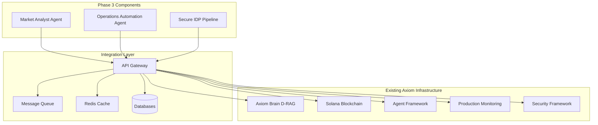
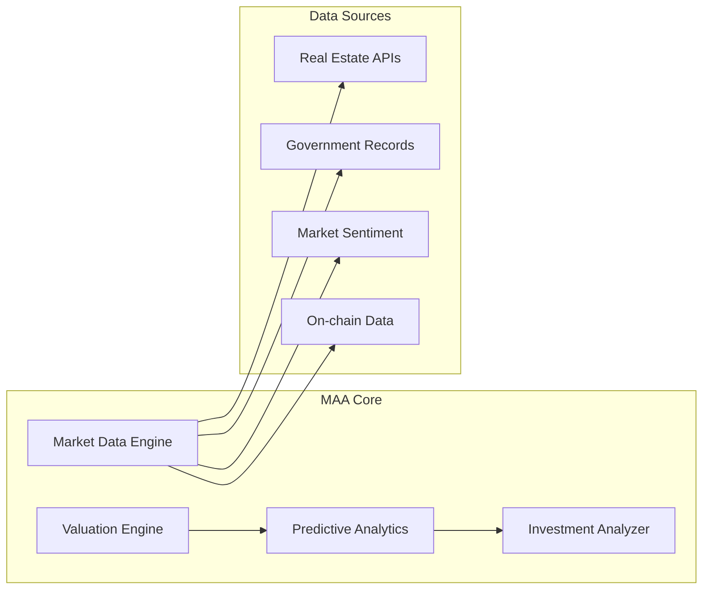
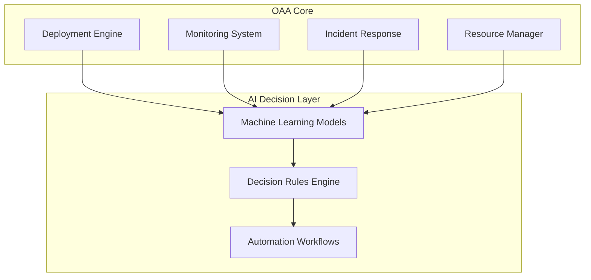
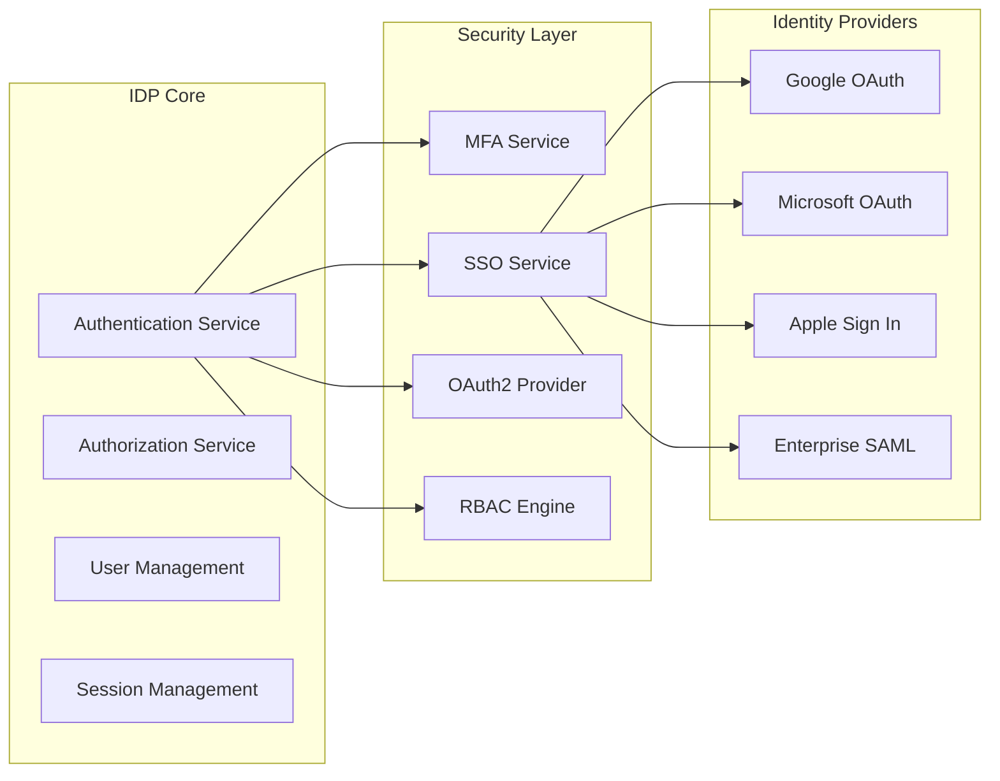
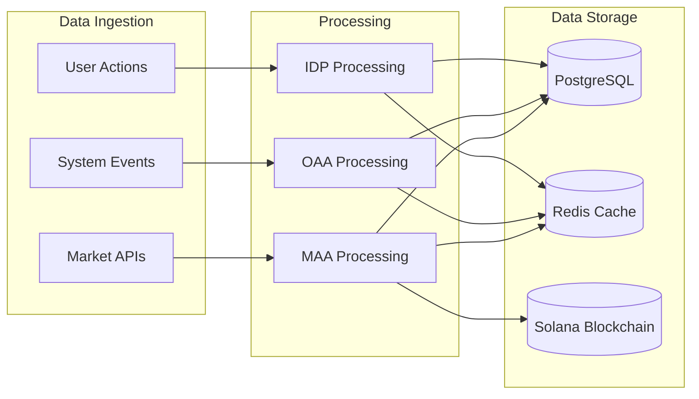

# Phase 3: Intelligence & Ops Architecture Plan

## Executive Summary

Phase 3 introduces three critical components to enhance Axiom's intelligence and operational capabilities:
- **Market Analyst Agent (MAA)** - MENA real estate market analysis with property valuation
- **Operations Automation Agent (OAA)** - AI-driven deployment, monitoring, and incident response
- **Secure IDP Pipeline** - Unified authentication with SSO, MFA, and OAuth2 integration

## System Architecture Overview

## Component 1: Market Analyst Agent (MAA)

### Purpose
Specialized AI agent for MENA real estate market analysis, property valuation, and investment insights.

### Core Capabilities
- **Market Data Aggregation**: Real-time property listings, pricing trends, market sentiment
- **Property Valuation**: AI-powered valuation using comparable sales, location analysis, and market trends
- **Investment Analysis**: ROI calculations, risk assessment, portfolio optimization
- **Regional Intelligence**: GCC market dynamics, regulatory compliance, cultural factors
- **Predictive Analytics**: Price forecasting, market trend prediction, opportunity identification

### Technical Architecture

### Integration Points
- **Axiom Brain**: D-RAG routing for complex analysis queries
- **Solana Blockchain**: On-chain property records and tokenized assets
- **Agent Framework**: Superpowers for market analysis capabilities
- **Tool Library**: Market oracle and sentiment analysis tools

## Component 2: Operations Automation Agent (OAA)

### Purpose
AI-driven automation platform for deployment operations, monitoring, and incident response.

### Core Capabilities
- **Deployment Automation**: Blue-green, canary, and rolling deployments
- **Intelligent Monitoring**: Anomaly detection, performance optimization, predictive alerts
- **Incident Response**: Automated triage, root cause analysis, resolution workflows
- **Resource Management**: Auto-scaling, cost optimization, capacity planning
- **Compliance Enforcement**: Security checks, policy validation, audit trails

### Technical Architecture

### Integration Points
- **Deployment Manager**: Existing blue-green deployment infrastructure
- **Production Monitor**: Real-time system health and metrics
- **Security Framework**: Compliance checks and threat detection
- **Axiom Brain**: Complex decision routing and analysis

## Component 3: Secure IDP Pipeline

### Purpose
Unified authentication and authorization system with enterprise-grade security features.

### Core Capabilities
- **Single Sign-On (SSO)**: Centralized identity management across all Axiom services
- **Multi-Factor Authentication (MFA)**: Biometric, TOTP, and hardware token support
- **OAuth2 Integration**: Third-party identity provider connectivity
- **Role-Based Access Control**: Granular permissions with dynamic policies
- **Identity Federation**: Cross-platform identity synchronization
- **Audit & Compliance**: Comprehensive logging and regulatory compliance

### Technical Architecture

### Integration Points
- **Agent Security Framework**: Existing RBAC and permission systems
- **Axiom Brain**: Identity-aware routing and personalization
- **All Agent Services**: Unified authentication across all components
- **External Services**: OAuth2 integration for third-party access

## Implementation Strategy

### Phase 3.1: Foundation (Weeks 1-2)
1. **Infrastructure Setup**
   - Create dedicated databases for each component
   - Set up Redis caching layer
   - Configure message queues for inter-component communication
   - Establish monitoring and logging infrastructure

2. **Core Services Development**
   - Implement MAA market analysis algorithms
   - Build OAA automation workflows
   - Create IDP authentication and authorization services
   - Develop API endpoints and communication protocols

### Phase 3.2: Integration (Weeks 3-4)
1. **Axiom Brain Integration**
   - Connect MAA to D-RAG routing system
   - Integrate OAA with existing deployment manager
   - Connect IDP with agent security framework
   - Implement unified API gateway

2. **Blockchain Integration**
   - Connect MAA to Solana for on-chain property data
   - Implement tokenized asset tracking
   - Create smart contract interfaces for property records

3. **Agent Framework Integration**
   - Enhance agent superpowers for market analysis
   - Create specialized tools for operations automation
   - Implement identity-aware agent capabilities
   - Build collaborative intelligence sharing

### Phase 3.3: Advanced Features (Weeks 5-6)
1. **AI Enhancement**
   - Implement machine learning models for market prediction
   - Create intelligent incident response algorithms
   - Build adaptive authentication systems
   - Develop predictive maintenance capabilities

2. **Security & Compliance**
   - Implement comprehensive security monitoring
   - Create automated compliance checking
   - Build audit trail systems
   - Develop threat detection capabilities

3. **Performance Optimization**
   - Implement caching strategies
   - Optimize database queries
   - Create performance monitoring dashboards
   - Build auto-scaling capabilities

## Technology Stack

### Backend Services
- **Node.js/TypeScript**: Primary development framework
- **Python**: Machine learning and data analysis components
- **PostgreSQL**: Primary database for structured data
- **Redis**: Caching and session management
- **RabbitMQ**: Message queuing and event streaming

### AI/ML Components
- **TensorFlow.js**: Market prediction models
- **scikit-learn**: Property valuation algorithms
- **LangChain**: Agent reasoning and tool integration
- **OpenAI API**: Complex analysis and decision making

### Security & Identity
- **JWT**: Token-based authentication
- **OAuth2**: Third-party identity integration
- **TOTP**: Time-based one-time passwords
- **WebAuthn**: Hardware-based authentication
- **RBAC**: Role-based access control

### Infrastructure
- **Docker**: Containerization for all services
- **Kubernetes**: Orchestration and scaling
- **Cloudflare Workers**: Edge computing and API gateway
- **Vercel**: Frontend deployment and CDN

## Data Architecture

### Data Models
- **Market Data**: Property listings, pricing trends, market sentiment
- **User Identity**: Authentication tokens, roles, permissions
- **Operational Data**: Deployment logs, incidents, performance metrics
- **Analytics Data**: User behavior, system performance, business insights

### Data Flow

## Security Considerations

### Authentication & Authorization
- **Zero Trust Architecture**: Verify every request regardless of source
- **Principle of Least Privilege**: Minimum necessary permissions only
- **Multi-Layer Security**: Defense in depth across all components
- **Audit Trail**: Comprehensive logging of all security events

### Data Protection
- **Encryption at Rest**: AES-256 for all stored data
- **Encryption in Transit**: TLS 1.3 for all communications
- **Data Anonymization**: PII protection and privacy compliance
- **Key Management**: Secure key rotation and storage

### Compliance
- **GDPR Compliance**: Data protection for EU users
- **SOC 2**: Security controls and reporting
- **ISO 27001**: Information security management
- **Regional Regulations**: MENA-specific compliance requirements

## Performance Requirements

### Response Times
- **API Response**: < 200ms for 95th percentile
- **Database Queries**: < 100ms for optimized queries
- **Market Analysis**: < 5 seconds for complex valuations
- **Authentication**: < 500ms for identity verification

### Scalability
- **Concurrent Users**: 10,000+ simultaneous users
- **Market Data**: 1M+ property records
- **Transaction Volume**: 1,000+ transactions/second
- **Storage**: Petabyte-scale data retention

### Availability
- **Uptime Target**: 99.9% availability
- **Recovery Time**: < 5 minutes for critical incidents
- **Data Backup**: Real-time replication with point-in-time recovery
- **Disaster Recovery**: Multi-region failover capability

## Monitoring & Observability

### Metrics Collection
- **Business Metrics**: Market accuracy, user engagement, transaction success
- **Technical Metrics**: Response times, error rates, resource utilization
- **Security Metrics**: Authentication attempts, threat detection, compliance status
- **Operational Metrics**: Deployment success, incident resolution, automation efficiency

### Alerting Strategy
- **Real-time Alerts**: Immediate notification for critical issues
- **Trend Analysis**: Proactive identification of emerging issues
- **Escalation Paths**: Clear escalation procedures for different severity levels
- **Automated Response**: AI-driven incident resolution workflows

### Dashboards
- **Executive Dashboard**: High-level business and system health overview
- **Operations Dashboard**: Detailed technical metrics and controls
- **Security Dashboard**: Threat landscape and compliance status
- **Market Dashboard**: Real-time market analysis and insights

## Deployment Strategy

### Environment Strategy
- **Development**: Local development with hot reloading
- **Staging**: Production-like environment for testing
- **Production**: Blue-green deployment with zero downtime
- **Disaster Recovery**: Multi-region backup and failover

### CI/CD Pipeline
- **Automated Testing**: Unit, integration, and end-to-end tests
- **Security Scanning**: Automated vulnerability assessment
- **Performance Testing**: Load testing and optimization
- **Compliance Checking**: Automated policy validation
- **Rollback Capability**: Instant rollback on deployment failure

### Infrastructure as Code
- **Terraform**: Infrastructure provisioning and management
- **Docker Compose**: Local development environment
- **Kubernetes Manifests**: Container orchestration
- **Helm Charts**: Package management for Kubernetes
- **Ansible**: Configuration management and deployment

## Success Criteria

### Functional Requirements
- [ ] All three components fully implemented and integrated
- [ ] Market analysis accuracy > 95% for test datasets
- [ ] Operations automation reduces manual intervention by 80%
- [ ] Identity system supports 10,000+ concurrent users
- [ ] End-to-end workflows tested and validated

### Performance Requirements
- [ ] All response times meet performance targets
- [ ] System handles target scalability requirements
- [ ] 99.9% uptime achieved in production
- [ ] Resource utilization optimized under target thresholds

### Security Requirements
- [ ] Zero-trust architecture implemented
- [ ] All data encrypted at rest and in transit
- [ ] Comprehensive audit trails maintained
- [ ] Compliance with GDPR, SOC 2, ISO 27001
- [ ] Third-party security audit passed

### Integration Requirements
- [ ] Seamless integration with existing Axiom Brain
- [ ] Full compatibility with Solana blockchain
- [ ] Enhanced agent superpowers framework
- [ ] Unified API gateway for all services
- [ ] Comprehensive monitoring and alerting

## Next Steps

1. **Immediate Actions** (Week 1)
   - Set up development environments and infrastructure
   - Begin core service development
   - Establish data models and schemas

2. **Short-term Goals** (Weeks 2-4)
   - Complete core component implementation
   - Begin integration with existing systems
   - Implement basic security measures

3. **Medium-term Objectives** (Weeks 5-8)
   - Full system integration and testing
   - Performance optimization and scaling
   - Advanced security and compliance features

4. **Long-term Vision** (Months 3-6)
   - AI model training and optimization
   - Market expansion and additional data sources
   - Advanced automation and intelligence features

---

*This plan provides a comprehensive roadmap for implementing Phase 3: Intelligence & Ops components with focus on MENA real estate market analysis, operations automation, and secure identity management.*