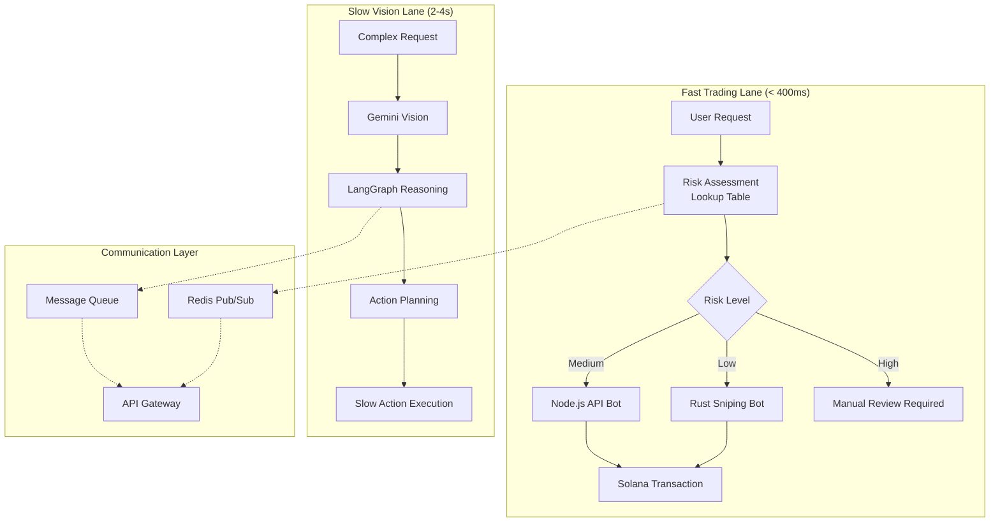

# AxiomID Strategic Research Plan
## Critical Pivot: From Complex Engineering to Market-Focused MVP

### 🎯 **Executive Summary**
Based on comprehensive internal review, we're pivoting from over-engineering to a market-focused approach. The $0.99/month price point is our killer feature - NOT the technical complexity. This research plan addresses the 5 critical areas that will determine our success or failure.

---

## 🚨 **CRITICAL RESEARCH PHASES (Priority Order)**

### **Phase 1: Turnkey MPC Cost Analysis** 
**Timeline: 1-2 days | Critical for business model viability**

**Research Questions:**
- Can MPC be economically viable at $0.99/month subscription?
- What are the per-transaction costs vs revenue?
- Is there a "Master MPC Wallet" approach with derived addresses?

**Target Research:**
- "Solana HD Wallet derivation for SaaS"
- "Turnkey sub-organization pricing model" 
- "MPC wallet cost per user analysis"
- "Solana SaaS wallet architecture patterns"

**Expected Outcome:** Yes/No decision on MPC viability + recommended architecture

---

### **Phase 2: Opal Export Capabilities**
**Timeline: 1 day | Critical for UI/UX strategy**

**Research Questions:**
- Can Opal reliably generate structured AIX JSON?
- What's the technical limitation preventing Opal from holding private keys?
- How to make Opal export clean JSON without LLM hallucination?

**Target Research:**
- "Google Opal export structured data"
- "No-code to JSON schema workflow"
- "Opal API limitations and security model"
- "Structured Output from No-Code tools"

**Expected Outcome:** Opal as frontend generator only vs complete Opal rejection

---

### **Phase 3: Dual-Lane Architecture**
**Timeline: 2 days | Critical for performance**

**Research Questions:**
- How to separate fast trading (Rust/Node) from slow vision/chat (Python/LLM)?
- What's the best communication pattern between lanes?
- Can we achieve <400ms for sniping while maintaining vision capabilities?

**Target Research:**
- "Redis Pub/Sub for microservices low latency"
- "Rust Node.js IPC communication"
- "Message queue architecture for trading bots"
- "Dual-lane architecture patterns"

**Expected Outcome:** Technical blueprint for latency separation

---

### **Phase 4: Simplified Mizan Logic**
**Timeline: 1 day | Critical for MVP complexity**

**Research Questions:**
- How to convert "Balance Logic" into simple lookup tables?
- What's the minimal viable risk assessment algorithm?
- Can we achieve differentiation with simple rules vs neural networks?

**Target Research:**
- "Risk assessment lookup tables"
- "Simple trading risk algorithms"
- "Risk slider to parameter mapping"
- "Trading bot risk management basics"

**Expected Outcome:** Simple rule-based system specification

---

### **Phase 5: Dependency Consolidation**
**Timeline: 1 day | Critical for stability**

**Research Questions:**
- Which dependencies can be eliminated or replaced with Vercel SDK?
- What's causing the Google Provider errors we're seeing?
- How to create a unified wrapper for all external services?

**Target Research:**
- "Vercel SDK unified wrapper"
- "Google provider error patterns"
- "Minimal dependency stack for AI agents"
- "Next.js ecosystem consolidation"

**Expected Outcome:** Reduced dependency list and stability improvements

---

## 📊 **DUAL-LANE ARCHITECTURE CONCEPT**

## 🎯 **SIMPLIFIED MIZAN LOOKUP TABLE**

| Risk Level | Slippage % | LLM Temperature | Max Position $ | Action Required |
|------------|------------|-----------------|----------------|-----------------|
| 1 (Low)    | 0.1%      | 0.1            | $100           | Auto-execute    |
| 2 (Low-Med)| 0.3%      | 0.3            | $250           | Auto-execute    |
| 3 (Medium) | 0.5%      | 0.5            | $500           | Auto-execute    |
| 4 (Med-High)| 1.0%     | 0.7            | $1000          | Human review    |
| 5 (High)   | 2.0%      | 0.9            | $5000          | Human approval  |

## 🔍 **SEARCH STRATEGY FOR EACH PHASE**

### Primary Sources:
- **Academic Papers:** arXiv, Google Scholar for MPC research
- **Technical Docs:** Solana docs, Vercel docs, Opal API docs
- **GitHub Repos:** Open source MPC implementations, trading bot architectures
- **Developer Forums:** Solana Discord, Vercel Discord, developer communities

### Search Terms by Priority:
1. **MPC:** "solana mpc wallet saas", "derived key architecture cost", "turnkey mpc pricing"
2. **Opal:** "opal export json schema", "no-code structured output", "opal security model"
3. **Architecture:** "redis pubsub trading", "microservices latency", "dual-lane architecture"
4. **Risk Logic:** "trading bot risk assessment", "risk slider parameters", "simple risk algorithms"
5. **Dependencies:** "vercel unified sdk", "ai agent dependency hell", "nextjs ecosystem consolidation"

## 📋 **DELIVERABLES EXPECTED**

### From Each Research Phase:
1. **Technical Feasibility Report** (1 page max)
2. **Cost-Benefit Analysis** (numbers, not speculation)
3. **Recommended Architecture** (specific implementation approach)
4. **Risk Assessment** (what could go wrong)
5. **Next Steps** (immediate implementation actions)

### Final Output:
- **Go/No-Go Decision** on each major architectural choice
- **MVP Scope Definition** (what we build vs what we postpone)
- **Implementation Timeline** (realistic, not wishful thinking)
- **Resource Requirements** (developers, budget, infrastructure)

## ⚡ **SUCCESS CRITERIA**

### Phase 1 (MPC) Success:
- [ ] Clear cost model showing $0.99/month viability
- [ ] Technical architecture for secure wallet management
- [ ] Risk mitigation for wallet drainage scenarios

### Phase 2 (Opal) Success:
- [ ] Confirmed Opal capability for AIX JSON generation
- [ ] Security boundary definition (Opal frontend only)
- [ ] Alternative plan if Opal limitations are too restrictive

### Phase 3 (Dual-Lane) Success:
- [ ] <400ms latency target achieved architecturally
- [ ] Communication pattern between lanes defined
- [ ] Scalability plan for high-volume trading

### Phase 4 (Mizan) Success:
- [ ] Simple lookup table replaces complex RL
- [ ] Differentiation maintained with rule-based approach
- [ ] Easy to implement and debug

### Phase 5 (Dependencies) Success:
- [ ] Reduced dependency count by 50%
- [ ] Unified wrapper strategy defined
- [ ] Stability improvements quantified

## 🚀 **IMMEDIATE NEXT STEPS**

1. **Assign Research Leads:** One person per phase
2. **Set Daily Standups:** Track progress against timeline
3. **Create Decision Matrix:** Quantitative comparison of options
4. **Plan UI Merge:** Prepare for post-research implementation
5. **Resource Allocation:** Ensure research doesn't block development

---

## 🎯 **THE BIG PICTURE**

This research phase will determine whether we:
- **Proceed with MPC** vs traditional wallet approach
- **Use Opal as intended** vs build custom frontend
- **Implement dual architecture** vs single-lane approach
- **Ship simplified Mizan** vs over-engineered solution
- **Maintain lean dependencies** vs current complex stack

**Timeline:** Complete all research in 5 days maximum
**Success:** Clear Go/No-Go decisions + implementation roadmap
**Failure:** Continuing with current over-engineered approach

---

*This document serves as our strategic compass during the critical research phase. Every decision should be evaluated against the $0.99/month market reality.*