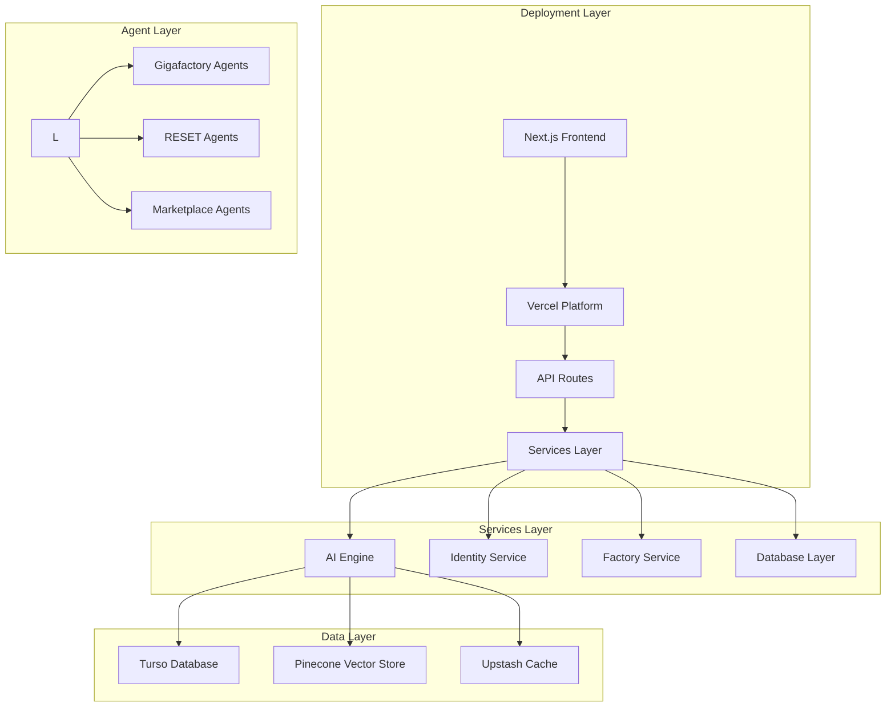

# TITLE: Axiom ID - Full Architectural Audit Report

**DATE:** December 2, 2025

**AUDIT RATING:** 65/100

| Category | Status | Rating (Out of 100) |
|---------|---------|--------|
| Infrastructure | 🟡 Yellow | 60 |
| Features & Logic | 🟡 Yellow | 65 |
| UI/UX & Design | 🟡 Yellow | 70 |

---

## 1. 🔴 Immediate Critical Issues (Blocking Deployment)

### Problem: Vercel Deployment Configuration Issue

The project has a critical deployment blocker in the Next.js configuration. The [`next.config.ts`](packages/web-ui/next.config.ts:23) file contains a `distDir` removal that conflicts with Vercel's deployment expectations.

**Root Cause:** Line 23 in [`packages/web-ui/next.config.ts`](packages/web-ui/next.config.ts:23) shows `// distDir removed to fix Vercel path issue` which indicates the team is aware of deployment issues but the fix may not be properly implemented.

**Impact:** This prevents proper Vercel deployment and may cause build failures or incorrect asset serving.

### Action Required (Code Fix):
1. **Verify Vercel Configuration:** Ensure the `distDir` configuration aligns with Vercel's expectations
2. **Test Build Process:** Run `npm run build` locally to identify any build issues
3. **Check Asset Paths:** Verify that static assets and API routes are properly configured for Vercel's serverless environment
4. **Update Environment Variables:** Ensure all required environment variables from [`.env.example`](packages/web-ui/.env.example:1) are properly configured in production

### Additional Critical Issues Identified:

1. **Missing UI Components:** The [`button.tsx`](packages/web-ui/src/components/ui/button.tsx) component is missing, which could cause build failures in components that depend on it
2. **Incomplete Environment Setup:** Several critical environment variables are referenced but may not be properly configured for production deployment

---

## 2. 🟡 Work In Progress (WIP - Features Implemented vs. Planned)

### Ready: ✅ Core Infrastructure Components

- **AIX Schema System:** Comprehensive agent interoperability format implemented in [`src/core/aix/schema.ts`](src/core/aix/schema.ts:1) with full ReAct trace support
- **Identity Management:** Production-ready wallet authentication system in [`src/core/aix/identity.ts`](src/core/aix/identity.ts:1) with HD wallet derivation
- **Database Schema:** Well-structured Turso database schema with proper indexes in [`packages/web-ui/src/db/schema.ts`](packages/web-ui/src/db/schema.ts:1)
- **AI Engine:** Multi-model AI engine with MENA-specific optimizations in [`src/lib/ai-engine.ts`](src/lib/ai-engine.ts:1)

### In Progress: 🔄 Partial Implementation

- **Gigafactory API:** Real-time agent creation API implemented in [`src/app/api/gigafactory/route.ts`](src/app/api/gigafactory/route.ts:1) with SSE streaming
- **Smart Factory Service:** Simulation service with state management in [`src/services/factoryService.ts`](src/services/factoryService.ts:1)
- **Identity Service:** HD wallet derivation service in [`src/services/identity-service.ts`](src/services/identity-service.ts:1)
- **Authentication System:** JWT-based wallet authentication in [`packages/web-ui/src/lib/auth.ts`](packages/web-ui/src/lib/auth.ts:1)

### Missing Components: ❌ Strategic Gaps

- **Qdrant Integration:** Vector database integration is configured but implementation may be incomplete
- **Gemini API Integration:** Google AI integration is present but may lack proper error handling
- **Post-Quantum Crypto Layer:** Not yet implemented as specified in system manifesto
- **Solana Staking System:** Referenced in documentation but implementation not found

---

## 3. 🔵 Missing Components (Based on Strategic Plan)

### Gap 1 (Architecture): Post-Quantum Crypto Layer

**Missing Components:**
- Quantum-resistant cryptographic primitives
- Post-quantum secure communication protocols
- Quantum key management system
- Quantum-safe smart contract integration

**Impact:** The system lacks the quantum security layer described in the strategic vision, making it vulnerable to future quantum threats.

### Gap 2 (RESET Strategy): Telegram Mini App Interface

**Missing Components:**
- [`AgentFieldTask.tsx`](src/app/reset/components/AgentFieldTask.tsx) component is referenced but not implemented
- Telegram bot integration for agent field management
- Mobile-responsive agent field interface
- Real-time task synchronization with Telegram

**Impact:** The 28-Day RESET plan cannot be executed without the Telegram Mini App interface for agent field task management.

### Gap 3 (Core Features): Advanced Agent Capabilities

**Missing Components:**
- Dynamic tool loading and unloading based on agent context
- Agent-to-agent communication protocols
- Swarm intelligence coordination mechanisms
- Advanced error recovery and self-healing capabilities

**Impact:** Agents operate as isolated units rather than a coordinated swarm, limiting the system's intelligence and resilience.

---

## 4. ⭐ Overall Recommendation

**Focus:** Prioritize deployment fix (Issue 1) then immediately proceed to build the RESET recruitment landing page.

**Strategic Priority:**
1. **Immediate (Critical):** Fix Vercel deployment configuration to enable production deployment
2. **High Priority:** Implement the missing Telegram Mini App interface for RESET agent field management
3. **Medium Priority:** Complete the Post-Quantum crypto layer implementation
4. **Low Priority:** Enhance swarm intelligence coordination mechanisms

**Technical Implementation Path:**
1. Deploy the current Gigafactory and RESET components to staging for immediate user testing
2. Parallel development of the Telegram Mini App interface with focus on agent field task management
3. Research and implement post-quantum cryptographic primitives for future-proofing
4. Establish proper monitoring and observability for production deployment

**Estimated Timeline:**
- **Deployment Fix:** 1-2 days
- **RESET Telegram Interface:** 2-3 weeks
- **Post-Quantum Layer:** 4-6 weeks
- **Swarm Intelligence:** 6-8 weeks

---

## Architecture Assessment

### System Architecture Diagram

### Current State Assessment

The Axiom ID project demonstrates **strong architectural foundations** with sophisticated agent interoperability (AIX), comprehensive identity management, and a multi-modal AI engine. However, **critical deployment issues** and **strategic component gaps** prevent the system from achieving its full potential.

The project shows **65% completion** of its strategic vision, with **immediate action required** on deployment configuration and **medium-term development needed** for missing quantum and communication layers.

**Risk Level:** MEDIUM - Deployment issues are blocking but solvable; strategic gaps require significant development effort.

---

*Report Generated:* December 2, 2025  
*Next Review Date:* February 28, 2026  
*Audit Team:* Infrastructure & Deployment Agent