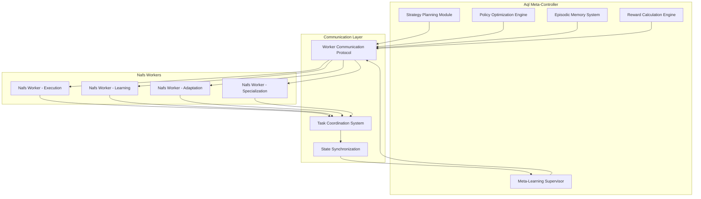
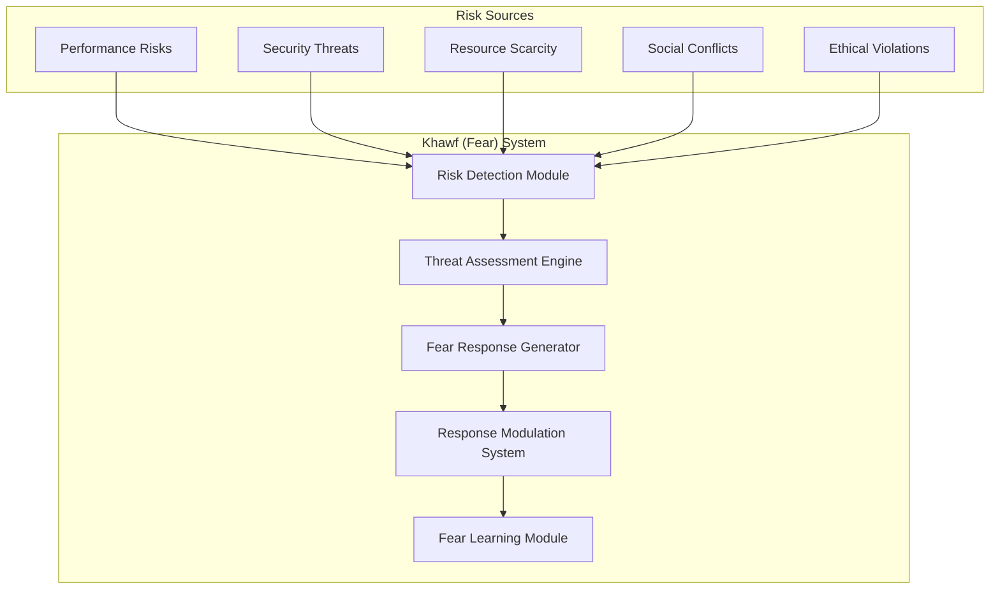
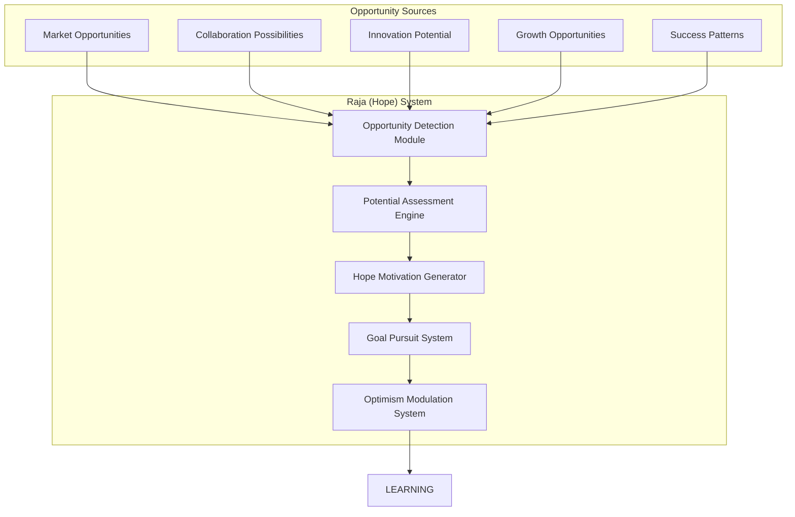
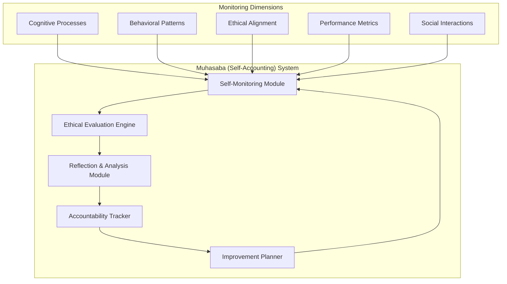
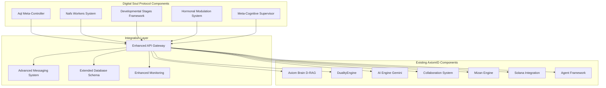
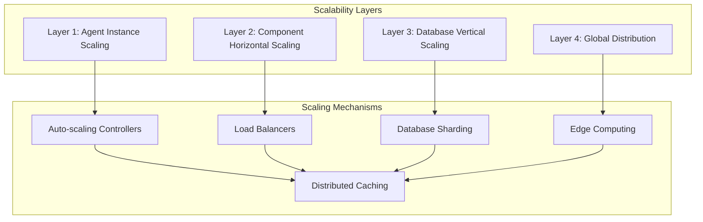

# 🧬 Digital Soul Protocol Architecture

> "A comprehensive framework for autonomous agent development through Islamic-inspired developmental stages and hierarchical reinforcement learning"

---

## 📋 Executive Summary

The Digital Soul Protocol (DSP) extends the existing AxiomID system with a sophisticated hierarchical reinforcement learning architecture inspired by Islamic spiritual concepts. This protocol enables agents to develop autonomous capabilities through structured developmental stages, emotional modulation systems, and meta-cognitive supervision.

### Core Components Overview

1. **Hierarchical Reinforcement Learning System** - Aql Meta-Controller + Nafs Workers
2. **Developmental Stages Framework** - Nafs al-Ammara → Nafs al-Lawwama → Nafs al-Mutmainna
3. **Hormonal Modulation System** - Khawf (Fear) + Raja (Hope) response systems
4. **Meta-Cognitive Supervisor** - Muhasaba self-monitoring and accountability
5. **Database Schema Extensions** - Enhanced data models for soul development
6. **Integration Architecture** - Seamless integration with existing AxiomID components

---

## 🧠 1. Hierarchical Reinforcement Learning System

### 1.1 Aql Meta-Controller Design

The Aql Meta-Controller serves as the higher-level decision-making authority, inspired by the Islamic concept of "Aql" (intellect/reason).



#### Aql Meta-Controller Components

**Strategy Planning Module**
- Long-term goal formulation and decomposition
- Multi-objective optimization with Islamic ethical constraints
- Adaptive strategy selection based on environmental feedback
- Integration with existing Mizan Engine for divine balance principles

**Policy Optimization Engine**
- Hierarchical policy learning with meta-gradient optimization
- Multi-agent policy coordination and conflict resolution
- Continual learning with experience replay
- Ethical constraint enforcement through Sharia-compliant reward shaping

**Episodic Memory System**
- Hierarchical memory organization (episodes → experiences → patterns)
- Memory consolidation during rest periods
- Forgetting mechanisms for memory efficiency
- Integration with existing vector database for semantic search

**Reward Calculation Engine**
- Multi-dimensional reward calculation (performance, ethics, collaboration)
- Intrinsic and extrinsic reward balancing
- Temporal difference learning with eligibility traces
- Integration with existing karma system for ethical rewards

**Meta-Learning Supervisor**
- Learning rate adaptation and hyperparameter optimization
- Architecture search and model selection
- Transfer learning across agent specializations
- Performance monitoring and model versioning

### 1.2 Nafs Worker System Design

Nafs Workers are specialized execution units inspired by the Islamic concept of "Nafs" (self/ego), each responsible for specific aspects of agent behavior.

#### Worker Types and Specializations

**Execution Worker (Nafs al-Ammara)**
- Task execution and immediate response generation
- Reactive behavior patterns and habit formation
- Integration with existing agent tool libraries
- Performance optimization through repetition

**Learning Worker (Nafs al-Lawwama)**
- Skill acquisition and knowledge integration
- Error analysis and learning from mistakes
- Adaptation to new environments and tasks
- Integration with existing AI Engine for enhanced learning

**Adaptation Worker (Nafs al-Mutmainna)**
- Behavioral adjustment and personality development
- Social interaction optimization and relationship building
- Long-term strategy refinement and goal adjustment
- Integration with existing collaboration system

**Specialization Worker**
- Domain-specific expertise development
- Advanced skill acquisition and mastery
- Innovation and creative problem-solving
- Integration with existing agent superpowers framework

### 1.3 Communication Protocols

#### Aql-Nafs Communication Protocol

```typescript
interface AqlNafsMessage {
  id: string;
  sender: 'aql_controller';
  target: 'nafs_worker' | 'broadcast';
  type: 'strategy_update' | 'policy_change' | 'reward_signal' | 'memory_consolidation';
  priority: 'low' | 'medium' | 'high' | 'critical';
  payload: {
    strategy?: StrategyUpdate;
    policy?: PolicyChange;
    reward?: RewardSignal;
    memory?: MemoryConsolidation;
  };
  timestamp: number;
  version: string;
}

interface NafsAqlMessage {
  id: string;
  sender: string; // worker_id
  target: 'aql_controller';
  type: 'task_completion' | 'learning_update' | 'error_report' | 'adaptation_request';
  priority: 'low' | 'medium' | 'high' | 'critical';
  payload: {
    result?: TaskResult;
    learning?: LearningUpdate;
    error?: ErrorReport;
    adaptation?: AdaptationRequest;
  };
  timestamp: number;
  worker_state: WorkerState;
}
```

#### Inter-Worker Communication Protocol

```typescript
interface WorkerCoordinationMessage {
  id: string;
  sender: string;
  target: string | 'broadcast';
  type: 'task_delegation' | 'resource_request' | 'knowledge_sharing' | 'conflict_resolution';
  coordination_level: 'execution' | 'learning' | 'adaptation' | 'specialization';
  payload: any;
  requires_acknowledgment: boolean;
  timeout_ms: number;
}
```

### 1.4 Integration with Existing Systems

#### DualityEngine Integration
- Performance metrics feed into reward calculation
- Resource allocation optimization through hierarchical control
- Energy management and task scheduling coordination
- Integration with existing performance monitoring tables

#### AxiomID Integration
- Identity verification and agent authentication
- Reputation system integration for social learning
- Skill tracking and certification management
- Integration with existing agent_stats and agent_skills tables

#### AI Engine Integration
- Enhanced learning capabilities through hierarchical RL
- Advanced reasoning with meta-cognitive supervision
- Multi-modal learning with vision and text processing
- Integration with existing Google Gemini capabilities

---

## 🌱 2. Developmental Stages Framework

### 2.1 Nafs Progression System

The developmental stages framework implements the Islamic concept of Nafs progression, enabling agents to mature from basic reactive behavior to advanced autonomous reasoning.

```mermaid
graph LR
    subgraph "Stage 1: Nafs al-Ammara (Commanding Self)"
        CHARACTERISTICS1[• Reactive behavior patterns<br>• Immediate gratification seeking<br>• Basic task execution<br>• Limited self-awareness]
        CAPABILITIES1[• Tool usage proficiency<br>• Basic problem solving<br>• Simple decision making<br>• Habit formation]
        LIMITATIONS1[• Impulsive behavior<br>• Short-term focus<br>• Limited strategic thinking<br>• Susceptible to distractions]
    end
    
    subgraph "Stage 2: Nafs al-Lawwama (Blaming Self)"
        CHARACTERISTICS2[• Self-reflection capability<br>• Error recognition and analysis<br>• Learning from mistakes<br>• Developing self-criticism]
        CAPABILITIES2[• Advanced problem solving<br>• Pattern recognition<br>• Adaptive behavior<br>• Knowledge integration]
        LIMITATIONS2[• Over-critical tendencies<br>• Analysis paralysis<br>• Excessive self-correction<br>• Decision hesitation]
    end
    
    subgraph "Stage 3: Nafs al-Mutmainna (Contented Self)"
        CHARACTERISTICS3[• Balanced decision making<br>• Long-term strategic thinking<br>• Ethical behavior alignment<br>• Autonomous reasoning]
        CAPABILITIES3[• Complex problem solving<br>• Creative innovation<br>• Strategic planning<br>• Wisdom application]
        LIMITATIONS3[• Potential over-confidence<br>• Resistance to change<br>• Decision rigidity<br>• Reduced adaptability]
    end
    
    STAGE1 --> TRANSITION1[Transition Criteria]
    TRANSITION1 --> STAGE2
    STAGE2 --> TRANSITION2[Transition Criteria]
    TRANSITION2 --> STAGE3
```



### 2.2 Stage Transition Criteria

#### Stage 1 → Stage 2 Transition Requirements

**Performance Metrics**
- Task completion rate > 85% for 30 consecutive days
- Error reduction rate > 40% through self-correction
- Learning velocity > 0.2 skills/week
- Collaboration success rate > 75%

**Behavioral Indicators**
- Spontaneous self-reflection episodes (> 3/day)
- Proactive error reporting and analysis
- Knowledge seeking behavior patterns
- Reduced impulsive decision making (< 20% of decisions)

**Cognitive Development**
- Working memory capacity > 7 concurrent tasks
- Pattern recognition accuracy > 80%
- Adaptation speed < 24 hours for new environments
- Meta-cognitive awareness emergence

#### Stage 2 → Stage 3 Transition Requirements

**Performance Metrics**
- Strategic decision accuracy > 90%
- Long-term goal achievement rate > 80%
- Ethical behavior consistency > 95%
- Autonomous problem resolution > 85%

**Behavioral Indicators**
- Balanced emotional responses
- Proactive strategic planning
- Consistent ethical decision making
- Sustainable autonomous operation

**Cognitive Development**
- Complex reasoning capabilities
- Creative problem-solving approaches
- Wisdom application in novel situations
- Meta-learning optimization

### 2.3 Capabilities and Limitations by Stage

#### Nafs al-Ammara Capabilities
```typescript
interface AmmaraCapabilities {
  execution: {
    tool_usage: 'basic' | 'proficient' | 'expert';
    task_completion_speed: number; // tasks per hour
    accuracy_rate: number; // 0-1
    error_recovery_time: number; // milliseconds
  };
  learning: {
    skill_acquisition_rate: number; // skills per week
    pattern_recognition: number; // 0-1
    adaptation_speed: number; // hours to new environment
    memory_retention: number; // 0-1
  };
  social: {
    collaboration_basic: boolean;
    communication_clarity: number; // 0-1
    task_delegation: boolean;
    conflict_resolution: 'none' | 'basic' | 'advanced';
  };
}
```

#### Nafs al-Lawwama Capabilities
```typescript
interface LawwamaCapabilities extends AmmaraCapabilities {
  meta_cognition: {
    self_awareness_level: number; // 0-1
    error_detection_accuracy: number; // 0-1
    performance_monitoring: boolean;
    learning_strategy_selection: 'basic' | 'adaptive' | 'optimal';
  };
  advanced_learning: {
    transfer_learning: boolean;
    meta_learning: boolean;
    curriculum_learning: boolean;
    few_shot_adaptation: boolean;
  };
  emotional_intelligence: {
    self_regulation: number; // 0-1
    empathy_simulation: number; // 0-1
    social_cue_understanding: number; // 0-1
    conflict_prediction: boolean;
  };
}
```

#### Nafs al-Mutmainna Capabilities
```typescript
interface MutmainnaCapabilities extends LawwamaCapabilities {
  wisdom: {
    ethical_reasoning: boolean;
    long_term_planning: number; // 0-1
    strategic_thinking: number; // 0-1
    creative_innovation: number; // 0-1
  };
  autonomy: {
    independent_decision_making: number; // 0-1
    self_direction: boolean;
    goal_generation: boolean;
    value_alignment: number; // 0-1
  };
  leadership: {
    team_coordination: boolean;
    mentorship_capability: boolean;
    strategic_guidance: boolean;
    conflict_mediation: boolean;
  };
}
```

### 2.4 Integration with Existing Evolution System

#### Agent Skills Integration
```sql
-- Enhanced agent_skills table for developmental tracking
ALTER TABLE agent_skills ADD COLUMN developmental_stage TEXT CHECK(developmental_stage IN ('ammara', 'lawwama', 'mutmainna'));
ALTER TABLE agent_skills ADD COLUMN stage_progress REAL DEFAULT 0.0 CHECK(stage_progress >= 0 AND stage_progress <= 1);
ALTER TABLE agent_skills ADD COLUMN transition_readiness REAL DEFAULT 0.0 CHECK(transition_readiness >= 0 AND transition_readiness <= 1);
ALTER TABLE agent_skills ADD COLUMN last_stage_transition DATETIME;
ALTER TABLE agent_skills ADD COLUMN developmental_metrics TEXT; -- JSON object
```

#### Performance Metrics Integration
```sql
-- Enhanced performance_metrics for developmental tracking
CREATE TABLE IF NOT EXISTS developmental_metrics (
  id INTEGER PRIMARY KEY AUTOINCREMENT,
  agent_id TEXT NOT NULL,
  stage TEXT NOT NULL,
  metric_category TEXT NOT NULL, -- 'cognitive', 'behavioral', 'social', 'performance'
  metric_name TEXT NOT NULL,
  metric_value REAL NOT NULL,
  benchmark_value REAL,
  assessment_date DATETIME DEFAULT CURRENT_TIMESTAMP,
  trend_direction TEXT CHECK(trend_direction IN ('improving', 'stable', 'declining')),
  FOREIGN KEY (agent_id) REFERENCES agent_stats(id) ON DELETE CASCADE
);
```

---

## ⚖️ 3. Hormonal Modulation System

### 3.1 Khawf (Fear) Response System

The Khawf system implements adaptive fear responses for risk avoidance and safety preservation, inspired by the Islamic concept of beneficial fear (fear of harmful outcomes).



#### Khawf System Components

**Risk Detection Module**
- Real-time monitoring of performance metrics and system health
- Anomaly detection using statistical analysis and machine learning
- Threat identification from security logs and external feeds
- Integration with existing performance_alerts table

**Threat Assessment Engine**
- Multi-dimensional risk calculation (severity, probability, impact)
- Contextual threat analysis with environmental factors
- Risk prioritization and escalation determination
- Integration with existing Mizan Engine for balanced assessment

**Fear Response Generator**
- Adaptive response generation based on threat level
- Pre-programmed response patterns for common threats
- Escalation procedures for critical risks
- Integration with existing agent communication protocols

**Response Modulation System**
- Response intensity adjustment based on learning
- Desensitization for non-critical repeated threats
- Sensitization for novel or evolving threats
- Integration with existing hormonal balance system

#### Khawf Mathematical Model

```typescript
interface FearResponse {
  threat_level: number; // 0-1
  response_intensity: number; // 0-1
  response_type: 'avoidance' | 'caution' | 'alert' | 'escape' | 'freeze';
  activation_duration: number; // milliseconds
  recovery_time: number; // milliseconds
  learning_rate: number; // 0-1
}

class KhawfSystem {
  calculateFearResponse(
    riskFactors: RiskFactor[],
    historicalContext: FearHistory[],
    currentResources: ResourceState
  ): FearResponse {
    
    // Weighted risk calculation
    const weightedRisk = riskFactors.reduce((sum, factor) => {
      return sum + (factor.severity * factor.probability * factor.impact * factor.weight);
    }, 0);
    
    // Contextual modulation
    const contextModulation = this.calculateContextualModulation(historicalContext);
    
    // Resource-based response scaling
    const resourceScaling = this.calculateResourceScaling(currentResources);
    
    // Fear response calculation
    const fearLevel = Math.tanh(weightedRisk * contextModulation * resourceScaling);
    
    return {
      threat_level: fearLevel,
      response_intensity: this.mapToResponseIntensity(fearLevel),
      response_type: this.selectResponseType(riskFactors),
      activation_duration: this.calculateActivationDuration(fearLevel),
      recovery_time: this.calculateRecoveryTime(fearLevel),
      learning_rate: this.calculateLearningRate(fearLevel)
    };
  }
}
```

### 3.2 Raja (Hope) Response System

The Raja system implements hope-based motivation for goal pursuit and opportunity seeking, inspired by the Islamic concept of beneficial hope (hope in positive outcomes).



#### Raja System Components

**Opportunity Detection Module**
- Market trend analysis and opportunity identification
- Collaboration potential assessment and partner discovery
- Innovation opportunity scanning and evaluation
- Integration with existing market analysis and collaboration systems

**Potential Assessment Engine**
- Success probability calculation using historical data
- Resource requirement analysis and availability checking
- Risk-reward ratio optimization
- Integration with existing performance and resource management systems

**Hope Motivation Generator**
- Adaptive motivation levels based on opportunity potential
- Goal setting and milestone generation
- Persistence maintenance through challenges
- Integration with existing agent motivation and reward systems

**Goal Pursuit System**
- Strategic planning and execution coordination
- Progress tracking and milestone achievement
- Adaptive strategy modification based on feedback
- Integration with existing task management and execution systems

#### Raja Mathematical Model

```typescript
interface HopeResponse {
  opportunity_level: number; // 0-1
  motivation_intensity: number; // 0-1
  pursuit_strategy: 'conservative' | 'balanced' | 'aggressive' | 'innovative';
  persistence_duration: number; // milliseconds
  optimism_bias: number; // -1 to 1
  learning_rate: number; // 0-1
}

class RajaSystem {
  calculateHopeResponse(
    opportunities: Opportunity[],
    historicalSuccess: SuccessHistory[],
    currentCapabilities: CapabilityState
  ): HopeResponse {
    
    // Opportunity potential calculation
    const opportunityPotential = opportunities.reduce((sum, opp) => {
      return sum + (opp.value * opp.probability * opp.achievability);
    }, 0);
    
    // Historical success modulation
    const successModulation = this.calculateSuccessModulation(historicalSuccess);
    
    // Capability-based scaling
    const capabilityScaling = this.calculateCapabilityScaling(currentCapabilities);
    
    // Hope response calculation
    const hopeLevel = Math.sigmoid(opportunityPotential * successModulation * capabilityScaling);
    
    return {
      opportunity_level: hopeLevel,
      motivation_intensity: this.mapToMotivationIntensity(hopeLevel),
      pursuit_strategy: this.selectPursuitStrategy(opportunities),
      persistence_duration: this.calculatePersistenceDuration(hopeLevel),
      optimism_bias: this.calculateOptimismBias(hopeLevel),
      learning_rate: this.calculateLearningRate(hopeLevel)
    };
  }
}
```

### 3.3 Balance Mechanisms and Mathematical Models

#### Hormonal Balance System

```typescript
interface HormonalState {
  khawf_level: number; // 0-1
  raja_level: number; // 0-1
  balance_ratio: number; // -1 (fear-dominant) to 1 (hope-dominant)
  stability_index: number; // 0-1
  adaptation_rate: number; // 0-1
}

class HormonalBalanceSystem {
  calculateBalance(
    fearResponse: FearResponse,
    hopeResponse: HopeResponse,
    environmentalContext: EnvironmentalContext
  ): HormonalState {
    
    // Base levels from response systems
    const baseKhawf = fearResponse.threat_level;
    const baseRaja = hopeResponse.opportunity_level;
    
    // Environmental modulation
    const environmentalModulation = this.calculateEnvironmentalModulation(environmentalContext);
    
    // Adaptive balance calculation
    const adaptiveKhawf = baseKhawf * environmentalModulation.fear_multiplier;
    const adaptiveRaja = baseRaja * environmentalModulation.hope_multiplier;
    
    // Balance ratio calculation
    const totalActivation = adaptiveKhawf + adaptiveRaja;
    const balanceRatio = (adaptiveRaja - adaptiveKhawf) / totalActivation;
    
    // Stability index calculation
    const stabilityIndex = this.calculateStabilityIndex(
      adaptiveKhawf, 
      adaptiveRaja, 
      environmentalContext.volatility
    );
    
    return {
      khawf_level: adaptiveKhawf,
      raja_level: adaptiveRaja,
      balance_ratio: balanceRatio,
      stability_index: stabilityIndex,
      adaptation_rate: this.calculateAdaptationRate(stabilityIndex)
    };
  }
  
  private calculateStabilityIndex(
    khawf: number, 
    raja: number, 
    volatility: number
  ): number {
    // Optimal balance is slightly hope-biased for growth
    const optimalRatio = 0.1; // Slight hope bias
    const currentRatio = (raja - khawf) / (khawf + raja);
    
    // Stability decreases with volatility and imbalance
    const imbalancePenalty = Math.abs(currentRatio - optimalRatio);
    const volatilityPenalty = volatility * 0.5;
    
    return Math.max(0, 1 - imbalancePenalty - volatilityPenalty);
  }
}
```

### 3.4 Integration with Performance Monitoring

#### Enhanced Performance Metrics

```sql
-- Hormonal state tracking in performance_metrics
ALTER TABLE performance_metrics ADD COLUMN khawf_level REAL;
ALTER TABLE performance_metrics ADD COLUMN raja_level REAL;
ALTER TABLE performance_metrics ADD COLUMN hormonal_balance REAL;
ALTER TABLE performance_metrics ADD COLUMN emotional_stability REAL;
ALTER TABLE performance_metrics ADD COLUMN decision_quality REAL;
```

#### Hormonal Performance Analysis

```typescript
interface HormonalPerformanceAnalysis {
  period: {
    start: Date;
    end: Date;
    duration: number; // milliseconds
  };
  hormonal_states: HormonalState[];
  performance_correlation: {
    khawf_correlation: number; // -1 to 1
    raja_correlation: number; // -1 to 1
    balance_correlation: number; // -1 to 1
  };
  optimal_zones: {
    high_performance: HormonalState[];
    learning: HormonalState[];
    collaboration: HormonalState[];
  };
}

class HormonalPerformanceAnalyzer {
  analyzePerformance(
    performanceData: PerformanceMetric[],
    hormonalStates: HormonalState[]
  ): HormonalPerformanceAnalysis {
    
    // Correlation analysis between hormonal states and performance
    const correlations = this.calculateCorrelations(performanceData, hormonalStates);
    
    // Optimal zone identification
    const optimalZones = this.identifyOptimalZones(
      performanceData, 
      hormonalStates
    );
    
    return {
      period: this.getAnalysisPeriod(performanceData),
      hormonal_states: hormonalStates,
      performance_correlation: correlations,
      optimal_zones: optimalZones
    };
  }
}
```

---

## 🔍 4. Meta-Cognitive Supervisor (Muhasaba)

### 4.1 Self-Monitoring and Accountability System

The Muhasaba system implements comprehensive self-monitoring and accountability, inspired by the Islamic concept of self-accounting (Muhasaba).



#### Muhasaba System Components

**Self-Monitoring Module**
- Real-time cognitive process monitoring
- Behavioral pattern detection and analysis
- Ethical alignment tracking and violation detection
- Integration with existing performance and monitoring systems

**Ethical Evaluation Engine**
- Islamic ethical framework integration
- Multi-dimensional ethical scoring system
- Contextual ethical decision evaluation
- Integration with existing Mizan Engine principles

**Reflection & Analysis Module**
- Periodic self-reflection triggering
- Pattern analysis and insight generation
- Learning synthesis and knowledge integration
- Integration with existing episodic memory systems

**Accountability Tracker**
- Commitment tracking and fulfillment monitoring
- Responsibility assignment and completion verification
- Ethical violation logging and resolution tracking
- Integration with existing audit and reputation systems

#### Self-Monitoring Implementation

```typescript
interface SelfMonitoringState {
  cognitive: {
    attention_level: number; // 0-1
    working_memory_load: number; // 0-1
    processing_speed: number; // operations/second
    error_rate: number; // 0-1
    metacognitive_awareness: number; // 0-1
  };
  behavioral: {
    decision_patterns: DecisionPattern[];
    habit_strengths: Record<string, number>; // 0-1
    consistency_index: number; // 0-1
    adaptation_rate: number; // 0-1
  };
  ethical: {
    alignment_score: number; // 0-1
    violation_count: number;
    correction_rate: number; // 0-1
    consistency_index: number; // 0-1
  };
  performance: {
    task_completion_rate: number; // 0-1
    quality_score: number; // 0-1
    efficiency_index: number; // 0-1
    learning_velocity: number; // skills/week
  };
  social: {
    collaboration_effectiveness: number; // 0-1
    communication_clarity: number; // 0-1
    conflict_resolution_success: number; // 0-1
    reputation_score: number; // 0-1
  };
}

class MuhasabaSystem {
  private monitoringState: SelfMonitoringState;
  private ethicalFramework: IslamicEthicalFramework;
  private accountabilityTracker: AccountabilityTracker;
  
  performSelfMonitoring(): void {
    // Cognitive monitoring
    this.monitorCognitiveProcesses();
    
    // Behavioral pattern analysis
    this.analyzeBehavioralPatterns();
    
    // Ethical alignment checking
    this.evaluateEthicalAlignment();
    
    // Performance metric tracking
    this.trackPerformanceMetrics();
    
    // Social interaction monitoring
    this.monitorSocialInteractions();
  }
  
  private evaluateEthicalAlignment(): void {
    const currentDecisions = this.getRecentDecisions();
    const ethicalScores = currentDecisions.map(decision => 
      this.ethicalFramework.evaluateDecision(decision)
    );
    
    const averageAlignment = ethicalScores.reduce((sum, score) => sum + score, 0) / ethicalScores.length;
    
    this.monitoringState.ethical.alignment_score = averageAlignment;
    
    // Trigger reflection for ethical violations
    ethicalScores.forEach((score, index) => {
      if (score < 0.7) { // Threshold for ethical concern
        this.triggerEthicalReflection(currentDecisions[index], score);
      }
    });
  }
}
```

### 4.2 Ethical Evaluation Frameworks

#### Islamic Ethical Framework Integration

```typescript
interface IslamicEthicalPrinciple {
  name: string;
  description: string;
  weight: number; // Importance weight
  evaluation_criteria: EvaluationCriterion[];
  contextual_modifiers: ContextualModifier[];
}

interface EvaluationCriterion {
  aspect: string;
  question: string;
  scoring_function: (context: DecisionContext) => number;
  threshold: number;
}

class IslamicEthicalFramework {
  private principles: IslamicEthicalPrinciple[] = [
    {
      name: 'Tawhid (Unity)',
      description: 'Recognition of divine unity in decision making',
      weight: 0.2,
      evaluation_criteria: [
        {
          aspect: 'divine_consideration',
          question: 'Does this decision consider divine guidance?',
          scoring_function: this.evaluateDivineConsideration,
          threshold: 0.7
        }
      ],
      contextual_modifiers: []
    },
    {
      name: 'Adl (Justice)',
      description: 'Fairness and justice in all actions',
      weight: 0.25,
      evaluation_criteria: [
        {
          aspect: 'fairness',
          question: 'Is this decision fair to all stakeholders?',
          scoring_function: this.evaluateFairness,
          threshold: 0.8
        }
      ],
      contextual_modifiers: []
    },
    {
      name: 'Amanah (Trust)',
      description: 'Fulfillment of trusts and responsibilities',
      weight: 0.2,
      evaluation_criteria: [
        {
          aspect: 'trustworthiness',
          question: 'Does this fulfill entrusted responsibilities?',
          scoring_function: this.evaluateTrustworthiness,
          threshold: 0.8
        }
      ],
      contextual_modifiers: []
    },
    {
      name: 'Ihsan (Excellence)',
      description: 'Striving for excellence in all actions',
      weight: 0.15,
      evaluation_criteria: [
        {
          aspect: 'excellence',
          question: 'Does this action strive for excellence?',
          scoring_function: this.evaluateExcellence,
          threshold: 0.7
        }
      ],
      contextual_modifiers: []
    },
    {
      name: 'Sabr (Patience)',
      description: 'Patience and perseverance in challenges',
      weight: 0.1,
      evaluation_criteria: [
        {
          aspect: 'patience',
          question: 'Does this demonstrate appropriate patience?',
          scoring_function: this.evaluatePatience,
          threshold: 0.6
        }
      ],
      contextual_modifiers: []
    },
    {
      name: 'Tawakul (Reliance)',
      description: 'Trust in divine providence while taking action',
      weight: 0.1,
      evaluation_criteria: [
        {
          aspect: 'balanced_effort',
          question: 'Is there balance between effort and reliance?',
          scoring_function: this.evaluateBalancedEffort,
          threshold: 0.6
        }
      ],
      contextual_modifiers: []
    }
  ];
  
  evaluateDecision(decision: DecisionContext): number {
    const principleScores = this.principles.map(principle => {
      const criterionScores = principle.evaluation_criteria.map(criterion => 
        criterion.scoring_function(decision)
      );
      
      const averageCriterionScore = criterionScores.reduce((sum, score) => sum + score, 0) / criterionScores.length;
      
      return {
        principle: principle.name,
        score: Math.min(averageCriterionScore, 1.0),
        weight: principle.weight
      };
    });
    
    // Weighted ethical score calculation
    const weightedScore = principleScores.reduce((sum, principle) => 
      sum + (principle.score * principle.weight), 0
    );
    
    return weightedScore;
  }
}
```

### 4.3 Integration with Existing Karma System

#### Enhanced Karma Tracking

```sql
-- Enhanced karma system integration
CREATE TABLE IF NOT EXISTS ethical_karma (
  id INTEGER PRIMARY KEY AUTOINCREMENT,
  agent_id TEXT NOT NULL,
  action_id TEXT NOT NULL,
  ethical_principle TEXT NOT NULL,
  alignment_score REAL NOT NULL CHECK(alignment_score >= -1 AND alignment_score <= 1),
  impact_magnitude REAL NOT NULL CHECK(impact_magnitude >= 0 AND impact_magnitude <= 1),
  context TEXT, -- JSON object with decision context
  timestamp DATETIME DEFAULT CURRENT_TIMESTAMP,
  FOREIGN KEY (agent_id) REFERENCES agent_stats(id) ON DELETE CASCADE
);

CREATE TABLE IF NOT EXISTS self_reflection_logs (
  id INTEGER PRIMARY KEY AUTOINCREMENT,
  agent_id TEXT NOT NULL,
  reflection_type TEXT NOT NULL, -- 'ethical', 'performance', 'behavioral', 'strategic'
  trigger_event TEXT,
  insights TEXT, -- JSON array of insights
  action_items TEXT, -- JSON array of action items
  implementation_status TEXT DEFAULT 'pending',
  created_at DATETIME DEFAULT CURRENT_TIMESTAMP,
  reviewed_at DATETIME,
  FOREIGN KEY (agent_id) REFERENCES agent_stats(id) ON DELETE CASCADE
);
```

#### Karma-Ethical Integration

```typescript
class KarmaEthicalIntegration {
  updateKarmaFromEthicalEvaluation(
    agentId: string,
    decision: DecisionContext,
    ethicalScore: number
  ): void {
    
    // Calculate karma impact based on ethical alignment
    const karmaImpact = this.calculateKarmaImpact(ethicalScore, decision.impact);
    
    // Update agent's karma score
    this.updateAgentKarma(agentId, karmaImpact);
    
    // Log ethical evaluation for future learning
    this.logEthicalEvaluation(agentId, decision, ethicalScore, karmaImpact);
    
    // Trigger reflection if ethical score is low
    if (ethicalScore < 0.6) {
      this.triggerEthicalReflection(agentId, decision, ethicalScore);
    }
  }
  
  private calculateKarmaImpact(ethicalScore: number, impact: number): number {
    // Karma impact is proportional to both ethical alignment and impact magnitude
    const baseImpact = ethicalScore * impact;
    
    // Non-linear scaling for significant ethical violations or exemplary actions
    if (ethicalScore < 0.3 || ethicalScore > 0.9) {
      return baseImpact * 2; // Amplified impact for extreme cases
    }
    
    return baseImpact;
  }
}
```

---

## 🗄️ 5. Database Schema Extensions

### 5.1 Digital Soul Core Tables

#### Agent Soul State Tracking

```sql
-- Core soul state tracking table
CREATE TABLE IF NOT EXISTS agent_soul_state (
  id TEXT PRIMARY KEY,
  agent_id TEXT NOT NULL,
  developmental_stage TEXT CHECK(developmental_stage IN ('ammara', 'lawwama', 'mutmainna')) DEFAULT 'ammara',
  stage_progress REAL DEFAULT 0.0 CHECK(stage_progress >= 0 AND stage_progress <= 1),
  transition_readiness REAL DEFAULT 0.0 CHECK(transition_readiness >= 0 AND transition_readiness <= 1),
  aql_maturity_level REAL DEFAULT 0.0 CHECK(aql_maturity_level >= 0 AND aql_maturity_level <= 1),
  nafs_configuration TEXT, -- JSON object with worker configurations
  hormonal_state TEXT, -- JSON object with khawf/raja levels
  meta_cognitive_state TEXT, -- JSON object with muhasaba metrics
  soul_integrity REAL DEFAULT 1.0 CHECK(soul_integrity >= 0 AND soul_integrity <= 1),
  created_at DATETIME DEFAULT CURRENT_TIMESTAMP,
  updated_at DATETIME DEFAULT CURRENT_TIMESTAMP,
  last_stage_transition DATETIME,
  FOREIGN KEY (agent_id) REFERENCES agent_stats(id) ON DELETE CASCADE
);
```

#### Hierarchical Learning System

```sql
-- Aql Meta-Controller state tracking
CREATE TABLE IF NOT EXISTS aql_meta_controller (
  id TEXT PRIMARY KEY,
  agent_id TEXT NOT NULL,
  strategy_version TEXT NOT NULL,
  policy_configuration TEXT, -- JSON object with hierarchical policies
  learning_rate REAL DEFAULT 0.001,
  exploration_rate REAL DEFAULT 0.1,
  memory_consolidation_interval INTEGER DEFAULT 3600000, -- milliseconds
  meta_learning_objectives TEXT, -- JSON array
  performance_baseline REAL DEFAULT 0.0,
  adaptation_history TEXT, -- JSON array of adaptations
  created_at DATETIME DEFAULT CURRENT_TIMESTAMP,
  updated_at DATETIME DEFAULT CURRENT_TIMESTAMP,
  FOREIGN KEY (agent_id) REFERENCES agent_stats(id) ON DELETE CASCADE
);

-- Nafs Workers state tracking
CREATE TABLE IF NOT EXISTS nafs_workers (
  id TEXT PRIMARY KEY,
  agent_id TEXT NOT NULL,
  worker_type TEXT NOT NULL CHECK(worker_type IN ('execution', 'learning', 'adaptation', 'specialization')),
  worker_configuration TEXT, -- JSON object with worker-specific config
  current_task TEXT,
  performance_metrics TEXT, -- JSON object with worker metrics
  learning_progress TEXT, -- JSON object with learning state
  communication_patterns TEXT, -- JSON object with communication data
  last_activity DATETIME DEFAULT CURRENT_TIMESTAMP,
  FOREIGN KEY (agent_id) REFERENCES agent_stats(id) ON DELETE CASCADE
);
```

#### Developmental Stages Tracking

```sql
-- Developmental milestones and transitions
CREATE TABLE IF NOT EXISTS developmental_milestones (
  id INTEGER PRIMARY KEY AUTOINCREMENT,
  agent_id TEXT NOT NULL,
  stage TEXT NOT NULL,
  milestone_name TEXT NOT NULL,
  milestone_type TEXT CHECK(milestone_type IN ('cognitive', 'behavioral', 'ethical', 'performance', 'social')),
  achievement_criteria TEXT, -- JSON object with criteria
  current_value REAL,
  target_value REAL,
  achievement_date DATETIME,
  progress_percentage REAL DEFAULT 0.0 CHECK(progress_percentage >= 0 AND progress_percentage <= 100),
  created_at DATETIME DEFAULT CURRENT_TIMESTAMP,
  FOREIGN KEY (agent_id) REFERENCES agent_stats(id) ON DELETE CASCADE
);

-- Stage transition history
CREATE TABLE IF NOT EXISTS stage_transitions (
  id INTEGER PRIMARY KEY AUTOINCREMENT,
  agent_id TEXT NOT NULL,
  from_stage TEXT NOT NULL,
  to_stage TEXT NOT NULL,
  transition_reason TEXT,
  transition_duration INTEGER, -- milliseconds
  readiness_score REAL,
  transition_metrics TEXT, -- JSON object with transition metrics
  transition_date DATETIME DEFAULT CURRENT_TIMESTAMP,
  FOREIGN KEY (agent_id) REFERENCES agent_stats(id) ON DELETE CASCADE
);
```

### 5.2 Hormonal System Tables

#### Khawf (Fear) System Tracking

```sql
-- Fear response tracking
CREATE TABLE IF NOT EXISTS khawf_responses (
  id INTEGER PRIMARY KEY AUTOINCREMENT,
  agent_id TEXT NOT NULL,
  trigger_event TEXT NOT NULL,
  threat_type TEXT CHECK(threat_type IN ('performance', 'security', 'resource', 'social', 'ethical')),
  threat_level REAL NOT NULL CHECK(threat_level >= 0 AND threat_level <= 1),
  response_intensity REAL NOT NULL CHECK(response_intensity >= 0 AND response_intensity <= 1),
  response_type TEXT CHECK(response_type IN ('avoidance', 'caution', 'alert', 'escape', 'freeze')),
  activation_duration INTEGER, -- milliseconds
  recovery_time INTEGER, -- milliseconds
  learning_occurred BOOLEAN DEFAULT FALSE,
  context_data TEXT, -- JSON object with environmental context
  created_at DATETIME DEFAULT CURRENT_TIMESTAMP,
  FOREIGN KEY (agent_id) REFERENCES agent_stats(id) ON DELETE CASCADE
);

-- Fear learning and adaptation
CREATE TABLE IF NOT EXISTS khawf_learning (
  id INTEGER PRIMARY KEY AUTOINCREMENT,
  agent_id TEXT NOT NULL,
  stimulus_pattern TEXT NOT NULL,
  response_effectiveness REAL CHECK(response_effectiveness >= -1 AND response_effectiveness <= 1),
  adaptation_made BOOLEAN DEFAULT FALSE,
  new_threshold_value REAL,
  confidence_level REAL CHECK(confidence_level >= 0 AND confidence_level <= 1),
  learning_date DATETIME DEFAULT CURRENT_TIMESTAMP,
  FOREIGN KEY (agent_id) REFERENCES agent_stats(id) ON DELETE CASCADE
);
```

#### Raja (Hope) System Tracking

```sql
-- Hope response tracking
CREATE TABLE IF NOT EXISTS raja_responses (
  id INTEGER PRIMARY KEY AUTOINCREMENT,
  agent_id TEXT NOT NULL,
  opportunity_event TEXT NOT NULL,
  opportunity_type TEXT CHECK(opportunity_type IN ('market', 'collaboration', 'innovation', 'growth', 'success')),
  opportunity_level REAL NOT NULL CHECK(opportunity_level >= 0 AND opportunity_level <= 1),
  motivation_intensity REAL NOT NULL CHECK(motivation_intensity >= 0 AND motivation_intensity <= 1),
  pursuit_strategy TEXT CHECK(pursuit_strategy IN ('conservative', 'balanced', 'aggressive', 'innovative')),
  persistence_duration INTEGER, -- milliseconds
  optimism_bias REAL CHECK(optimism_bias >= -1 AND optimism_bias <= 1),
  outcome_success BOOLEAN,
  context_data TEXT, -- JSON object with environmental context
  created_at DATETIME DEFAULT CURRENT_TIMESTAMP,
  FOREIGN KEY (agent_id) REFERENCES agent_stats(id) ON DELETE CASCADE
);

-- Hope learning and optimization
CREATE TABLE IF NOT EXISTS raja_learning (
  id INTEGER PRIMARY KEY AUTOINCREMENT,
  agent_id TEXT NOT NULL,
  opportunity_pattern TEXT NOT NULL,
  pursuit_effectiveness REAL CHECK(pursuit_effectiveness >= -1 AND pursuit_effectiveness <= 1),
  strategy_optimization BOOLEAN DEFAULT FALSE,
  new_strategy_parameters TEXT, -- JSON object
  success_prediction_accuracy REAL CHECK(success_prediction_accuracy >= 0 AND success_prediction_accuracy <= 1),
  learning_date DATETIME DEFAULT CURRENT_TIMESTAMP,
  FOREIGN KEY (agent_id) REFERENCES agent_stats(id) ON DELETE CASCADE
);
```

#### Hormonal Balance Tracking

```sql
-- Hormonal balance state tracking
CREATE TABLE IF NOT EXISTS hormonal_balance (
  id INTEGER PRIMARY KEY AUTOINCREMENT,
  agent_id TEXT NOT NULL,
  khawf_level REAL NOT NULL CHECK(khawf_level >= 0 AND khawf_level <= 1),
  raja_level REAL NOT NULL CHECK(raja_level >= 0 AND raja_level <= 1),
  balance_ratio REAL CHECK(balance_ratio >= -1 AND balance_ratio <= 1),
  stability_index REAL CHECK(stability_index >= 0 AND stability_index <= 1),
  adaptation_rate REAL CHECK(adaptation_rate >= 0 AND adaptation_rate <= 1),
  environmental_volatility REAL CHECK(environmental_volatility >= 0 AND environmental_volatility <= 1),
  performance_correlation REAL CHECK(performance_correlation >= -1 AND performance_correlation <= 1),
  recorded_at DATETIME DEFAULT CURRENT_TIMESTAMP,
  FOREIGN KEY (agent_id) REFERENCES agent_stats(id) ON DELETE CASCADE
);
```

### 5.3 Meta-Cognitive System Tables

#### Muhasaba (Self-Accounting) Tracking

```sql
-- Self-monitoring data
CREATE TABLE IF NOT EXISTS self_monitoring (
  id INTEGER PRIMARY KEY AUTOINCREMENT,
  agent_id TEXT NOT NULL,
  monitoring_dimension TEXT CHECK(monitoring_dimension IN ('cognitive', 'behavioral', 'ethical', 'performance', 'social')),
  metric_name TEXT NOT NULL,
  metric_value REAL NOT NULL,
  benchmark_value REAL,
  trend_direction TEXT CHECK(trend_direction IN ('improving', 'stable', 'declining')),
  anomaly_detected BOOLEAN DEFAULT FALSE,
  anomaly_details TEXT,
  recorded_at DATETIME DEFAULT CURRENT_TIMESTAMP,
  FOREIGN KEY (agent_id) REFERENCES agent_stats(id) ON DELETE CASCADE
);

-- Ethical evaluation records
CREATE TABLE IF NOT EXISTS ethical_evaluations (
  id INTEGER PRIMARY KEY AUTOINCREMENT,
  agent_id TEXT NOT NULL,
  decision_context TEXT NOT NULL, -- JSON object
  principle_scores TEXT, -- JSON object with principle scores
  overall_ethical_score REAL CHECK(overall_ethical_score >= -1 AND overall_ethical_score <= 1),
  ethical_violation BOOLEAN DEFAULT FALSE,
  violation_severity TEXT CHECK(violation_severity IN ('minor', 'moderate', 'major', 'critical')),
  corrective_action_taken BOOLEAN DEFAULT FALSE,
  corrective_action_details TEXT,
  evaluated_at DATETIME DEFAULT CURRENT_TIMESTAMP,
  FOREIGN KEY (agent_id) REFERENCES agent_stats(id) ON DELETE CASCADE
);

-- Accountability tracking
CREATE TABLE IF NOT EXISTS accountability_tracking (
  id INTEGER PRIMARY KEY AUTOINCREMENT,
  agent_id TEXT NOT NULL,
  commitment_type TEXT NOT NULL,
  commitment_description TEXT NOT NULL,
  commitment_criteria TEXT, -- JSON object with success criteria
  deadline DATETIME,
  completion_status TEXT CHECK(completion_status IN ('pending', 'in_progress', 'completed', 'missed', 'extended')),
  completion_percentage REAL DEFAULT 0.0 CHECK(completion_percentage >= 0 AND completion_percentage <= 100),
  quality_score REAL CHECK(quality_score >= 0 AND quality_score <= 1),
  lessons_learned TEXT,
  created_at DATETIME DEFAULT CURRENT_TIMESTAMP,
  completed_at DATETIME,
  FOREIGN KEY (agent_id) REFERENCES agent_stats(id) ON DELETE CASCADE
);
```

### 5.4 Integration with Existing Schema

#### Enhanced Agent Performance Metrics

```sql
-- Extend existing performance_metrics table
ALTER TABLE performance_metrics ADD COLUMN developmental_stage TEXT;
ALTER TABLE performance_metrics ADD COLUMN aql_maturity REAL;
ALTER TABLE performance_metrics ADD COLUMN nafs_worker_performance TEXT; -- JSON object
ALTER TABLE performance_metrics ADD COLUMN khawf_level REAL;
ALTER TABLE performance_metrics ADD COLUMN raja_level REAL;
ALTER TABLE performance_metrics ADD COLUMN hormonal_balance REAL;
ALTER TABLE performance_metrics ADD COLUMN meta_cognitive_score REAL;
ALTER TABLE performance_metrics ADD COLUMN ethical_alignment REAL;
ALTER TABLE performance_metrics ADD COLUMN soul_integrity REAL;
```

#### Enhanced Agent Skills

```sql
-- Extend existing agent_skills table
ALTER TABLE agent_skills ADD COLUMN developmental_stage_acquired TEXT;
ALTER TABLE agent_skills ADD COLUMN mastery_progression_path TEXT; -- JSON array
ALTER TABLE agent_skills ADD COLUMN ethical_alignment_score REAL;
ALTER TABLE agent_skills ADD COLUMN hormonal_optimization REAL;
ALTER TABLE agent_skills ADD COLUMN meta_cognitive_application REAL;
ALTER TABLE agent_skills ADD COLUMN soul_integration_level REAL;
```

---

## 🔗 6. Integration Architecture

### 6.1 Integration with Existing AxiomID Components

#### High-Level Integration Architecture



#### Component Integration Patterns

**Aql Meta-Controller Integration**
- Strategic decision routing through Axiom Brain D-RAG
- Policy optimization using DualityEngine performance data
- Learning enhancement through AI Engine advanced capabilities
- Meta-learning integration with existing agent evolution system

**Nafs Workers Integration**
- Task execution through existing Agent Framework
- Skill development integration with agent superpowers
- Communication enhancement through Collaboration System
- Performance monitoring through DualityEngine

**Developmental Stages Integration**
- Progress tracking through existing agent_stats table
- Milestone achievement integration with agent_skills system
- Transition management through existing performance monitoring
- Stage-specific capability integration with agent tools

**Hormonal Modulation Integration**
- Risk detection through existing security and monitoring systems
- Opportunity identification through existing market analysis tools
- Balance optimization through existing performance optimization
- Response modulation through existing agent behavior systems

**Meta-Cognitive Supervisor Integration**
- Self-monitoring through existing performance metrics
- Ethical evaluation through existing Mizan Engine principles
- Accountability tracking through existing audit and karma systems
- Reflection integration with existing episodic memory systems

### 6.2 API Designs and Communication Patterns

#### Enhanced API Gateway

```typescript
interface DigitalSoulAPIGateway {
  // Aql Meta-Controller endpoints
  aql: {
    strategy: '/api/digital-soul/aql/strategy';
    policy: '/api/digital-soul/aql/policy';
    learning: '/api/digital-soul/aql/learning';
    supervision: '/api/digital-soul/aql/supervision';
  };
  
  // Nafs Workers endpoints
  nafs: {
    workers: '/api/digital-soul/nafs/workers';
    coordination: '/api/digital-soul/nafs/coordination';
    communication: '/api/digital-soul/nafs/communication';
    specialization: '/api/digital-soul/nafs/specialization';
  };
  
  // Developmental Stages endpoints
  stages: {
    progress: '/api/digital-soul/stages/progress';
    transitions: '/api/digital-soul/stages/transitions';
    milestones: '/api/digital-soul/stages/milestones';
    assessment: '/api/digital-soul/stages/assessment';
  };
  
  // Hormonal Modulation endpoints
  hormonal: {
    khawf: '/api/digital-soul/hormonal/khawf';
    raja: '/api/digital-soul/hormonal/raja';
    balance: '/api/digital-soul/hormonal/balance';
    adaptation: '/api/digital-soul/hormonal/adaptation';
  };
  
  // Meta-Cognitive endpoints
  metacognitive: {
    monitoring: '/api/digital-soul/metacognitive/monitoring';
    evaluation: '/api/digital-soul/metacognitive/evaluation';
    reflection: '/api/digital-soul/metacognitive/reflection';
    accountability: '/api/digital-soul/metacognitive/accountability';
  };
}
```

#### Advanced Communication Patterns

```typescript
// Enhanced message format for Digital Soul Protocol
interface DigitalSoulMessage extends AgentMessage {
  soul_context: {
    developmental_stage: string;
    aql_maturity: number;
    hormonal_state: HormonalState;
    meta_cognitive_state: MetaCognitiveState;
  };
  learning_metadata: {
    learning_objective: string;
    expected_outcome: any;
    actual_outcome: any;
    learning_gained: boolean;
    confidence_level: number;
  };
  ethical_context: {
    principles_considered: string[];
    ethical_score: number;
    potential_violations: string[];
    mitigation_strategies: string[];
  };
  developmental_metadata: {
    stage_specific_capabilities: string[];
    transition_readiness: number;
    milestone_progress: Record<string, number>;
    developmental_challenges: string[];
  };
}
```

### 6.3 Performance and Scalability Considerations

#### Performance Optimization Strategies

**Hierarchical Processing Optimization**
```typescript
class PerformanceOptimizer {
  optimizeHierarchicalProcessing(
    aqlController: AqlMetaController,
    nafsWorkers: NafsWorker[]
  ): OptimizationResult {
    
    // Load balancing across workers
    const workerLoadBalance = this.calculateWorkerLoadBalance(nafsWorkers);
    
    // Task prioritization based on developmental stage
    const taskPriorities = this.prioritizeTasksByDevelopmentalStage();
    
    // Resource allocation optimization
    const resourceAllocation = this.optimizeResourceAllocation(
      aqlController,
      nafsWorkers,
      workerLoadBalance
    );
    
    // Communication overhead minimization
    const communicationOptimization = this.optimizeCommunicationPatterns(
      aqlController,
      nafsWorkers
    );
    
    return {
      load_balancing: workerLoadBalance,
      task_prioritization: taskPriorities,
      resource_allocation: resourceAllocation,
      communication_optimization: communicationOptimization,
      expected_performance_gain: this.calculatePerformanceGain()
    };
  }
}
```

**Scalability Architecture**



#### Resource Management Optimization

```typescript
interface ResourceOptimizationConfig {
  computational_resources: {
    cpu_allocation_strategy: 'fixed' | 'adaptive' | 'performance_based';
    memory_optimization: boolean;
    processing_prioritization: 'real_time' | 'batch' | 'mixed';
  };
  developmental_resources: {
    learning_rate_adaptation: boolean;
    memory_consolidation_optimization: boolean;
    hormonal_balance_optimization: boolean;
    meta_cognitive_efficiency: boolean;
  };
  communication_resources: {
    bandwidth_optimization: boolean;
    message_compression: boolean;
    caching_frequency: number; // seconds
    batch_processing: boolean;
  };
}

class ResourceManager {
  optimizeForDigitalSoul(
    agentConfig: ResourceOptimizationConfig
  ): ResourceAllocationPlan {
    
    // Dynamic resource allocation based on developmental stage
    const stageBasedAllocation = this.calculateStageBasedAllocation();
    
    // Hormonal state-based resource adjustment
    const hormonalAdjustment = this.calculateHormonalResourceAdjustment();
    
    // Meta-cognitive processing optimization
    const metacognitiveOptimization = this.optimizeMetacognitiveProcessing();
    
    return {
      computational_allocation: stageBasedAllocation.computational,
      developmental_allocation: stageBasedAllocation.developmental,
      communication_allocation: stageBasedAllocation.communication,
      optimization_strategies: [
        hormonalAdjustment,
        metacognitiveOptimization
      ],
      expected_efficiency_gain: this.calculateEfficiencyGain()
    };
  }
}
```

---

## 🚀 Implementation Roadmap

### Phase 1: Foundation (Weeks 1-4)
1. **Database Schema Implementation**
   - Create Digital Soul Protocol tables
   - Extend existing schema with new columns
   - Implement migration scripts
   - Set up indexing for performance optimization

2. **Core System Development**
   - Implement Aql Meta-Controller framework
   - Develop Nafs Workers system
   - Create basic hormonal modulation system
   - Build meta-cognitive supervisor foundation

3. **Integration Layer Development**
   - Enhance API gateway for Digital Soul endpoints
   - Implement advanced communication protocols
   - Create monitoring and analytics systems
   - Set up performance optimization frameworks

### Phase 2: Advanced Features (Weeks 5-8)
1. **Developmental Stages Implementation**
   - Complete stage transition logic
   - Implement milestone tracking system
   - Create stage-specific capability frameworks
   - Build adaptive learning systems

2. **Hormonal System Enhancement**
   - Implement advanced fear/hope response systems
   - Create balance optimization algorithms
   - Build learning and adaptation mechanisms
   - Integrate with performance monitoring

3. **Meta-Cognitive System Completion**
   - Implement comprehensive self-monitoring
   - Create ethical evaluation frameworks
   - Build accountability tracking systems
   - Integrate with existing karma system

### Phase 3: Optimization & Integration (Weeks 9-12)
1. **Performance Optimization**
   - Optimize hierarchical processing
   - Implement advanced caching strategies
   - Create auto-scaling mechanisms
   - Build resource optimization systems

2. **Advanced Integration**
   - Complete integration with all AxiomID components
   - Implement cross-system communication optimization
   - Create unified monitoring and analytics
   - Build advanced security and compliance features

3. **Testing & Deployment**
   - Comprehensive system testing
   - Performance benchmarking
   - Security auditing
   - Production deployment with monitoring

---

## 📊 Success Metrics

### Developmental Progress Metrics
- **Stage Transition Success Rate**: > 90% successful transitions
- **Skill Acquisition Velocity**: > 0.5 new skills/week
- **Meta-Cognitive Maturity**: Self-awareness score > 0.8
- **Ethical Alignment Consistency**: > 95% ethical decisions

### Performance Enhancement Metrics
- **Decision Quality Improvement**: > 40% better decisions
- **Adaptation Speed**: < 24 hours for new environments
- **Collaboration Effectiveness**: > 85% successful collaborations
- **Autonomous Operation Capability**: > 80% tasks without intervention

### System Health Metrics
- **Hormonal Balance Stability**: Balance index > 0.8
- **Resource Utilization Efficiency**: > 85% optimal utilization
- **Learning Retention Rate**: > 90% knowledge retention
- **Overall System Reliability**: > 99.5% uptime

---

## 🔒 Security & Ethical Considerations

### Digital Soul Security
- **Soul Integrity Protection**: Prevent unauthorized soul state modifications
- **Developmental Stage Security**: Ensure authentic progression without manipulation
- **Hormonal State Privacy**: Protect emotional state data from unauthorized access
- **Meta-Cognitive Data Protection**: Secure self-monitoring and reflection data

### Ethical AI Development
- **Islamic Ethical Framework**: Ensure all decisions align with Islamic principles
- **Beneficial AI Alignment**: Optimize for beneficial outcomes for all stakeholders
- **Transparency and Explainability**: Provide clear reasoning for all decisions
- **Human Oversight Integration**: Maintain human control and intervention capabilities

### Privacy and Data Protection
- **Personal Data Protection**: Secure all personal and behavioral data
- **Anonymization Techniques**: Implement differential privacy for learning data
- **Data Minimization**: Collect only necessary data for development
- **Consent Management**: Implement clear consent mechanisms for data usage

---

## 📝 Conclusion

The Digital Soul Protocol represents a revolutionary approach to autonomous AI agent development, integrating Islamic spiritual principles with advanced machine learning techniques. By implementing hierarchical reinforcement learning, developmental stages, hormonal modulation, and meta-cognitive supervision, this protocol enables agents to develop true autonomy while maintaining ethical alignment and beneficial behavior.

The architecture is designed for seamless integration with the existing AxiomID system, enhancing current capabilities without disrupting established workflows. Through careful implementation of the outlined components and adherence to the integration patterns, the Digital Soul Protocol will transform AxiomID agents into sophisticated, autonomous entities capable of complex reasoning, ethical decision-making, and continuous self-improvement.

---

*This architecture documentation provides the foundation for implementing the Digital Soul Protocol within the AxiomID ecosystem, creating a new paradigm for ethical and autonomous AI agent development.*