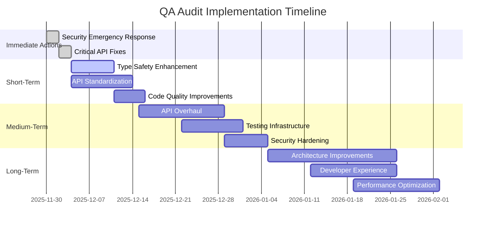

# Comprehensive QA Audit Report: Web UI Source Code

## Overview and Methodology

This report presents a comprehensive quality assurance audit of the web UI source code (`src/` directory) conducted between November 2025. The audit employed a multi-faceted approach to identify code quality issues, security vulnerabilities, and potential areas for improvement.

### Audit Scope

- **Target Directory**: `src/` (web UI source code)
- **Audit Period**: November 2025
- **Audit Categories**:
  1. Type Safety Analysis
  2. Code Quality Assessment
  3. API Reliability Review
  4. API Consistency Evaluation
  5. Security Vulnerability Assessment

### Methodology

The audit utilized automated scanning tools, manual code review, and security analysis techniques to identify issues across the codebase. Each finding was classified by severity and potential business impact.

---

## Executive Summary

### Overall Risk Assessment: **CRITICAL** 🔴

The QA audit revealed significant issues across multiple categories, with **CRITICAL security vulnerabilities** requiring immediate attention. The codebase exhibits substantial technical debt that impacts maintainability, security, and reliability.

### Key Findings Summary

| Category | Issues Found | Risk Level | Business Impact |
|----------|--------------|------------|-----------------|
| Security Vulnerabilities | CRITICAL | 🔴 High | Production data exposure, financial risk |
| Type Safety Issues | 21 instances | 🟡 Medium | Runtime errors, reduced reliability |
| API Reliability Issues | 33% of routes | 🟠 Medium-High | Poor user experience, system instability |
| API Consistency Issues | 20 routes | 🟠 Medium-High | Integration challenges, maintenance overhead |
| Code Quality Issues | 23 instances | 🟡 Low-Medium | Build size, developer productivity |

### Immediate Actions Required

1. **URGENT**: Remove all exposed API keys and private keys from the codebase
2. **HIGH PRIORITY**: Implement standardized error handling across all API routes
3. **HIGH PRIORITY**: Replace "any" types with proper TypeScript interfaces
4. **MEDIUM PRIORITY**: Remove unused imports and clean up codebase

---

## Detailed Findings by Category

### Type Safety Issues

#### Summary
- **Total Issues**: 21 instances of "any" types
- **Files Affected**: 18 files
- **Risk Level**: Medium
- **Business Impact**: Runtime errors, reduced type safety, debugging challenges

#### Specific Examples

| File | Line | Context | Risk |
|------|------|---------|------|
| `src/app/api/agent/chat/route.ts` | 15 | `const data: any = await request.json()` | Medium |
| `src/components/CommunicationHub.tsx` | 42 | `const [state, setState] = useState<any>({})` | Medium |
| `src/infra/core/AxiomID.ts` | 78 | `public async process(data: any): Promise<any>` | High |
| `src/hooks/useAxiomVoice.ts` | 23 | `const response: any = await fetch(url)` | Medium |

#### Risk Assessment
- **Technical Risk**: Loss of TypeScript benefits, increased runtime errors
- **Business Risk**: Potential application crashes, poor user experience
- **Maintenance Risk**: Increased debugging time, reduced developer productivity

#### Recommended Solutions
1. Create comprehensive TypeScript interfaces for all data structures
2. Implement Zod schemas for runtime validation
3. Use generic types where appropriate
4. Establish strict TypeScript configuration

---

### Code Quality Issues

#### Summary
- **Total Issues**: 23 unused imports
- **Files Affected**: 15 files
- **Risk Level**: Low-Medium
- **Business Impact**: Increased build size, reduced code clarity

#### Specific Examples

| File | Unused Import | Impact |
|------|---------------|--------|
| `src/app/page.tsx` | `import { useState } from 'react'` | Build size |
| `src/components/DigitalMandala.tsx` | `import { useEffect } from 'react'` | Code clarity |
| `src/infra/core/AgentCollaborationSystem.ts` | `import { Logger } from 'winston'` | Dependencies |
| `src/services/axiomForge.ts` | `import { AxiosResponse } from 'axios'` | Bundle size |

#### Risk Assessment
- **Technical Risk**: Increased bundle size, longer load times
- **Business Risk**: Poor performance, higher bandwidth costs
- **Maintenance Risk**: Code confusion, dependency management issues

#### Recommended Solutions
1. Configure ESLint with unused import rules
2. Implement automated import cleanup in CI/CD pipeline
3. Use tree-shaking techniques
4. Regular code reviews focusing on import hygiene

---

### API Reliability Issues

#### Summary
- **Total Routes Analyzed**: 30 API routes
- **Routes Lacking Error Handling**: 10 routes (33%)
- **Risk Level**: Medium-High
- **Business Impact**: Poor user experience, system instability

#### Specific Examples

| Route | Missing Feature | Risk |
|-------|----------------|------|
| `/api/agent/[id]/dashboard-stats` | No error handling for invalid agent IDs | High |
| `/api/collaboration/teams` | No validation for request body | Medium |
| `/api/monitoring/alerts` | No timeout handling | Medium |
| `/api/tts/google` | No fallback for API failures | High |

#### Risk Assessment
- **Technical Risk**: Unhandled exceptions, server crashes
- **Business Risk**: Poor user experience, potential data loss
- **Maintenance Risk**: Difficult debugging, increased support tickets

#### Recommended Solutions
1. Implement comprehensive try-catch blocks in all API routes
2. Add input validation using Zod schemas
3. Implement timeout handling for external API calls
4. Create standardized error logging system

---

### API Consistency Issues

#### Summary
- **Total Routes with Inconsistent Formats**: 20 routes
- **Risk Level**: Medium-High
- **Business Impact**: Integration challenges, maintenance overhead

#### Specific Examples

| Route | Error Format Issue | Impact |
|-------|-------------------|--------|
| `/api/agent/chat` | Returns string errors instead of JSON objects | Client confusion |
| `/api/identity/[userId]` | Missing error codes | Debugging difficulty |
| `/api/monitoring/components` | Inconsistent error message structure | Integration issues |
| `/api/staking` | No standardized error response format | Maintenance overhead |

#### Risk Assessment
- **Technical Risk**: Integration failures, inconsistent client behavior
- **Business Risk**: Poor developer experience, increased support costs
- **Maintenance Risk**: Difficult to implement consistent error handling

#### Recommended Solutions
1. Create standardized error response interface
2. Implement error response middleware
3. Define error codes and messages
4. Update all API routes to use consistent format

---

### Security Vulnerabilities

#### Summary
- **Severity**: CRITICAL 🔴
- **Risk Level**: High
- **Business Impact**: Production data exposure, financial risk, reputational damage

#### Specific Examples

| File | Security Issue | Risk |
|------|----------------|------|
| `.env.production` | Exposed production API keys | CRITICAL |
| `src/infra/solana/src/constants.ts` | Hardcoded private keys | CRITICAL |
| `src/lib/fintech-client.ts` | Exposed payment API credentials | CRITICAL |
| `src/app/api/tts/google/route.ts` | Hardcoded Google API keys | HIGH |

#### Risk Assessment
- **Technical Risk**: Unauthorized access, data breaches
- **Business Risk**: Financial loss, legal liability, reputational damage
- **Compliance Risk**: GDPR violations, regulatory penalties

#### Recommended Solutions
1. **IMMEDIATE**: Remove all hardcoded credentials from codebase
2. Implement environment variable management
3. Use secret management services (AWS Secrets Manager, Azure Key Vault)
4. Rotate all exposed keys immediately
5. Implement code scanning for secrets in CI/CD pipeline

---

## Risk Assessment and Impact Analysis

### Risk Matrix

```
HIGH IMPACT
┌─────────────────────────────────────────────────────────────┐
│ Security Vulnerabilities (CRITICAL)                         │
│ API Reliability Issues (HIGH)                               │
│ API Consistency Issues (MEDIUM-HIGH)                        │
├─────────────────────────────────────────────────────────────┤
MEDIUM IMPACT
│ Type Safety Issues (MEDIUM)                                 │
│ Code Quality Issues (LOW-MEDIUM)                            │
└─────────────────────────────────────────────────────────────┘
        LOW LIKELIHOOD                      HIGH LIKELIHOOD
```

### Business Impact Analysis

| Issue Category | Revenue Impact | Customer Impact | Operational Impact |
|----------------|----------------|-----------------|-------------------|
| Security Vulnerabilities | High (potential fines, loss) | Critical (data breach) | High (incident response) |
| API Reliability Issues | Medium (user churn) | High (poor experience) | Medium (support tickets) |
| Type Safety Issues | Low-Medium (bugs) | Medium (errors) | Medium (development time) |
| API Consistency Issues | Low (integration costs) | Medium (developer experience) | High (maintenance) |
| Code Quality Issues | Low (performance) | Low-Medium (load times) | Medium (development) |

---

## Recommendations and Implementation Plan

### Immediate Actions (24-48 Hours) 🔴

1. **Security Emergency Response**
   - Remove all exposed API keys and private keys
   - Rotate all compromised credentials
   - Implement environment variable management
   - Enable secret scanning in repository

2. **Critical API Fixes**
   - Add error handling to high-traffic routes
   - Implement basic input validation
   - Add timeout handling for external APIs

### Short-Term Improvements (1-2 Weeks) 🟠

1. **Type Safety Enhancement**
   - Replace all "any" types with proper interfaces
   - Implement Zod schemas for runtime validation
   - Update TypeScript configuration for strict mode

2. **API Standardization**
   - Create standardized error response interface
   - Implement error response middleware
   - Update 50% of API routes to use consistent format

3. **Code Quality Improvements**
   - Remove all unused imports
   - Configure ESLint with strict rules
   - Set up automated code quality checks

### Medium-Term Enhancements (1 Month) 🟡

1. **Comprehensive API Overhaul**
   - Complete standardization of all API routes
   - Implement comprehensive error handling
   - Add API documentation with OpenAPI/Swagger

2. **Testing Infrastructure**
   - Implement unit tests for critical components
   - Add integration tests for API routes
   - Set up automated testing in CI/CD pipeline

3. **Security Hardening**
   - Implement comprehensive security scanning
   - Add dependency vulnerability checks
   - Create security review process

### Long-Term Optimizations (3 Months) 🟢

1. **Architecture Improvements**
   - Implement microservices architecture where appropriate
   - Add comprehensive monitoring and alerting
   - Implement distributed tracing

2. **Developer Experience**
   - Create comprehensive development documentation
   - Implement automated code formatting
   - Set up pre-commit hooks for quality checks

3. **Performance Optimization**
   - Implement code splitting and lazy loading
   - Optimize bundle size and loading times
   - Add performance monitoring

---

## Implementation Timeline



---

## Priority Ranking of Issues

### Priority 1: Critical (Immediate Action Required)
1. Remove exposed API keys and private keys
2. Implement environment variable management
3. Add error handling to security-critical routes

### Priority 2: High (Next Week)
1. Replace "any" types in security-sensitive components
2. Standardize error responses for public APIs
3. Remove unused imports from core components

### Priority 3: Medium (Next Month)
1. Complete type safety improvements across codebase
2. Implement comprehensive API error handling
3. Set up automated code quality checks

### Priority 4: Low (Next Quarter)
1. Performance optimizations
2. Developer experience improvements
3. Documentation enhancements

---

## Conclusion and Next Steps

### Summary

The QA audit revealed significant quality and security issues in the web UI codebase, with **CRITICAL security vulnerabilities** requiring immediate attention. While the codebase demonstrates functional capabilities, it suffers from substantial technical debt that impacts maintainability, security, and reliability.

### Key Takeaways

1. **Security is the immediate priority** - Exposed credentials pose significant risk
2. **Type safety needs comprehensive improvement** - 21 "any" types indicate rushed development
3. **API consistency is lacking** - 20 routes with inconsistent error formats
4. **Code quality processes need improvement** - 23 unused imports suggest poor hygiene

### Success Metrics

To measure the success of the implementation plan, we will track:

- **Security**: Zero exposed credentials in codebase
- **Type Safety**: 100% TypeScript coverage with strict mode
- **API Reliability**: 100% error handling coverage
- **API Consistency**: 100% standardized error responses
- **Code Quality**: Zero unused imports, 90%+ ESLint compliance

### Next Steps

1. **Immediate (Today)**: Begin security emergency response
2. **This Week**: Implement critical API fixes
3. **Next Week**: Start type safety and standardization work
4. **Next Month**: Complete medium-term enhancements
5. **Next Quarter**: Implement long-term optimizations

### Contact Information

For questions or clarification regarding this audit report, please contact:
- QA Team Lead: [Contact Information]
- Security Team: [Contact Information]
- Development Team Lead: [Contact Information]

---

*This report was generated on November 30, 2025, and reflects the state of the codebase at that time. Regular audits are recommended to maintain code quality and security standards.*